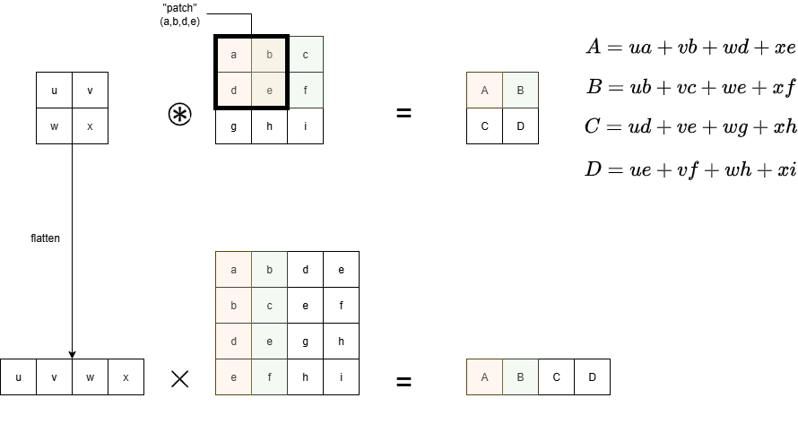
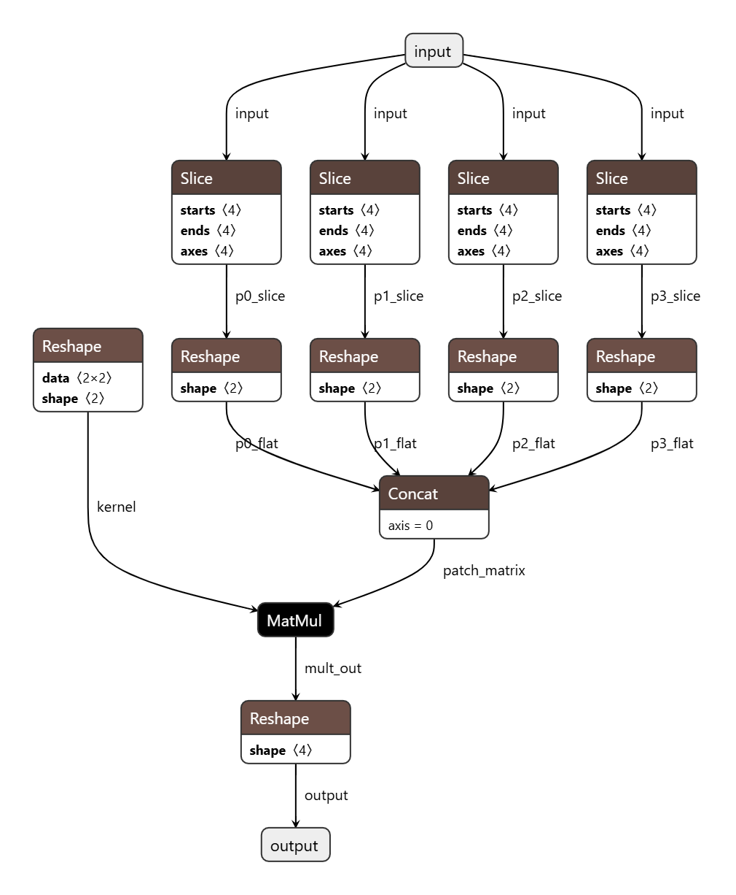
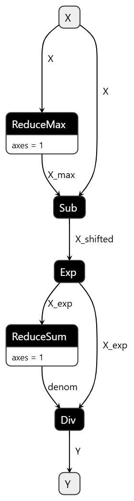
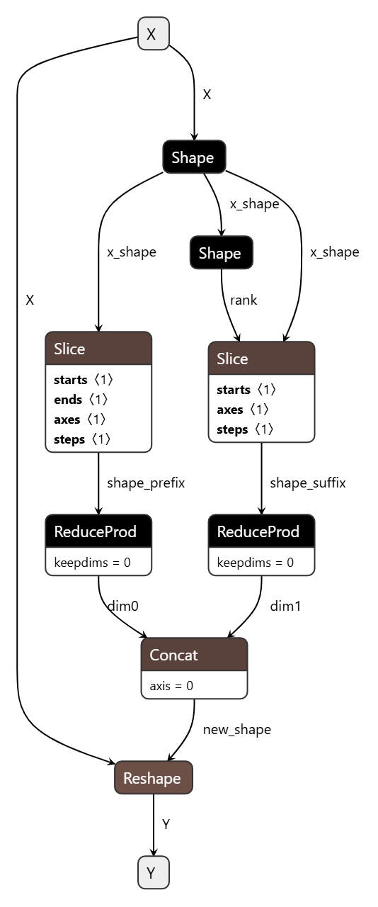

# Introduction

The idea is to build up all operators of our selection on the basis of a small corpus of primitive operators. The objective is to simplify the specification (esp. the formal specification) thanks to a modular approach.

In some cases, the decomposition is fairly trivial and the resulting description remains understandable describes in a fairly understanable way what the operator is doing.  However, care shall be taken not to make the description of the operators overly complicated. A good example is the one of convolution (`conv`). We will show how it can be decomposed using simpler operators, but at the expense of making it much more difficult to understand than when using the usual "triple-sum" (for a 2D convolution).


# Core operators
## Core Arithmetic Operators: 
  - Add, (Sub)
  - Mul, Div
  - Exp
  - Sine, (Cos, Tan)
  - Log
  - Sqrt
  
## Matrix Multiplication: 
- MatMul

## Data Manipulation/Shaping Operators: 
- Reshape, 
- Concat, 
- Slice, 
- Gather,
- Where,
- Shape

## Comparison/Logical Operators
- Max, (Min), 
- Greater, (Less). 

## Reduction Operators
- ReduceSum, 
- ReduceMean,
- ReduceMax.

## Other operators (non ONNX)
Those operators do not belong to the ONNX operator set. However, they are useful to describe the are not ONNX operators, but opera
- Broadcast, used to describe the implicit broadcasting done by some operators
- Dilation, used to describe the dilation done by the `conv` operator. 

# Synthesis

The following table indicates is an operator is primitive or not.
When the answer is "YES (*)", it means that we consider it primitive even though they could actually be described using more primitive operators. This is for instance the case of `Sub(x,y)` which could be in principle encoded as `Add(x, -y)`. 

An empty entry means that the operator has not been analyzed yet. 

| Operator                     | Primitive |
|------------------------------|-----------|
| Abs                          | NO        |
| Add                          | YES       |
| Cast                         |           |
| Clip                         |           |
| Concat                       | YES       |
| Constant                     | YES       |
| ConstantOfShape              |           |
| Conv                         | NO        |
| ConvTranspose                | NO        |
| Div                          | YES (*)   |
| Equal                        | YES       |
| Erf                          | YES       |
| Exp                          | YES       |
| Expand                       |           |
| Flatten                      | NO        |
| Gather                       |           |
| Gemm                         | NO        |
| GlobalAveragePool            | NO        |
| GRU                          |           |
| HardSwish                    | NO        |
| Identity                     |           |
| LeakyRelu                    | NO        |
| Less                         |           |
| Log                          | YES       |
| LSTM                         |           |
| MatMul                       | YES       |
| Max                          | YES       |
| MaxPool                      |           |
| Min                          | YES (*)   |
| Mod                          | YES       |
| Mul                          | YES       |
| Neg                          | NO        |
| Not                          | YES       |
| Pad                          | YES       |
| Pow                          | YES       |
| Range                        |           |
| ReduceMean                   | YES       |
| ReduceSum                    | YES       |
| Relu                         | NO        |
| Reshape                      | YES       |
| Resize                       |           |
| ScatterND                    |           |
| Shape                        | YES       |
| Sigmoid                      | NO        |
| Slice                        |           |
| Softmax                      | NO        |
| SoftPlus                     | NO        |
| Split                        |           |
| Sqrt                         | YES       |
| Squeeze                      |           |
| Sub                          | YES (*)   |
| Tanh                         | NO        |
| Transpose                    | NO        |
| ConvTranspose                |           |
| Unsqueeze                    |           |
| Where                        |           |
																           

# Examples 

# Abs
Operator Àbs`could be defined using operator `Max`:

$$\texttt{Abs}(x) = \texttt{Max}(x,-x)$$

or 

$$\texttt{Abs}(x) = x \times \texttt{Sign}(x)$$


## Neg

$$Neg(x)= x \times -1$$

## ReLU

$$Relu(x) = max(1,x)$$

## Convolution
  -  Conv = (Slice + Reshape = img2col) + MatMul

A convolution can be implemented using a matrix multiplication by "flattening" the kernel and reorganizing the tensor, as illustrated below for a (2x2) kernel and (3x3) matrix.



The Slice operator is used to extract the four "patches". Then each patch is reshaped into a (1x4) vector. The four vectors are then concatenated into a 4x4 matrix.

The kernel is reshaped (`reshape`) into a 1x4 vector.

The flattened kernel is then multiplied with the 4x4 matrix. The (1x4) vector result is finally reshaped into a 2x2 matrix. The Python code can be found in [Google Collab](https://colab.research.google.com/drive/1CpJv2-zwHV_ZmC7FH9VD0UffFDahHI3s#scrollTo=vWPbx5Br7RJZ).

The resulting graph is given below: 



*WARNING: describing convolution this way makes the actual operation done by the operator much more difficult to understand... In fact, this scheme will necessarily be explained with a reference to the classical way to compute convolutions...* 

The `Conv` operator also does padding and dilation. Padding can be expressed using the ONNX `Pad` operator. since there is no Dilation operator, we have to describe it using simpler operators. 

Dilation can be implemented using `Reshape` and `Concat`. For instance, for a 2D tensor: 
- First, we insert zeroes between columns by  
    - reshaping the tensor to add a dimension. This means that the scalar items of the matrix becomes vectors. The initial shape 2x2 becomes 2x2x1 : 
    ```
    [
        [1,2],
        [3,4]
    ]
    ```
    becomes
    ```
    [
        [ [1],[2]],
        [ [3],[4]]
    ]
    ```
    - we construct a zero tensor with the same shape 2x2x1:
    ```
    [
        [ [0],[0]],
        [ [0],[0]]
    ]
    ```
    - Then we concat the two tensors along dimension 2. The resulting tensor is now 2x2x2
    ```
    [
        [[1,0],[2,0]],
        [[3,0],[4,0]]
    ]
    ```
    - Then we reshape the tensor to 2x4 which is the size of the dilated tensor along the second dimension (columns):
    ```
    [
        [1,0,2,0],
        [3,0,4,0]
    ]
    ```
  - Second, the same process is applied on the rows.

We could also use `pad` to insert the zeroes. For instance, if we consider the dilation on the column dimension: 
- First, as before, we reshape the tensor from 2x2 to 2x2x1
- We pad the tensor with zeroes (tensor is now 2x2x2):
    ```
    [
        [[1,0],[2,0]],
        [[3,0],[4,0]]
    ]
    ```
- and we reshape it to 2x4
    ```
    [
        [1,0,2,0],
        [3,0,4,0]
    ]
    ```

We could also use `Reshape` to flatten the tensor, then use `ScatterElement`to insert zeroes and use `Reshape` again to set final tensor shape.

## MaxPool

  - MaxPool = Slice + ReduceMax + Concat

## LayerNormalization 
    - LayerNormalization = ReduceMean, Sub, Pow, Sqrt, Add, Div, Mul

## GlobalAveragePool

*Defined with respect to AveragePool.*

## AveragePool

`AveragePool` can be defined using a channel-wise convolution. Average pooling consists to apply a kernel which values are all equal to $1/\texttt{kernel size}$.


It can also be described using `Slice`, `Reshape` and `ReduceMean`

## HardSwish

Operator `HardSwish` can be defined using the `max` and `min` operators: 

$$ hardswish(x) = x * max(0, min(1, \alpha * x + \beta))$$

with $\alpha=1/6$ and $\beta=0.5$. 

It could also be expressed using `Relu` or `HardSigmoid`.

## LeakyRelu

The mathematical definition of `LeakyRelu` is 

$$ LeakyRelu(x) =     \begin{cases}
      x & \text{if}\ x \ge 0 \\
      \alpha x &  \text{if}\ x \lt 0
    \end{cases} $$

which can be written as 

$$LeakyRelu(x) = max(0,x)+min(0, \alpha x)$$

## SoftMax

Operator `SoftMax` is defined as follows: 
$$\texttt{SoftMax}(x_i) = { e^{x_i} \over {\sum_{j=1}^{K} e^{x_j}}}$$

The numerator can be computed using operator `Exp`. The denominator can be computed using the  `ReduceSum` operator that computes the sum of the input tensor’s elements along the provided axes.

In order to ensure numerical stability, the actual formula should be 

$$\texttt{SoftMax}(x_i) = { e^{x_i-max(x)} \over {\sum_{j=1}^{K} e^{x_j-max(x)}}}$$

which means that we have to use the `ReduceMax` operator.

The netron representation of the `SoftMax` operator is given below:



## SoftPlus

Operator `SoftPlus` is defined as follows:
$$\texttt{SoftPlus}(x) = \ln(e^{x} +1 )$$

*Note that in the ONNX documenation, $\ln$ and $\log$ are used. There is a unique logarithm operator, `Log` that computes the natural (neperian) logarithm, i.e, $\log(x)=\ln(x)=\log_e(x)$.*

This operator can be described using `Log` and `Add`.

## Sigmoid

The mathematical expression for operator `Sigmoid` is :

$$ sigmoid(x)= { 1 \over 1+e^{-x} } $$

This operator can be described using `Div`, `Exp` and `Add`.

## Tanh

The mathematical expression for operator `Tanh` is :

$$ tanh(x)= { e^x-e^{-x} \over e^x+e^{-x} } $$
or
$$ tanh(x)= { 1-e^{-2x} \over 1+e^{-2x} } $$


This operator can be described using `Div`, `Exp`, `Add`, `Sub`, `Mul`

## Transpose

Transpose could be expressed using 
- `Reshape` (or `Flatten`), to flatten the tensor, 
- a computation of the new indices
- `Gather` to collect the elements of the flattened tensor 
- `Reshape` to set back the dimension of the tensor

## Flatten

Operator `Flatten` flattens a tensor starting from a given axis. If input tensor has shape $(d_0, d_1, … d_n)$ then the output will have shape $(d_0 \times d_1 \times ... \times d_{{axis}-1}, d_{axis} \times d_{{axis}+1}  \times ... \times d_n)$.

This operator can be represented using:
- `Shape` to get the shape of the tensor
- `Slice`, `ReduceProd`, and `Concat` to compute the flattened dimensions
- `Reshape`
  
The following picture gives an example of such transformation applied to a 2D input tensor (but it can be generalized).

Values `dim0` and `dim1` correspond to the previous products:
- ${dim_0} =  d_0 \times d_1 \times ... \times d_{{axis}-1}$
- ${dim_1} = d_{axis} \times d_{{axis}+1}  \times ... \times d_n$ 




Operator `Slice` uses the starts, ends, axes and steps inputs to select a sub-tensor of its input data tensor. (see the ONNX and numpy documenration: it is a pretty complicated operator...)

## Gemm

Operator `Gemm` is defined as follows:
$$\texttt{Gemm}(A,B,C) = \alpha \times A' \times B’ + \beta \times C$$

where $A'$ and $B'$ are the transposed version of $A$ and $B$ depending on attributes `transA` and `transB`.

This operator can be described using operators `Transpose`, `MatMul`, `Add`, `Mul`.

The booleans that control the transposition of $A$ and $B$ are attributes, not input tensors. Therefore, the description of the operator should probably (?) use a textual condition, (i.e., "if transA is true then...") rather than other operators. (To be discussed).


