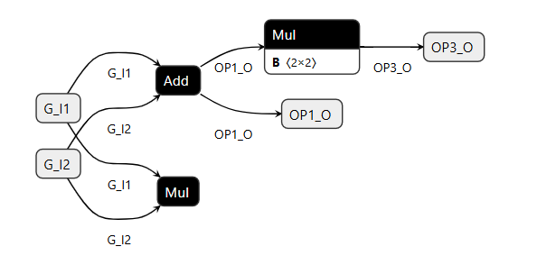

## Restrictions
The following restrictions apply to graphs in the SONNX profile:

| Restriction    | Statement | Origin |
| -------- | ------- | ------- |
| `[R1]`|  There is a 1-to-1 mapping between the inputs and outputs of a node and the inputs and outputs of its associated operator.  | TBC |
| `[R2]` | Each output of a node must be the input of another node or be a graph output.  | No unused output |
| `[R3]` | A graph shall only contain deterministic operators. | Deterministic behavior |

> (eric) Constrainsts to be checked


# Informal specification

## Definitions
### Graph
- `[T01a]` A graph is a set of *nodes* and *edges* 
- `[T01b]` A node is either a *tensor node* or a *computation node*
  
In the following example[^1], written using the `onnxruntime` API, the graph is composed of four computation nodes (`add_node`, `cons_node`, `mul_node1`, `mul_node2`) and 4 tensors nodes (`g_i1` and `g_i2`, `op1_o`, `op3_o`). The complete example in given in Section [example](#example) below).

```python
# Create nodes
add_node = onnx.helper.make_node(op_type="Add", inputs=[g_i1_id, g_i2_id], outputs=[op1_o_id])
cons_node = onnx.helper.make_node("Constant", inputs=[], outputs=[op2_o_id], value=const_value)
mul_node1 = onnx.helper.make_node("Mul", inputs=[op1_o_id, op2_o_id], outputs=[op3_o_id])
mul_node2 = onnx.helper.make_node("Mul", inputs=[g_i1_id, g_i2_id], outputs=[op4_o_id])
[...]
# Create graph
graph = onnx.helper.make_graph(
    nodes=[add_node, cons_node, mul_node1, mul_node2],
    name="Test",
    inputs=[g_i1, g_i2],
    outputs=[op1_o, op3_o]
)
[...]
```
[^1]: The complete example in given in Section [example](#example) below.


### Tensor nodes
- `[T02a]` A tensor node is an object that can have a value or no value
- `[T02b]` A tensor node is identified by a unique identifier within a graph

`[RX]`  A tensor node that is not the input of a computation node (i.e., it does not belong to any edges to a computation node input) must be an output node of the graph.

In the following example[^1], written using the `onnxruntime` API, a tensor node is created using the `onnx.helper.make_tensor_value_info` function. In this example, `op1_o` is a tensor of rank 2 with no given dimensions. Its identifier is `op1_o` is `OP1_O`. 

```python
op1_o_id = "OP1_O"
op1_o = onnx.helper.make_tensor_value_info(op1_o_id, onnx.TensorProto.FLOAT, [None, None])
```

### Computation nodes

- `[T03a]`  A computation node specifies some relation between its inputs and its outputs.
- `[T03b]`  The relation is defined by the *operator* that is associated with the node. The semantics of operators is defined in the SONNX profile opset (see, e.g., [add](../profile_opset/add/add.md)).
  - Note that multiple computation nodes can refer to the same operator. 
- `[T03c]` There is a 1-to-1 mapping between the computation node's inputs and outputs and those of its associated operator . 

- `[RX]`  A computation node must belong to at least one path from an input tensor to an output tensor of the graph (i.e., there shall be no "dead" node)
- `[Rx]` A computation node must refer to an operator in the SONNX profile. 
  
In the following example[^1], nodes `mul_node1` and `mul_node2` refer to the same operator [`Mul`](../profile_opset/mul/mul.md) that has 2 inputs and 1 output.

```python
mul_node1 = onnx.helper.make_node("Mul", [op1_o_id, op2_o_id], [op3_o_id])
mul_node2 = onnx.helper.make_node("Mul", [g_i1_id, g_i2_id], [op4_o_id])
```

### Edges
- `[T04a]` An edge is a relation between a computation node, one input or output of this computation node, and a tensor node. A tensor that is related to some computation node input (resp. output) is said to be an input (resp. output) of the computation node. 

- `[Rx]` All inputs and outputs of all computation nodes must belong to an edge.
  - Note that is is a restriction with respect to the ONNX standard that allows fewer inputs or outputs when the omitted input or output is optional
  
The following restrictions apply to graphs in the SONNX profile:
-  is not part of an  
  - Rationale: each node of the graph shall contribute to the function of the graph (no "dead node").

In the following example[^1], edges are defined by the `inputs` and `outputs` arguments of the `make_node` and `make_graph` functions. For instance, the `add_node` computation node has 2 inputs (one for each element of the `inputs` list, noted $i_1$, $i_2$ hereafter) and 1 output (one for each element of the `outputs` list, noted $o$). The corresponding graph edges are:
- e1: (add_node, $i_1$, g_i1_id)
- e2: (add_node, $i_2$, g_i2_id)

```python
# Create nodes
add_node = onnx.helper.make_node(op_type="Add", inputs=[g_i1_id, g_i2_id], outputs=[op1_o_id])
cons_node = onnx.helper.make_node("Constant", inputs=[], outputs=[op2_o_id], value=const_value)
mul_node1 = onnx.helper.make_node("Mul", inputs=[op1_o_id, op2_o_id], outputs=[op3_o_id])
mul_node2 = onnx.helper.make_node("Mul", inputs=[g_i1_id, g_i2_id], outputs=[op4_o_id])
[...]
# Create graph
graph = onnx.helper.make_graph(
    nodes=[add_node, cons_node, mul_node1, mul_node2],
    name="Test",
    inputs=[g_i1, g_i2],
    outputs=[op1_o, op3_o]
)
[...]
```

### Operators
- `[T05a]` An operator specifies a function, i.e., a relation between the values of some input variables (the arguments of the function) and some output variables. For instance operation $z=\text{\bf add}(x,y)$ specifies a relation between variables  $x$, $y$, and $z$ such that $z=x+y$.
  - The set of input variables may be empty (case of a constant function). 


  
> (eric) Can a node have an internal state? In that case, it is not functional. 

### Example
The following figure gives an example of a simple graph composed of 4 nodes. The graph has 2 input and 2 output tensors. Note that output of one of the nodes, `mul_node2`, is not used: this is actually forbidden in SONNX.

 

The `onnxruntime`used to create the graph is given hereafter:

```python
import onnx
import onnxruntime as ort
import numpy as np

# Define tensor identifiers
g_i1_id = "G_I1"
g_i2_id = "G_I2"
op1_o_id = "OP1_O"
op2_o_id = "OP2_O"
op3_o_id = "OP3_O"
op4_o_id = "OP4_O"

# Create 2-rank input tensors (two inputs for division)
g_i1 = onnx.helper.make_tensor_value_info(g_i1_id, onnx.TensorProto.FLOAT, [None, None])
g_i2 = onnx.helper.make_tensor_value_info(g_i2_id, onnx.TensorProto.FLOAT, [None, None])

# Create output tensors
op1_o = onnx.helper.make_tensor_value_info(op1_o_id, onnx.TensorProto.FLOAT, [None, None])
op2_o = onnx.helper.make_tensor_value_info(op2_o_id, onnx.TensorProto.FLOAT, [None, None])
op3_o = onnx.helper.make_tensor_value_info(op3_o_id, onnx.TensorProto.FLOAT, [None, None])
op4_o = onnx.helper.make_tensor_value_info(op4_o_id, onnx.TensorProto.FLOAT, [None, None])

# Create a constant value
const_value = onnx.helper.make_tensor(
    name='const_tensor',
    data_type=onnx.TensorProto.FLOAT,
    dims=[2, 2],
    vals=np.array([[1.0, 2.0], [3.0, 4.0]], dtype=np.float32).flatten() # Example values, adjust as needed
)

# Create nodes
add_node = onnx.helper.make_node("Add", [g_i1_id, g_i2_id], [op1_o_id])
cons_node = onnx.helper.make_node("Constant", [], [op2_o_id], value=const_value)
mul_node1 = onnx.helper.make_node("Mul", [op1_o_id, op2_o_id], [op3_o_id])
mul_node2 = onnx.helper.make_node("Mul", [g_i1_id, g_i2_id], [op4_o_id])

# Create the ONNX graph
graph = onnx.helper.make_graph(
    nodes=[add_node, cons_node, mul_node1, mul_node2],
    name="Test",
    inputs=[g_i1, g_i2],
    outputs=[op1_o, op3_o]
)

# Create the ONNX model
model = onnx.helper.make_model(graph, opset_imports=[onnx.helper.make_opsetid("", 13)], ir_version=10) # Explicitly set opset to 13 and ir_version to 10
onnx.checker.check_model(model)
print(onnx.helper.printable_graph(model.graph))

# Save the model
onnx.save(model, "graph.onnx")

# Load and run the model using ONNX Runtime
session = ort.InferenceSession("graph.onnx")

# Do inference
i1 = np.array([[1.0, 2.0],[3.0, 4.0]], dtype=np.float32)
i2 = np.array([[3.0, 4.0],[5.0, 6.0]], dtype=np.float32)
output = session.run(None, {g_i1_id: i1, g_i2_id: i2})

# Display results
i1_f=(np.array2string(i1, separator=',', max_line_width=np.inf).replace('\n', ''))
i2_f=(np.array2string(i2, separator=',', max_line_width=np.inf).replace('\n', ''))
o1_f=(np.array2string(output[0], separator=',', max_line_width=np.inf).replace('\n', ''))
o2_f=(np.array2string(output[1], separator=',', max_line_width=np.inf).replace('\n', ''))

# Display results
np.set_printoptions(precision=None, floatmode='fixed')
print(f"I1={i1_f}, I2={i2_f}")
print(f"Result={o1_f}{o2_f}")
```

## Execution Semantics
Executing a graph means evaluating the output tensors of the graph according to the following rules: 
- `[T06a]` A computation node is executable if all the tensors connected to its inputs (i.e., belonging to an edge) are initialized 
- `[T06b]` Executing a computation node means assigning values to the tensors connected to its outputs (i.e., belonging to an edge) so that the relation specified by the operator between its inputs and outputs holds 
- `[T06c]` All executable computation nodes shall be executed
- `[T06e]` A tensor shall be assigned a value at most once (Single Assignment) 


 
## Special nodes
*This section is very preliminary*

The way graphs are described and executed is independent from the operators used in the graph. In other terms, the semantics of the graph (how the operators are called) and the semantics of the operators (what the operators do) are defined separately. This modularity applies to the standard operators (convolution, relu, etc.) and to the special function and control flow nodes.  

### Functions nodes
- A `function` operator encapsulates a graph. 
- Executing a function operator means executing the encapsulated graph according to the graph execution semantics described before. 
- An encapsulated graph may itself use `function` nodes, in a hierarchical manner. 
- A valid ONNX graph with function nodes must be always actually converted to an equivalent ONNX graph without any function nodes. This forbids any direct or indirect recursion. 

### Control-flow operators 
- ONNX provides a series of control flow operators such as `if`, `scan`, `loop`,...). 
- Those nodes take one (e.g, operators `for`, `loop`, `scan`,...) or two graphs (`if`) as attributes and execute this graph or those graphs according to their specific semantics. 

#### The `if` operator 

- An `if` operator, takes one boolean input and two attributes, one attribute specifying the graph to be executed when the boolean input is true (the `then_branch` subgraph) and the other specifying the graph to be executed when the boolean is false (the `else_branch` subgraph). 
- As for any other operator, the `if`node has a single list of outputs (e.g., [Y1, Y2, ..., Yn]). Both the `then_branch` and the `else_branch` subgraphs must produce the same number and types of outputs, and those are mapped to the outputs of the `if` node.
- The then and else subgraphs do not need to use all of the `if` inputs. In the following example, the then and else subgraph use no inputs (they use constant tensors). 
  
```
import onnx
from onnx import helper, TensorProto, numpy_helper

cond_input = helper.make_tensor_value_info("cond", TensorProto.BOOL, [])

if_output = helper.make_tensor_value_info("if_out", TensorProto.FLOAT, [])

# Create a constant node for the then branch
then_const = helper.make_node("Constant", [], ["then_out"],
    value=helper.make_tensor(name="const_tensor_1", data_type=TensorProto.FLOAT, dims=[], vals=[1.0])
)
then_output = helper.make_tensor_value_info("then_out", TensorProto.FLOAT, [])

# The "then" subgraph contains a unique "constant" node.
then_branch = helper.make_graph([then_const], "then_branch", [], [then_output])

# Create a constant node for the else branch
else_const = helper.make_node("Constant", [], ["else_out"],
    value=helper.make_tensor(name="const_tensor_0", data_type=TensorProto.FLOAT, dims=[], vals=[0.0])
)
else_output = helper.make_tensor_value_info("else_out", TensorProto.FLOAT, [])

# The "else" subgraph contains a unique "constant" node.
else_branch = helper.make_graph([else_const], "else_branch", [], [else_output])

# Create the "if" node that contains the "then" and "else" subgraphs.
if_node = helper.make_node(
    "If",
    inputs=["cond"],
    outputs=["if_out"],
    then_branch=then_branch,
    else_branch=else_branch
)

# Ceate the toplevel graph.
graph = helper.make_graph(
    nodes=[if_node],
    name="if_example",
    inputs=[cond_input],
    outputs=[if_output]
)

model = helper.make_model(graph, producer_name="onnx-if-minimal")
onnx.checker.check_model(model)
onnx.save(model, "if_example.onnx")

```
  
- In addition, they may use tensors directly available in the scope of the `if` operator. In the following example, the `then_branch` and the `else_branch` subgraphs "capture" tensor `X` that is declared in the top-level graph. **DO WE ACCEPT SUCH CAPTURE OR DO WE IMPOSE ALL FLOWS TO BE DECLARED IN THE IF NODE**?

```
import onnx
from onnx import helper, TensorProto

 
cond_input = helper.make_tensor_value_info("cond", TensorProto.BOOL, [])

# X is an input tensor of the graph
x_input = helper.make_tensor_value_info("X", TensorProto.FLOAT, [1])

if_output = helper.make_tensor_value_info("if_out", TensorProto.FLOAT, [1])

# Create constant node with value 2
two_const = helper.make_node(
    "Constant",
    inputs=[],
    outputs=["two"],
    value=helper.make_tensor("two_val", TensorProto.FLOAT, [1], [2.0])
)

# Create node X*2
mul_node = helper.make_node("Mul", ["X", "two"], ["then_out"])
then_output = helper.make_tensor_value_info("then_out", TensorProto.FLOAT, [1])
then_branch = helper.make_graph(
    [two_const, mul_node],
    "then_branch",
    inputs=[],
    outputs=[then_output]
)

# Create constant node with value 3
three_const = helper.make_node(
    "Constant",
    inputs=[],
    outputs=["three"],
    value=helper.make_tensor("three_val", TensorProto.FLOAT, [1], [3.0])
)

# Create node X+3
add_node = helper.make_node("Add", ["X", "three"], ["else_out"])
else_output = helper.make_tensor_value_info("else_out", TensorProto.FLOAT, [1])
else_branch = helper.make_graph(
    [three_const, add_node],
    "else_branch",
    inputs=[],
    outputs=[else_output]
)

# Create IF node with no input (but the condition)
if_node = helper.make_node(
    "If",
    inputs=["cond"],
    outputs=["if_out"],
    then_branch=then_branch,
    else_branch=else_branch
)

# Create the main graph
main_graph = helper.make_graph(
    [if_node],
    "if_capture_outer_scope",
    inputs=[cond_input, x_input],
    outputs=[if_output]
)

# Model
model = helper.make_model(main_graph, producer_name="onnx-if-outer-scope")
onnx.checker.check_model(model)
onnx.save(model, "if_capture_outer_scope.onnx")
```


## Additional remarks

### Properties of a graph
- If all operators are purely functional (stateless), a graph is also purely functional, i.e., the values of its outputs only depends on the values of its inputs and the values of the attributes of its nodes. 
- If all operators are deterministic, a graph is also deterministic, i.e., for a  given set of input values, the execution of the graph always gives the same output values.
- A graph has no side effect, i.e., the only visible effects of a graph are via its outputs.

Note:
- The values of the outputs do not depend on the execution order of its nodes.
- By construction, a graph makes it explicit the order according to which terms of expressions are computed. For instance, expression `a+b+c` is either represented **explicitly** by `(a+b)+c`or `(a+(b+c)`


# Formal specification

See draft [here](../profile_formal/onnxgraph.mlw).
