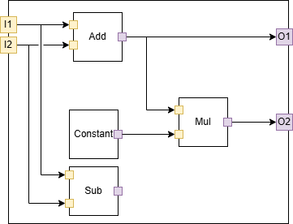

# Preamble

This document gives a high level description of how the execution execution of an ONNX graph. How the graph graph elements are described in the ONNX file is given in the Intermediate Representation (IR) specification document.

In the context of SONNX, the specification of the semantics of an ONNX graph is limited to the inference phase.  

# Informal specification

## Structure 

### Graph
- In ONNX, a **model** is represented by a **graph**. Evaluating a model means evaluating the graph. 
- A **graph**
  - is composed of a set of  **nodes** and **edges**
  - has zero or more inputs and at least one output.
- An **input** or an **output** is either undefined or has a value.
- A **node** 
  - refers to a fully qualified and configured ONNX **operator** (the version of the operator is defined, the attributes of the operators are set). 
  - has inputs and outputs corresponding to the inputs and outputs of the referenced operator.  
- An **edge** 
  - is a connection between an input and an output of two different nodes, or a connection between an input (resp. output) of the graph and an input (resp. output) of a node so that, 


   
### Constraints
- (C1) Each input of the graph is connected to one or more inputs of its nodes.
- (C2) Each output of the graph is connected to the output of one of its nodes.
- (C3) A graph is acyclic.
- (C4) A node has zero or more inputs and at least one output.
- (C5) A node's input is either connected to the output of another node or to an input of the graph.
- (C6) A node's output is either connected to the input of another node, to an output of the graph, or remains unconnected.

### Illustration
The following picture gives a simple example of a graph composed of 4 nodes. In this  example, the inputs of the graph are connected to the inputs of two nodes (`add` and `sub`) and the output of the `sub` node is not used.

<p align="center">

</p>

Here is a textual export of same model using `onnx.helper.printable_graph(model.graph)`. 

```
graph Test (
  %I1[FLOAT, ?x?]
  %I2[FLOAT, ?x?]
) {
  %O1 = Add(%I1, %I2)
  %op2_out = Constant[value = <Tensor>]()
  %O2 = Mul(%O1, %op2_out)
  %op4_out = Sub(%I1, %I2)
  return %O1, %O2
}
```

*(Note that ONNX also defines another textual serialization scheme (only available in C++)*

## Behaviour
- Evaluating a graph's output requires evaluating the output of the node it is connected to.
- Evaluating a node's output is done by executing the node.
- Executing a node means computing its outputs based on the specification of the referenced operator.
- A node can only be executed if all its input values are defined.
- Initially, all input values are defined
- Initially, all output values are undefined
- All inputs and outputs connected by an edge are either both undefined or have the same value.


## Special nodes

### Functions nodes
- A `function` operator encapsulates a graph. 
- Executing a function operator means executing the embedded graph according to the graph execution semantics described before. 
- An embedded graph may itself use `function` nodes, in a hierarchical manner. 
- In ONNX, a `function` node is conceptually expanded ("inlined") at the place where it is used. This forbids any direct or indirect recursion (incl. infinite recursion). 

### Control-flow operators 
- ONNX provides a series of control flow operators such as `if`, `scan`, `loop`,...). 
- Those nodes take one (e.g, operators `for`, `loop`, `scan`,...) or two graphs (`if`) as attributes and execute this graph or those graphs according to their specific semantics. 
- An `if` node, for instance, takes one boolean input and two attributes, one specifying the graph to be executed when the boolean input is true (the `then_branch`) and another graph when the boolean is false (the `else_branch`). 
  - Note that one of the graph is not executed. This seems to contradict the execution semantics of a graph bit but is not since executing the `then_branch` or the `else_branch` concerns the semantics of the `if` node, not of the graph. From the graph's perspective, the only node that is visible is the `if`. 
  - The same applies for the other control flow nodes.  


## Additional remarks

### Properties of a graph
- If all operators are purely functional (stateless), a graph is also purely functional, i.e., the values of its outputs only only depends on the values of its inputs and the values of the attributes of its nodes. 
- If all operators are deterministic, a graph is also deterministic, i.e., for a  given set of input values, the execution of the graph always gives the same output values.
- A graph has no side effect, i.e., the only visible effects of a graph are via its outputs.

Note:
- The values of the outputs do not depend on the execution order of its nodes are executed.
- By construction, a graph makes it explicit the order according to which terms of expressions are computed. For instance, expression `a+b+c` is either represented by `(a+b)+c`or `(a+(b+c)`


 
## Restrictions
The following restrictions apply to graphs in the SONNX profile:
- `[R1]` A graph shall not contain nodes with no connected outputs. 
  - Rationale: each node of the graph shall contribute to the function of the graph (no "dead node").
 
