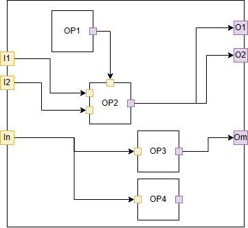

> **_NOTE:_**  Copy of "graph.md" with notes by Edoardo Manino

# Preamble

This document gives a high level description of how the execution execution of an ONNX graph. How the graph graph elements are described in the ONNX file is given in the Intermediate Representation (IR) specification document.

In the context of SONNX, the specification of the semantics of an ONNX graph is limited to the inference phase.  

> **_NOTE 1:_**  Typos: "execution" and "graph" are repeated twice. The first sentence is broken: maybe it is meant to say "how the execution of an ONNX graph _takes place_"?

> **_REPLY 1:_** OK: Corrected.

# Informal specification

> **_NOTE 2:_**  The document does not contain a _formal_ specification (yet?). If it exists in another document, mention that. Also, it may be worth having a little table of content listing the main sections: i.e. structure, behaviour, special nodes, additional remarks.

> **_REPLY 2:_** OK: There is no formal specification yet. As for the operators, I add a "Formal specification" section that will point to the Why3 spec (which does not exist yet). The document does not contain a _formal_ specification (yet?). If it exists in another document, mention that. Also, it may be worth having a little table of content listing the main sections: i.e. structure, behaviour, special nodes, additional remarks.


## Structure 

### Graph
- In ONNX, a **model** is represented by a **graph**. Evaluating a model means evaluating the graph. 
- A **graph**
  - is composed of a set of  **nodes** and **edges**
  - has zero or more inputs and at least one output.

> **_NOTE 3:_**  Later we state that nodes in the graph may have unused outputs. I can see how that could be helpful, e.g. use a complicated operator for just a few of its outputs, or pad a computational graph with irrelevant operators to avoid side-channel attacks. However, we are losing the nice recursive property that any subgraph of an ONNX graph is also a valid ONNX graph, because an arbitrary subgraph _may not have any outputs_. For an example, see the illustration below: the subgraph containing only the "Sub" node is not a valid ONNX graph. Do we care about this recursive definition? Should we change the definition of ONNX graphs to include graphs without any outputs?

> **_REPLY 3:_** This has to be discussed... One point : a graph is a particular object... In particular, the output of a graph may be "driven" by outputs of multiple node, but outputs of different nodes cannot be connected together (due to the SSA constraint). 


- An **input** or an **output** is either undefined or has a value.

> **_NOTE 4:_**  Maybe it is worth clarifying the last sentence. By "undefined" do we mean we have not computed its value yet, its value does not matter, or that its value is non-deterministic? When an input/output has a value, can the value change during this specific execution or is it constant once it is computed?

> **_REPLY 4:_** KO: I don't see clearly the ambiguity. In computer science, "undefined" generally (often?) means "not initialized", "not assigned". I don't like the term "initialized" because it refers to a specific phase of "initialization". "Not assigned" would be fine. I have changed to : "An **input** or an **output** is either defined (i.e. it has a value) or undefined (it has has no value)."

- A **node** 
  - refers to a fully qualified and configured ONNX **operator** (the version of the operator is defined, the attributes of the operators are set). 
  - has inputs and outputs corresponding to the inputs and outputs of the referenced operator.  
- An **edge** 
  - is a connection between an input and an output of two different nodes, or a connection between an input (resp. output) of the graph and an input (resp. output) of a node so that, 

> **_NOTE 4:_**  I would complete the sentence with "...so that the following constraints hold." and rename the next section as "Graph Constraints".

> **_REPLY 5:_** OK: Agree, but I keep the section title ("constraints") to be consistent with the operators specification. 

> ** NOTE (Eric) ** In fact, I am not convinced that the use of nodes and edges is a good idea. A better model would be that nodes have inputs and output consuming and producing tensors. Connections between nodes would be done by referring to the same tensor. Thi sis how I have started modeling formally a graph.

### Constraints
- (C1) Each input of the graph is connected to one or more inputs of its nodes.
- (C2) Each output of the graph is connected to the output of one of its nodes.
- (C3) A graph is acyclic.

> **_NOTE 6:_**  Should we mention that the graph is also directed? We clearly imply it, since all edges connect the output of a node to the input of another (C5-6).

> **_REPLY 6:_** KO: I don't think that we have to say that it is directed because, as you write, this is pretty clear from the existence of input and outputs and the way there are connected. 

- (C4) A node has zero or more inputs and at least one output.
- (C5) A node's input is either connected to the output of another node or to an input of the graph.
- (C6) A node's output is either connected to the input of another node, to an output of the graph, or remains unconnected.

> **_NOTE 7:_**  Typo: "node" is inanimate so we cannot use the Saxon genitive. Say "The input/output of a node" instead of "A node's input/output".

> **_REPLY 7:_** OK: Corrected, even though the rule you mentioned is not really applied any more... See e.g., [here](https://english.stackexchange.com/questions/1031/is-using-the-possessive-apostrophe-correct-in-the-cars-antenna/100073#100073).

### Illustration
The following picture gives a simple example of a graph composed of 4 nodes. In this  example, the inputs of the graph are connected to the inputs of two nodes (`add` and `sub`) and the output of the `sub` node is not used.

<p align="center">

</p>

Here is a textual export of same model using `onnx.helper.printable_graph(model.graph)`. 

```
graph Test (
  %I1[FLOAT, ?x?]
  %I2[FLOAT, ?x?]
) {
  %O1 = Add(%I1, %I2)
  %op2_out = Constant[value = <Tensor>]()
  %O2 = Mul(%O1, %op2_out)
  %op4_out = Sub(%I1, %I2)
  return %O1, %O2
}
```

*(Note that ONNX also defines another textual serialization scheme (only available in C++)*

## Behaviour
- Evaluating a graph's output requires evaluating the output of the node it is connected to.
- Evaluating a node's output is done by executing the node.

> **_NOTE 8:_**  Typos: "Evaluating an output of a graph/node"
> **_REPLY 8:_** OK. Corrected. (but see my previous reply)

- Executing a node means computing its outputs based on the specification of the referenced operator.
- A node can only be executed if all its input values are defined.
- Initially, all input values are defined

> **_NOTE 9:_**  I presume we are referring to the graph inputs, rather than all node inputs? I would also say "before execution", as it is more precise than "initially".

> **_REPLY 9:_** (a) KO : but there is an error: "all inputs are undefined." (b) OK

- Initially, all output values are undefined
- All inputs and outputs connected by an edge are either both undefined or have the same value.


## Special nodes

### Functions nodes

> **_NOTE 10:_** In this section we are using "encapsulate" and "embed" as synonym. I would pick only one for consistency.
> **_REPLY 10:_** OK : use "encapsulate"
> 
- A `function` operator encapsulates a graph. 
- Executing a function operator means executing the embedded graph according to the graph execution semantics described before. 
- An embedded graph may itself use `function` nodes, in a hierarchical manner. 

> **_NOTE 11:_** We are not saying explicitly whether the same function definition can be reused (called) in more than one node of the graph.
> **_REPLY 11:_** As we are not saying that this is forbidden, it is authorized... I wouldn't say anything more.

- In ONNX, a `function` node is conceptually expanded ("inlined") at the place where it is used. This forbids any direct or indirect recursion (incl. infinite recursion). 

> **_NOTE 12:_** (a) The last requirement is crucial, but I feel it is expressed in a potentially ambiguous way. Possible alternative: "A valid ONNX graph with function nodes must be always convertible to an equivalent ONNX graph without any function nodes. This forbids any direct..." (b) On this note, we might need to say explicitly (in the graph definition) that the number of nodes and edges must be finite.

> **_REPLY 12:_** OK. (a) OK : modified as proposed (b) KO: as we are talking about an actual artefact (an ONNX model), I think that this is not necessary.

### Control-flow operators 
- ONNX provides a series of control flow operators such as `if`, `scan`, `loop`,...). 
- Those nodes take one (e.g, operators `for`, `loop`, `scan`,...) or two graphs (`if`) as attributes and execute this graph or those graphs according to their specific semantics. 
- An `if` node, for instance, takes one boolean input and two attributes, one specifying the graph to be executed when the boolean input is true (the `then_branch`) and another graph when the boolean is false (the `else_branch`). 
  - Note that one of the graph is not executed. This seems to contradict the execution semantics of a graph bit but is not since executing the `then_branch` or the `else_branch` concerns the semantics of the `if` node, not of the graph. From the graph's perspective, the only node that is visible is the `if`. 
  
  > **_NOTE 13:_** Hmmm, this paragraph sounds a little defensive. Is this disclaimer really necessary? In section "Behaviour", we do not specify whether all outputs should become defined after execution. Thus, we already allow arbitrary sub-graphs to remain non-executed. Am I missing the point here?
  
  > **_REPLAY 13:_** OK. I remove this sentence. I have added that all outputs of the graph must be defined after execution otherwise the graph is considered to be malformed. Let's say that we have a graph with output O and has a simple IF node where the THEN branch produces O and the ELSE branch produces nothing. Tis graph is invalid. 

  - The same applies for the other control flow nodes.  


## Additional remarks

### Properties of a graph
- If all operators are purely functional (stateless), a graph is also purely functional, i.e., the values of its outputs only only depends on the values of its inputs and the values of the attributes of its nodes. 

> **_NOTE 14:_**  Typo: "only only" is repeated.
> **_REPLY 14:_** OK.

- If all operators are deterministic, a graph is also deterministic, i.e., for a  given set of input values, the execution of the graph always gives the same output values.
- A graph has no side effect, i.e., the only visible effects of a graph are via its outputs.

> **_NOTE 15:_** Does the latter requirement mean that all operators _must_ be stateless and deterministic? The former two requirements begin with "if", which makes it sound like an option.
> **_REPLY 15:_** TBC: not sure to understand your comment.
> 
Note:
- The values of the outputs do not depend on the execution order of its nodes are executed.

> **_NOTE 16:_** Typo: "execution order ... are executed".
> **_REPLY 16:_** OK.

- By construction, a graph makes it explicit the order according to which terms of expressions are computed. For instance, expression `a+b+c` is either represented by `(a+b)+c`or `(a+(b+c)`

> **_NOTE 17:_** This requirement contradicts the previous one. The latter seems to forbid non-determinism in the execution order, the former seems to allow it as long as the output stays the same. I would prefer keeping only one of them, with strong preference towards fixing the execution order.
> **_REPLY 17:_** OK. May sentence was really unclear! What I means is that in ONNX, `a+b+c` is explicitly represented by 
 `(a+b)+c`or `(a+(b+c)`.

## Restrictions
The following restrictions apply to graphs in the SONNX profile:
- `[R1]` A graph shall not contain nodes with no connected outputs. 
  - Rationale: each node of the graph shall contribute to the function of the graph (no "dead node").
 
> **_NOTE 18:_** Shall we change the illustration then? It contains a node "Sub" with a dangling output. Also, clarify whether I can have a node with multiple outputs, some connected, some disconnected. I think R1 allows it, but another reader may not.
> **_REPLY 18:_** TBC. The illustration describes the general case. May be shoud I add a comment stating that this kind of graph is forbidden by R1. The question is : is R1 mandatory?