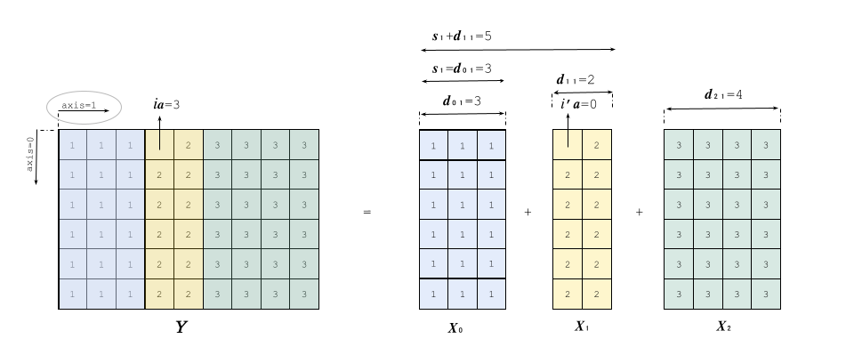

### Contents

- `concat` [operator (INT8, INT16, INT32, INT64, UINT8, UINT16, UINT32, UINT64, FP16, FP32, FP64, BFLOAT16, STRING, BOOL)](#types) 

Based on ONNX documentation version 13. 
<a id="types"></a>

## `concat` `(INT8, INT16, INT32, INT64, UINT8, UINT16, UINT32, UINT64, FP16, FP32, FP64, BFLOAT16, STRING, BOOL)`

### Signature

$Y = \text{concat}(X_{0}, \dots, X_{n})$

where
<a id="T1"></a>
- <b><span style="font-family: 'Courier New', monospace">[T1]</span></b> $X_{0}, \dots ,X_{n}$ input tensors with $n \in [0, 2^{31}-1[$
-  `Y`: output concatenated tensor

#### Restrictions

The following restriction applies to the `concat` operator for the SONNX profile:


| Restriction    | Statement | Origin |
| -------- | ------- | ------- |
| `[R1]`   | Attribute `axis` is positive. | Transient | 


#### Informal specification

The  `concat` operator concatenates the input tensors $X_{0}, \dots , X_{n}$ along the `axis` into a single output tensor `Y`. The operator `concat` is not commutative so the input tensors order impacts on the output tensor.

Let $a$ be the concatenation axis and $dX_{k,a}$ ([see traceability tag <b><span style="font-family: 'Courier New', monospace">[T6]</span></b>](#T6)) the dimension of the $X_{k}$ along the axis $a$. The mathematical definition of the operator `concat` is given hereafter. 

<a id="T2"></a>
<a id="T3"></a>
$$\begin{gathered}
 \texttt{[T2]} \text{  } Y[i_{0}, \dots , i_{r-1}] = X_{k}[i_{0}, \dots,  i_{a}', \dots, i_{r-1}], \text{  } \texttt{[T3]}  \text{  if } \text{  } \exists k \in [0, n], \text{  } s_k \le i_a \le s_k + dX_{k,a}
\end{gathered}$$


Where

- $k$ ([see traceability tag <b><span style="font-family: 'Courier New', monospace">[T3]</span></b>](#T3)) refers to the unique index of the source input tensor. Since there is always at least one input tensor ([see traceability tag <b><span style="font-family: 'Courier New', monospace">[T1]</span></b>](#T1)), $k$ is guaranteed to exist and is found by the condition:
<a id="T4"></a>
```math
 \texttt{[T4]} \text{  } s_k \leq i_{a} < s_k + dX_{k,a}
``` 
- $i_{a}'$ the local index in $X_{k}$ corresponding to the global index $i_{a}$ along dimension $a$, is defined as follows:
<a id="T5"></a>
```math
  \texttt{[T5]}\mathord{:} \text{  } i_{a}' = i_{a} - s_k
```
- with $s_k$ the cumulative offset along axis before input $X_{k}$ defined as:  
<a id="T6"></a>
```math
\texttt{[T6]}  \text{  } s_k= \sum_{j=0}^{k-1} dX_{j,a}
```

The following example illustrates the concept explained above:



Let's compute the concatenation illustrated by the example above:
```math
Y = \text{concat}(X_0, X_1, X_2) \text{ along axis}=1
```
Now, let's calculate for \( $i_a = 3$ \):
```math
Y[0, 3] = X_k[0, 3 - s_k]
```
According to the inequality ([see traceability tag <b><span style="font-family: 'Courier New', monospace">[T4]</span></b>](#T4)):
```math
s_k \leq i_a < s_k + dX_{k,a}
```
We check for which \( $k$ \) this holds ([see traceability tag <b><span style="font-family: 'Courier New', monospace">[T3]</span></b>](#T3)):
```math
s_1 \leq i_a < s_1 + dX_{1,a} \Rightarrow 3 \leq 3 < 3 + 2 = 5
```
Thus,
```math
k = 1
```
So,
```math
Y[0,3] = X_1[0, 3 - s_1] = X_1[0, 3 - 3] = X_1[0, 0]
```

You can find more examples in [tests](./tests/.) folder.


#### Error conditions
No error conditions since there is no computation for `concat` operator. 

#### Inputs


#####  **$X_{0},...,X_{n}$** (INT8, INT16, INT32, INT64, UINT8, UINT16, UINT32, UINT64, FP16, FP32, FP64, BFLOAT16, STRING, BOOL)

`concat` operator accepts a variable number of input tensors. 
<a id="T7"></a>

<b><span style="font-family: 'Courier New', monospace">[T7]</span></b> All inputs must have the same total count of dimensions. Dimension sizes must match on all axes other than the concatenation axis ([see traceability tag <b><span style="font-family: 'Courier New', monospace">[T8]</span></b>](#T8)). 

#####  Constraints

- `[C1]:` Limit on argument number
	- Statement: The number of input tensors must range from [1, $2^{31}-1$]. 
- `[C2]:` Shape consistency
    - Statement: All tensors must have the same shape except for the concatenation axis, i.e, 

<a id="T8"></a>
```math
 \texttt{[T8]} \text{  } \forall i,k \text{ and all } j \neq a: dX_{i,j} = dX_{k,j}
```
- `[C3]:` Limit on scalars
    - Statement: All input tensors must be non-scalar, meaning they must have a number of dimensions of at least one.  

```math
  \forall i,k : \sum dX_{i,j} \in [1, 2^{31}-1]
```

#### Attributes

##### `axis`: int (required)
Attribute  `axis`  determines the axis along which concatenation should done. 

##### Constraints

-   `[C1]:`Valid axis domain
    -   Statement: `axis` must be an integer identifying a valid dimension.
```math
 \forall i,k \text{  axis } \in [0, \sum dX_{i,j}-1]
```

#### Output

##### `Y` (INT8, INT16, INT32, INT64, UINT8, UINT16, UINT32, UINT64, FP16, FP32, FP64, BFLOAT16, STRING, BOOL)

Tensor  `Y`  is the output tensor of the concatenation.

##### Constraints

-   `[C1]:` Dimension of the concatenation axis
	-	 Statement: Output tensor must have the same shape as input tensors except for the concatenation axis where this dimension is the sum of the dimensions of the inputs i.e,

```math
   \forall i,k : r = \sum dX_{i,j}, \text{  }  \texttt{[T9]} \text{  } shape(Y) = (dX_0,dX_1, \dots, dX_{r-1})
```
```math
dX_j = \sum_{i=1}^{n} dX_{i,j} \text{ if } j=a \text{ and } d_{j} = d_{1,j} \text{ otherwise }
```      


#### Formal specification
The formal specification of the `concat` operator using the Why3 language is provided in the folder [why3](./why3/.). This specification ensures the consistency and desired behavior of the operator within the constraints described.

#### Numerical Accuracy
`concat` operator does not perform numerical operations thus numerical accuracy issues are not considered here. 
