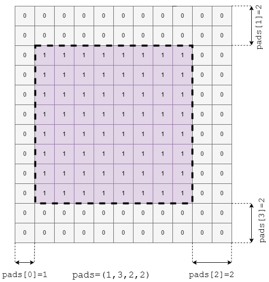
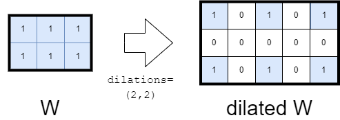

# Conventions
## Notations
- Notations $h(X)$ and $w(X)$ respectively denote the _height_ and the _width_ of tensor $X$. If the tensor represents an image, $h(X)$ and $w(X)$ represent the _height_ and the _width_ of the image.
## Usage of fonts
- Inputs, outputs, and attributes are represented using a non-serif font. For instance, the "pads" attribute is represented by `pads`.
## Tags
- Restrictions with respect to the ONNX standard are indicated in the text with the tag `[Ri]` where `i` is a number.\
A synthesis of all restrictions is given in section "Restrictions".
## Types
- Operators are first described for values in the domain of real numbers. A specific description is given for the other types (floats, integers).
 
# `conv` operator (real)

### Restrictions
The following restrictions apply to the `conv` operator for the SONNX profile:
- The number of spatial axes of the tensors is restricted to 2 `[R1]`
- Attribute `auto_pad` is restricted to `NOTSET` `[R2]`
- Attribute `group` is restricted to 1 (standard convolution) or to the number of channels of the input tensor (depthwise convolution) `[R3]`
- All attributes shall be be given explicit values (i.e., default values for attributes are not supported) `[R4]`
- The number of elements in the `strides` list is equal to 2. `[R5]`

### Signature
`Y = conv(X,W,[B])`
where
- `X`: input tensor
- `W`: convolution kernel
- `B`: optional bias
- `Y`: output tensor
  
#### Informal specification

Operator `conv` computes the convolution of the input tensor `X` with the kernel `W` and adds bias `B` to the result. Two types of convolutions are supported: _standard convolution_ and _depthwise convolution_ `[R3]`. The SONNX profile limits the number of spatial axes to 2 `[R1]`.

##### Standard convolution
A _standard convolution_ applies a kernel (also called "filter") to the input tensor, aggregating information accross both spatial axes and channels. For a given output channel, the kernel operates accross all input channels and all contributions are summed to produce the output. This corresponds to the case where `group`= 1. 

The mathematical definition of the operator without padding is given hereafter.
The formal specification is given in Section <a href="#sec:conv_formal" data-reference-type="ref" data-reference="sec:conv_formal">Formal specification</a>. When considering padding, the same formula applies, in which `X` represents the padded version of the actual input `X`.

$$\begin{gathered}
    Y[b, c, m, n] = \sum_{i=0}^{fm(W)-1} \sum_{j=0}^{h(W)-1} \sum_{z=0}^{w(W)-1} \\ (X[b,i,m \cdot strides[0]+ j \cdot dilations[0], n \cdot strides[1]+ z \cdot dilations[1]] \cdot W[c, i, j, z]) \\ + B[c]
\end{gathered}$$

Where
- $b$ is the batch index, $b \in [0,b(Y)-1]$, $b(Y)$ is the batch size of output `Y`
- $c$ is the data channel, $c \in [0,c(Y)-1]$, $c(Y)$ is the number of data channels of output `Y`
- $m \in [0,h(Y)-1]$ is the index of the first spatial axis of output `Y`
- $n \in [0,w(Y)-1]$ is the index of the second spatial axis of output `Y`
- $fm(W)$ is the number of feature maps of kernel `W`
- $h(W)$ is the size of the first spatial axis of kernel `W`
- $w(W)$ is the sizes of the second spatial axis of kernel `W`

`strides` and `dilations` are attributes of the operator. They are described later in this section.

The effect of the operator is illustrated on the following figure. In this example
- shape of `Y` is $1\times 1 \times 4 \times 4$ (batch size is 1, number of data channels is 1)
- shape of `X` is $1 \times 1 \times 8 \times 8$ (batch size is 1, number of data channels is 1)
- shape of `W` is $1 \times 1 \times 3 \times 2$  (number of data channels is 1)
- shape of `B` is $1$
- `pads` is  set to (1,2,2,2) (1 column on the left, 2 columns on the right, 2 rows on the top, 2 rows on the bottom)
- `dilations` is set to (2,2)
- `strides` is set to (2,3)


The following figure shows the case where the number of channels of `X` is 3. In this example:
- shape of `Y` is $1 \times 1 \times 4 \times 4$ 
- shape of `X` is $1 \times 3 \times 8 \times 8$ 
- shape of `W` is $1 \times 3 \times 3 \times 2$
- shape of `B` is $1$
- `groups` is  set to 1 
- the other attributes have the same values as in the previous figure.

 


##### Depthwise convolution
A _depthwise convolution_ applies a specific kernel (or "filter") to each input channels. The number of output channels is equal to the number of input channels.  This corresponds to the case where `group`= $c(X)$. 

The mathematical definition is given hereafter:

$$\begin{gathered}
    Y[b, c, m, n] = \sum_{j=0}^{h(W)-1} \sum_{z=0}^{w(W)-1}\\ (X[b, c, m \cdot strides[0] + j \cdot dilations[0], n \cdot strides[1] + z \cdot dilations[1]] \cdot W[c, 0, j , z] ) + B[c]
\end{gathered}$$

Variables are defined as for the standard convolution.
The effect of the operator is illustrated on the following figure. In this example,
- shape of `Y` is $1\times 3 \times 4 \times 4$ 
- shape of `X` is $1 \times 3 \times 8 \times 8$
- shape of `W` is $3 \times 1 \times 3 \times 2$
- shape of `B` is $3$
- `groups` is  set to 3
- the other attributes have the same values as in the previous figure.


#### Inputs and outputs

##### `X`

Tensor `X` is the input tensor on which convolution with kernel `W` is computed.

The shape of tensor `X` is $b(X) \times c(X) \times h(X) \times w(X)$.

###### Constraints

- (C1) Number of spatial axes of tensor `X`
    - Statement: The number of spatial axes of tensor `X` is 2. `[R1]`
    - Rationale: This restriction is intoduced to simplify the implementation considering the actual industrial use cases.
- (C2) <a name="channel_consist"></a> Consistency between the number of channels of `X` and `W` 
    - Statement:  $c(X)=fm(W)$
- (C3) <a name="shape_consist"></a> Consistency between the shape of tensors `X`, `W`, `Y` and attributes `pads`, `dilations` and `strides`
    <span id="it:shape_consist" label="it:shape_consist"></span>
    - Statement: 
       *  $$\left\lfloor{\frac{alpha-(dilations[0] \cdot h(W)-1)}{strides[0]}} \right\rfloor +1 = h(Y) \mbox{ with }  alpha=h(X)+pads[0]+pads[2]$$
         
      and
      
       * $$\left\lfloor{\frac{beta-(dilations[1] \cdot w(W)-1)}{strides[1]}} \right\rfloor +1 = w(Y)  \mbox{ with } beta=w(X)+pads[1]+pads[3]$$
    - Rationale: The size of the output is determined by the number of times the kernel can be applied on a given spatial axis.
- (C4) Axis denotations
    - Statement: If axis denotation is in effect, the operation expects input data tensor to have axis denotation \[`DATA_BATCH`, `DATA_CHANNEL`, `DATA_FEATURE`, `DATA_FEATURE`\].
    - Rationale: Denotation convention

##### `W`

Tensor `W` is the convolution kernel.

The shape of tensor `W`is $(c(W) \times fm(W) \times h(W) \times w(W))$, where
- $c(W)$ is the number of output channels or number of feature maps
- $fm(W)$ is the number of input channels
- $h(W)$ and $w(W)$ are the sizes of the kernel for the two spatial axes.

###### Constraints
- (C1) Consistency between the number of channels of `X` and `W`
   - Statement: [See constraint (C2) of X](#channel_consist).
- (C2) Consistency between the shape of tensors `X`, `W`, `Y` and attributes `pads`, `dilations` and `strides`.
   - Statement: [See constraint (C3) of X](#shape_consist).
- (C3) <a name="kernel_shape_w"></a> Consistency between `W` and `kernel_shape`
    <span id="it:kernel_shape_w" label="it:kernel_shape_w"></span> 
   - Statement:  The size of `W` for an axis must bve equal to the value of `kernel_shape` for that axis
   - Rationale: `kernel_shape` represents the shape of `W`, where `kernel_shape[0]` = $w(W)$ and `kernel_shape[1]` = $h(W)$.
- (C4) Axis denotations
    - Statement: If axis denotation is in effect, the operation expects the weight tensor to have axis denotation \[`FILTER_OUT_CHANNEL`, `FILTER_IN_CHANNEL`, `FILTER_SPATIAL`, `FILTER_SPATIAL`\].
    - Rationale: Denotation convention

##### `B`

Tensor `B` is the bias. 

The shape of tensor `B`is $c(B)$.

###### Constraints
- (C1) Consistency between the number of channels of `B` and `W`
    - Statement:  $c(B) = fm(W)$.

#### Attributes

##### `strides`: list of int

Attribute `strides` determines how the kernel is applied on tensor `X` during the convolution.

For instance, with $\mbox{\texttt{stride}}[0]=2$ and $\mbox{\texttt{stride}}[1]=3$, the kernel is applied to data 2 units on right in the first spatial axis and to data 3 units down in the second spatial axis at each step of the convolution.

> The previous sentence is not clear...

The effect of the `strides` attribute is illustrated on the following figure. In this example, `strides`=(2,3).


###### Constraints
- (C1) Size of `strides`
    - Statement: the number of elements in the `strides` list is equal to 2. `[R5]`
    - Rationale: The SONNX profile only supports 2 spatial axes. 
- (C2) Value domain
    - Statement: `strides` is a list of strictly positive integers.
    - Rationale: Stride values are used in the denominator of expression in [constraint (C3) of X](#shape_consist) 
- (C3) Consistency between the shape of tensors `X`, `W`, `Y` and attributes `pads`, `dilations` and `strides`.
    - Statement: [See constraint (C3) of X](#shape_consist)

##### `auto_pad` : string

The `auto_pad` attribute determines if and how automatic padding is done for the input tensor X.

###### Constraints
- (C1) Explicit padding
    - Statement: `auto_pad` shall be set to `NOTSET` `[R3]`
    - Rationale: The SONNX profile imposes explicit padding.

##### `pads`: list of int

Attribute `pads` determines the padding at the beginning and end along each spatial axis of the input tensor `X`.

`pads` is a list of the form (`x1_begin`, `x2_begin`,..., `x1_end`, `x2_end`,...), where `xi_begin` is the number of elements (possibly zero) added at the beginning of axis $i$ and `xi_end` is the number of elements added at the end of axis $i$.

The padding value is 0.

The effect of the `pads` attribute is illustrated on the following figure. In this example,  `pads`=(1,3,2,2).



###### Constraints
- (C1) Value domain
    - Statement: `pads` is a list of positive or null integers.
    - Rationale: A padding value gives a number of elements to be added to some spatial axis. This is positive[^2].
- (C2) Consistency between the shape of `X` and the length of `pads`
    - Statement: The length of the `pads` list is two times the number of spatial axes of `X`
    - Rationale: Padding shall be given for all spatial axes, and a beggining value and an end value must be given for each axis.
- (C3) Consistency between the shape of tensors `X`, `W`, `Y` and attributes `pads`, `dilations` and `strides`.
    - Statement: [See constraint (C3) of X](#shape_consist)

##### `dilations`: list of int

Attribute `dilations` specifies the spacing between the kernel elements for each spatial axis of the filter `W`. It is a list of non-null integer values where each value gives the dilation factor for spatial axis $i$. If the dilation factor is greater than 1 for axis $i$, then the kernel points are spaced out by the dilation factor for that axis. 

The spacing value is 0.

The effect of the `dilations` attribute for a tensor with two spatial axes is depicted on the following figure. In this example, `dilations`=(2,2). 




###### Constraints
- (C1) Value domain
    - Statement: `dilations` is a list of strictly positive integers
- (C2) Relation between `dilations` and `W`
    - Statement: The length of the `dilations` list is equal to number of spatial axes of `W`.
    - Rationale: Dilation is defined for all spatial axes of `W`.
- (C3) Consistency between the shape of tensors `X`, `W`, `Y` and  attributes `pads`, `dilations` and `strides`.
    - Statement: [See constraint (C3) of X](#shape_consist)

##### `group`: int 

This attribute specifies the number of groups the input channels and output channels are divided into. When `group`=1, a standard convolution is performed.
When group is greater than 1, convolution is computed for each group separately with a specific set of filters.

The effect of the `group` attribute for a tensor with two spatial axes is depicted on the following figure. In this example `group`=3.


(Taken from https://eli.thegreenplace.net/2018/depthwise-separable-convolutions-for-machine-learning)

In the example, with `group` set to 3 and an input `X` and an output `Y` with 3 channels, the input and output channels will be divided into 3 groups of 1 channel.

###### Constraints
- (C1) Support for standard and depthwise convolutions
    - Statement: `group`=1 (standard convolution) or `group`$=c(X)$ (depthwise convolution)
    - Rationale: SONNX only supports standard and depthwise convolutions

##### `kernel_shape`: list of int

This parameter specifies the shape of the convolution kernel `W`.

###### Constraints.

- (C1) Value domain
    - Statement: `kernel_shape` is a list of strictly positive integers
    - Rationale: A dimension is always positive and cannot be null.
- (C2) Consistency between `W` and `kernel_shape`
    - Statement: [See constraint (C3) of W](#kernel_shape_w)

#### Outputs

##### `Y`

The size of the output `Y` will be $(b(Y) \times c(Y) \times h(Y) \times w(Y))$ where
- $b(Y)$ is the number of batches
- $c(Y)$ is the number of channels
- $h(Y)$ and $w(Y)$ are the sizes of the output for the two spatial axes

###### Constraints.
- (C1) Consistency between the number of channels of `B` and `Y`
    - Statement:  HYPERLIEN VERS W / constraint kernel shape
- (C2) Consistency between the shape of tensors `X`, `W`, `Y`, attributes `pads` and `strides`,
    - Statement: [see constraint (C3) of X](#shape_consist)

#### Formal specification

The following code specifies the `conv` operator using the Why3 language[^3].

###### Nota: the specification does not cover all attributes values. Currently, there is no padding (`pads` is not set and `auto_pad = NOTSET`) and `dilations` is not set.

``` ocaml
module Conv
  use int.Int
  use real.RealInfix
  use array.Array
  use int.ComputerDivision
  use real.Truncate
  use real.FromInt

  type input_tensor = {
    x: array real;
    x_l: int;
    x_c: int;
    x_b: int;
    x_ch: int;
  }

    type convolution_kernel = {
    w: array real;
    w_l: int;
    w_c: int;
    w_ch_in: int;
    w_ch_out: int;
  }
  
  type bias_tensor = {
  b: array real;
  b_c: int;
  }
  
  type attributes = {
  stride: array int;
  pads: array int;
  auto_pad: int;
  dilation: array int; 
  }

  type output_tensor = {

   y_b: int;
   y_ch: int;
   y_l: int;
   y_c: int;

  }

  function conv_size (out: output_tensor) : int =
    out.y_b * out.y_ch * out.y_l * out.y_c

  predicate conv_result
    (inp: input_tensor)
    (kernel: convolution_kernel)
    (bias: bias_tensor)
    (attr: attributes)
    (out: output_tensor)
    (res: array real)
    (bi ci hi wi: int)
    (ci_in ki_h ki_w: int) =
     let y_idx = bi * (out.y_ch * out.y_l * out.y_c) + ci * (out.y_l * out.y_c) + hi * out.y_c + wi in
     let x_l_idx = hi * attr.stride[0] + ki_h * attr.dilation[0] - attr.pads[0] in
     let x_c_idx = wi * attr.stride[1] + ki_w * attr.dilation[1] - attr.pads[1] in
                                
     (0 <= x_l_idx < inp.x_l /\ 0 <= x_c_idx < inp.x_c) ->
        let x_idx = bi * (inp.x_ch * inp.x_l * inp.x_c) + ci_in * (inp.x_l * inp.x_c) + x_l_idx * inp.x_c + x_c_idx in
        let w_idx = ci * (kernel.w_ch_in * kernel.w_l * kernel.w_c) + ci_in * (kernel.w_l * kernel.w_c) + ki_h * kernel.w_c + ki_w in
        res.elts (y_idx) = bias.b[ci] +. (inp.x[x_idx] *. kernel.w[w_idx])

  val conv (inp: input_tensor)(kernel: convolution_kernel)(bias: bias_tensor)(attr: attributes)(out: output_tensor): array real
    requires{inp.x_ch = out.y_ch = kernel.w_ch_in = bias.b_c} 
    requires{out.y_l = (div (inp.x_l + attr.pads[0] + attr.pads[2] - (attr.dilation[0] * kernel.w_l)) attr.stride[0]) + 1}
    requires{out.y_c = (div (inp.x_c + attr.pads[1] + attr.pads[3] - (attr.dilation[1] * kernel.w_c)) attr.stride[1]) +1}
    requires { inp.x_l > 0 /\ inp.x_c > 0 /\ inp.x_ch > 0 /\ inp.x_b > 0}
    requires{kernel.w_l > 0 /\ kernel.w_c > 0 /\ kernel.w_ch_in > 0 /\ kernel.w_ch_out > 0}
    requires { out.y_b > 0 /\ out.y_ch > 0 /\ out.y_l > 0 /\ out.y_c > 0}
    requires { length inp.x = inp.x_l * inp.x_c * inp.x_ch * inp.x_b}
    requires{length kernel.w = kernel.w_l * kernel.w_c * kernel.w_ch_in * kernel.w_ch_out}
    requires{inp.x_l >= kernel.w_l}
    requires{inp.x_c >= kernel.w_c}
    requires{length bias.b = bias.b_c}
    requires{length attr.stride = 2}
    requires{length attr.dilation = 2}
    requires{length attr.pads = 4}
    requires{forall i. 0 <= i < length attr.pads -> attr.pads[i] = 0}
    requires{forall j. 0 <= j < length attr.dilation -> attr.dilation[j] >= 1}
    requires{forall k. 0 <= k < length attr.stride -> attr.stride[k] >= 1}
    ensures { length result = conv_size out }
    ensures { forall bi ci hi wi ci_in ki_h ki_w: int.
              0 <= bi < out.y_b ->
              0 <= ci < out.y_ch ->
              0 <= hi < out.y_l ->
              0 <= wi < out.y_c ->
              0 <= ci_in < kernel.w_ch_in ->
              0 <= ki_h < kernel.w_l ->
              0 <= ki_w < kernel.w_c -> conv_result inp kernel bias attr out result bi ci hi wi ci_in ki_h ki_w }

end


module Test_conv
  use int.Int
  use real.RealInfix
  use array.Array
  use int.ComputerDivision
  use real.Truncate
  use real.FromInt
  use Conv

let test_conv () =
  let inp_x = Array.make 9 1.0 in
  let inp = { x = inp_x; x_l = 3; x_c = 3; x_b = 1; x_ch = 1 } in
  
  let kernel_w = Array.make 4 0.0 in  
  let kernel = { w = kernel_w; w_l = 2; w_c = 2; w_ch_in = 1; w_ch_out = 1 } in
  
  let bias_b = Array.make 1 0.5 in 
  let bias = { b = bias_b; b_c = 1 } in
  let stride = Array.make 2 1 in  (* Stride of 1 *)
  let pads = Array.make 4 0 in  (* No padding *)
  let dilation = Array.make 2 1 in  (* Dilation of 1 *)
  let attr = { stride = stride; pads = pads; auto_pad = 0; dilation = dilation } in
  let out_h = (div (inp.x_l + pads[0] + pads[2] - (dilation[0] * kernel.w_l)) stride[0]) + 1 in
  let out_w = (div (inp.x_c + pads[1] + pads[3] - (dilation[1] * kernel.w_c)) stride[1]) + 1 in
  let out = { y_b = 1; y_ch = 1; y_l = out_h ; y_c = out_w  } in
  (* Call the conv function *)
  let result = conv inp kernel bias attr out in
  let actual_result = result.elts 0 in
  assert { conv_result inp kernel bias attr out result 0 0 0 0 0 0 0} ;
  assert { actual_result =  0.5 } ;
  ()

end
```

Another formal specification of the `conv` operator using Frama-C
language[^4] is presented below.

``` objectivec
#include <stdio.h>
#include <stdlib.h>
#include <string.h>

/* Data Structures */
typedef struct {
    float *x;
    int x_l, x_c, x_b, x_ch;
} input_tensor;

typedef struct {
    float *w;
    int w_l, w_c, w_ch_in, w_ch_out;
} convolution_kernel;

typedef struct {
    float *b;
    int b_c;
} bias_tensor;

typedef struct {
    int *stride;
    int *pads;
    int *dilation;
} attributes;

typedef struct {
    float *y;
    int y_b, y_ch, y_l, y_c;
} output_tensor;
/*@
 requires \valid_read(pads + (0 .. 3));
 requires \valid_read(stride + (0 .. 1));
 requires \valid_read(result + (0 .. 3));
 requires x_l > 0 && x_c > 0 && w_l > 0 && w_c > 0 && y_l > 0 && y_c > 0;
 assigns result[0 .. 3];
 behavior empty_or_notset:
    assumes (auto_pad == "")  || (auto_pad == "NOTSET");
    ensures \forall integer i; 0 <= i < 4 ==> result[i] == pads[i];

behavior valid:
    assumes (auto_pad == "VALID") ;
    ensures \forall integer i; 0 <= i < 4 ==> result[i] == 0;

behavior same_upper:
    assumes (auto_pad == "SAME_UPPER") ;
    ensures \let pad_l = (y_l - 1) * stride[0] + w_l - x_l;
            \let pad_c = (y_c - 1) * stride[1] + w_c - x_c;
            ((pad_l  % 2 == 0) && (pad_c  % 2 == 0)) ==> 
                (result[0] == (pad_c / 2) && result[1] == (pad_l / 2) && result[2] == (pad_c / 2) && result[3] == (pad_l / 2)) &&
            (pad_l % 2 != 0) && (pad_c % 2 != 0) ==> 
            (result[0] == (pad_c / 2) && result[1] == (pad_l / 2) && result[2] == ((pad_c / 2) + 1) && result[3] == ((pad_l / 2) + 1));   

behavior same_lower:
    assumes (auto_pad == "SAME_LOWER");
    ensures \let pad_l = (y_l - 1) * stride[0] + w_l - x_l;
            \let pad_c = (y_c - 1) * stride[1] + w_c - x_c;
            ((pad_l % 2 == 0) && (pad_c % 2 == 0)) ==> 
                (result[0] == (pad_c / 2) &&  result[2] == (pad_c / 2) && result[1] == (pad_l / 2) && result[3] == (pad_l == 2)) &&
            ((pad_l % 2 != 0) && (pad_c % 2 != 0)) ==> 
                (result[0] == ((pad_c / 2) + 1) && result[1] == ((pad_l / 2) + 1) && result[2] == (pad_c / 2) && result[3] == (pad_l / 2));
complete behaviors empty_or_notset, valid, same_upper, same_lower;
disjoint behaviors empty_or_notset, valid, same_upper, same_lower;            
*/
void compute_pad(const char* auto_pad, int pads[4], int stride[2], int x_l, int x_c, int w_l, int w_c, int y_l, int y_c, int result[4]) {
    int pad_l, pad_c;

    if ((auto_pad == "")  || (auto_pad == "NOTSET")) {
        for (int i = 0; i < 4; i++) {
            result[i] = pads[i];
        }
    } else if ((auto_pad == "VALID")) {
        for (int i = 0; i < 4; i++) {
            result[i] = 0;
        }
    } else if ((auto_pad == "SAME_UPPER")) {
        pad_l = (y_l - 1) * stride[0] + w_l - x_l;
        pad_c = (y_c - 1) * stride[1] + w_c - x_c;

        if ((pad_l % 2 == 0) && (pad_c % 2 == 0)) {
            result[0] = result[2] = pad_c / 2;
            result[1] = result[3] = pad_l / 2;
        } else if ((pad_l % 2 != 0) && (pad_c % 2 != 0)) {
            result[0] = pad_c / 2;
            result[1] = pad_l / 2;
            result[2] = (pad_c / 2) + 1;
            result[3] = (pad_l / 2) + 1;
        }
    } else if ((auto_pad == "SAME_LOWER")) {
        pad_l = (y_l - 1) * stride[0] + w_l - x_l;
        pad_c = (y_c - 1) * stride[1] + w_c - x_c;

        if ((pad_l % 2 == 0) && (pad_c % 2 == 0)) {
            result[0] = result[2] = pad_c / 2;
            result[1] = result[3] = pad_l / 2;
        } else if ((pad_l % 2 != 0) && (pad_c % 2 != 0)) {
            result[0] = (pad_c / 2) + 1;
            result[1] = (pad_l / 2) + 1;
            result[2] = pad_c / 2;
            result[3] = pad_l / 2;
        }
    }
}

/* Function to compute the convolution */
//void compute_pad(int auto_pad, int *pads, int *stride, int x_l, int x_c, int w_l, int w_c, int y_l, int y_c, int *result);

/*@
  requires \valid_read(inp.x + (0..(inp.x_l*inp.x_c*inp.x_b*inp.x_ch)-1));
  requires \valid_read(kernel.w + (0..(kernel.w_l*kernel.w_c*kernel.w_ch_in*kernel.w_ch_out)-1));
  requires \valid_read(bias.b + (0..bias.b_c-1));
  requires \valid_read(attr.stride+(0..1));
  requires \valid_read(attr.pads+(0..3));
  requires \valid_read(attr.dilation+(0..1));
  requires inp.x_ch == out.y_ch;
  requires out.y_ch == kernel.w_ch_in;
  requires kernel.w_ch_in == bias.b_c;
  requires out.y_l == ((inp.x_l + attr.pads[0] + attr.pads[2] - (attr.dilation[0] * kernel.w_l )) / attr.stride[0]) + 1;
  requires out.y_c == ((inp.x_c + attr.pads[1] + attr.pads[3] - (attr.dilation[1] * kernel.w_c )) / attr.stride[1]) + 1;
  requires inp.x_l > 0 && inp.x_c > 0 && inp.x_ch > 0 && inp.x_b > 0;
  requires kernel.w_l > 0 && kernel.w_c > 0 && kernel.w_ch_in > 0 && kernel.w_ch_out > 0;
  requires bias.b_c > 0;
  requires out.y_l > 0 && out.y_c > 0 && out.y_ch > 0 && out.y_b > 0;
  requires inp.x_l >= kernel.w_l;
  requires inp.x_c >= kernel.w_c;
  requires \forall integer i; 0 <= i < 4 ==> attr.pads[i] >= 0;
  requires \forall integer i; 0 <= i < 2 ==> attr.dilation[i] >= 1;
  requires \forall integer i; 0 <= i < 2 ==> attr.stride[i] >= 1;


  assigns out.y[0..(out.y_b * out.y_ch * out.y_l * out.y_c)-1];

  ensures \forall integer bi, ci, hi, wi, ci_in, ki_h, ki_w; 
            0 <= bi < out.y_b ==>
                0 <= ci < out.y_ch ==>
                    0 <= hi < out.y_l ==>
                        0 <= wi < out.y_c ==>  
                            0 <= ci_in <kernel.w_ch_in ==>
                                0 <= ki_h < kernel.w_l ==>
                                    0 <= ki_w < kernel.w_c ==> 
                                        (0 <= hi * attr.stride[0] + ki_h * attr.dilation[0] - attr.pads[0]) && 
                                        (hi * attr.stride[0] + ki_h * attr.dilation[0] - attr.pads[0]  < inp.x_l) && 
                                        (0 <= wi * attr.stride[1] + ki_w * attr.dilation[1] - attr.pads[1]) && 
                                        (wi * attr.stride[1] + ki_w * attr.dilation[1] - attr.pads[1] < inp.x_c) ==>
                                            out.y[bi * (out.y_ch * out.y_l * out.y_c) + ci * (out.y_l * out.y_c) + hi * out.y_c + wi] == inp.x[bi * (inp.x_ch * inp.x_l * inp.x_c) + ci_in * (inp.x_l * inp.x_c) + (hi * attr.stride[0] + ki_h * attr.dilation[0] - attr.pads[0]) * inp.x_c + ( wi * attr.stride[1] + ki_w * attr.dilation[1] - attr.pads[1])] * kernel.w[ci * (kernel.w_ch_in * kernel.w_l * kernel.w_c) + ci_in * (kernel.w_l * kernel.w_c) + ki_h * kernel.w_c + ki_w] + bias.b[ci];
                          
              
                          
                           
                                


  */
float* conv(input_tensor inp, convolution_kernel kernel, bias_tensor bias, attributes attr, output_tensor out) {
    
    out.y_l = ((inp.x_l + attr.pads[0] + attr.pads[2] - (attr.dilation[0] * kernel.w_l )) / attr.stride[0]) + 1;
    out.y_c = ( (inp.x_c + attr.pads[1] + attr.pads[3] - (attr.dilation[1] * kernel.w_c )) / attr.stride[1]) +1;
    int y_size = out.y_b * out.y_ch * out.y_l * out.y_c;
    out.y = (float *)malloc(y_size * sizeof(float));

    if (out.y == NULL) {
        fprintf(stderr, "Memory allocation failed\n");
        exit(EXIT_FAILURE);
    }

    // Compute padding
   // compute_pad(attr.auto_pad, attr.pads, attr.stride, inp.x_l, inp.x_c, kernel.w_l, kernel.w_c, out.y_l, out.y_c, attr.pads);

    // Initialize result tensor to bias values
    for (int bi = 0; bi < out.y_b; ++bi) {
        for (int ci = 0; ci < out.y_ch; ++ci) {
            for (int hi = 0; hi < out.y_l; ++hi) {
                for (int wi = 0; wi < out.y_c; ++wi) {
                    int y_idx = bi * (out.y_ch * out.y_l * out.y_c) + ci * (out.y_l * out.y_c) + hi * out.y_c + wi;
                    out.y[y_idx] = bias.b[ci];
                }
            }
        }
    }

    // Convolution computation
    for (int bi = 0; bi < out.y_b; ++bi) {
        for (int ci = 0; ci < out.y_ch; ++ci) {
            for (int hi = 0; hi < out.y_l; ++hi) {
                for (int wi = 0; wi < out.y_c; ++wi) {
                    int y_idx = bi * (out.y_ch * out.y_l * out.y_c) + ci * (out.y_l * out.y_c) + hi * out.y_c + wi;

                    for (int ci_in = 0; ci_in < kernel.w_ch_in; ++ci_in) {
                        for (int ki_h = 0; ki_h < kernel.w_l; ++ki_h) {
                            for (int ki_w = 0; ki_w < kernel.w_c; ++ki_w) {
                                int x_l_idx = hi * attr.stride[0] + ki_h * attr.dilation[0] - attr.pads[0];
                                int x_c_idx = wi * attr.stride[1] + ki_w * attr.dilation[1] - attr.pads[1];

                                if (x_l_idx >= 0 && x_l_idx < inp.x_l && x_c_idx >= 0 && x_c_idx < inp.x_c) {
                                    int x_idx = bi * (inp.x_ch * inp.x_l * inp.x_c) + ci_in * (inp.x_l * inp.x_c) + x_l_idx * inp.x_c + x_c_idx;
                                    int w_idx = ci * (kernel.w_ch_in * kernel.w_l * kernel.w_c) + ci_in * (kernel.w_l * kernel.w_c) + ki_h * kernel.w_c + ki_w;

                                    if (x_idx < inp.x_l * inp.x_c * inp.x_ch * inp.x_b && w_idx < kernel.w_l * kernel.w_c * kernel.w_ch_in * kernel.w_ch_out) {
                                        out.y[y_idx] += inp.x[x_idx] * kernel.w[w_idx];
                                    }
                                }
                            }
                        }
                    }
                }
            }
        }
    }

    return out.y;
}
```

# Graph execution semantics

<div class="note">

Elements of the execution semantics is given on the [IR (Intermediate
Representation) page](https://onnx.ai/onnx/repo-docs/IR.html) of the
ONNX web site. In addition, a Python “reference implementation” is also
provided (see <https://onnx.ai/onnx/api/reference.html>). The source
code of this implementation can be found at
<https://github.com/onnx/onnx/tree/main/onnx/reference>.

Very informally, the semantics is pretty simple: each operator (or
function) is called according to its position in the topological sorting
of the operators. The topological order is a partial order that ensures
that an operator is executed only when its inputs are available. Being a
partial order, it means that several valid orders exist for a given
graph. Normally (?) each order should generate the same result, even in
the presence of floating point operations.

The Python code to execute a graph is given in class
[`ReferenceEvaluator`](https://github.com/onnx/onnx/blob/main/onnx/reference/reference_evaluator.py)).
After having processed the inputs and the initializers (i.e., fed the
`results` dictorionary with these data), the nodes are executed in
sequence. For each operator, the interpretor checks that its inputs are
in the `results` dictionary. If they are not, an error is raised (if the
operators are listed in topological order, this situation should not
occur). Otherwise, the operator is simply executed (method `run`) with
or without a context (composed of the current results) depending on the
type of operators. (Check that this does not create a dependency to the
total order of operators.)

</div>

### Informal specification

<div class="note">

The semantics of an ONNX model is given in Section "Model Semantics" of
the [Intermediate
Representation](https://github.com/onnx/onnx/blob/main/docs/IR.md) page.
Basically, an inference-model is a stateless function (except possibly
for some specific nodes such as a random-generation node) represented by
an acyclic `graph` of nodes. The `graph` is mainly represented by a set
of inputs and outputs and a topologically sorted list of nodes. Each
node represents a call to an operator or a function. A `function` is
itself a graph.

Note that the types of inputs and outputs are not systematically
required because they can be inferred. In our case, I guess that we will
forbib shape inference and rely on static tensor shapes (or, at least,
shape inference can be bone before serializing the model). The proecss
of shape inference is described in Section  [ONNX Shape
Inference](https://onnx.ai/onnx/repo-docs/ShapeInference.html).

</div>

### Formal specification

*To be completed.*

[^1]: At least in a first phase...

[^2]: Note: in the ONNX runtime implementation, the padding value may be
    negative, which corresponds to reducing the size of the tensor.

[^3]: See [Why3 documentation](https://www(W)hy3.org/)

[^4]: See [Frama-C
    documentation](https://www.frama-c.com/html/documentation.html)
