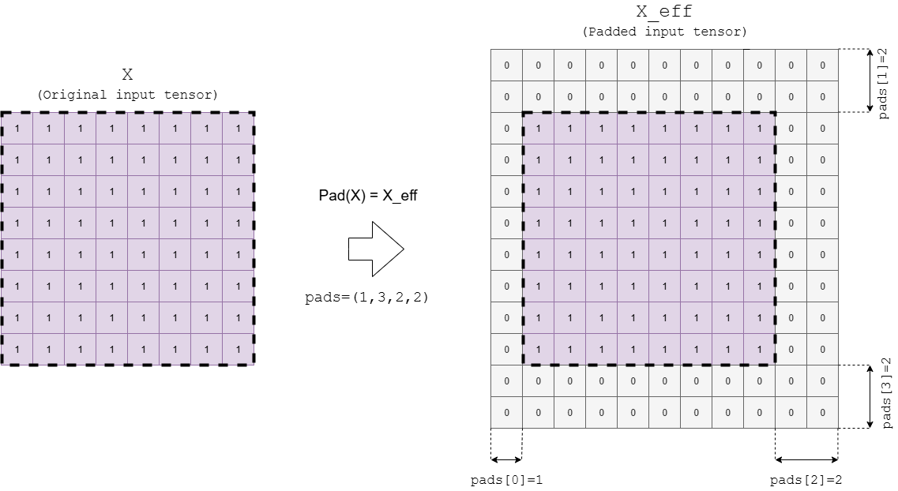
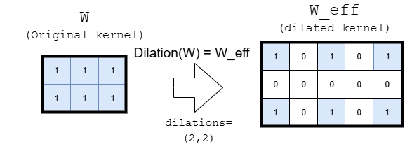
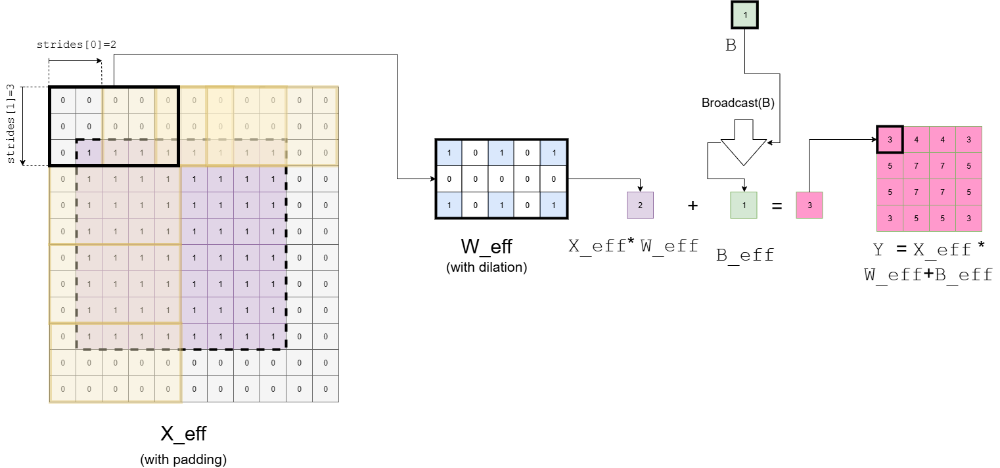

# `conv` operator
### Contents
- `Convolution` operator for type real.

## `Conv`  `(real)`

### Signature
`Y = conv(X,W,[B])`
where
- `X`: input tensor
- `W`: convolution kernel
- `B`: optional bias
- `Y`: output tensor

#### Restrictions
The following restrictions apply to the `conv` operator for the SONNX profile:

| Restriction    | Statement | Origin |
| -------- | ------- | ------- |
| `R1` | Input tensor `X` has 2 spatial axes | Transient |
| `R2` | Attribute `auto_pad` is set to `NOTSET`  | [No default values](../../../deliverables/reqs/reqs.md#no_default_value) |
| `R3` | Attribute `group` is set to 1 (standard convolution) or to the number of channels of the input tensor `X` (depthwise convolution) | Transient | 

 #### Informal specification
  
Operator `conv` computes the convolution of the input tensor `X` with the kernel `W` and adds bias `B` to the result. Two types of convolutions are supported: _standard convolution_ and _depthwise convolution_.

##### Standard convolution
A _standard convolution_ applies a kernel (also called "filter") to the input tensor, aggregating information accross both spatial axes and channels. For a given output channel, the kernel operates accross all input channels and all contributions are summed to produce the output. This corresponds to the case where attribute `group`= 1. 

The mathematical definition of the operator is given hereafter:

$$\begin{gathered}
    Y[b, c, m, n] = \sum_{i=0}^{dW_1-1} \sum_{j=0}^{dW_2-1} \sum_{z=0}^{dW_3-1} \\ (X_p[b,i,m \cdot \text{strides}[0]+ j , n \cdot \text{strides}[1]+ z ] \cdot W_d[c, i, j, z]) \\ + B_b[c]
\end{gathered}$$

Where
- $b \in [0,dY_0-1]$ is the batch index. $dY_0$ is the batch size of output `Y`
- $c \in [0,dY_1-1]$ is the data channel. $dY_1$ is the number of data channels of output `Y`
- $m \in [0,dY_2-1]$ is the index of the first spatial axis of output `Y`
- $n \in [0,dY_3-1]$ is the index of the second spatial axis of output `Y`
- $dW_1$ is the number of feature maps of kernel `W`
- $dW_2$ is the size of the first spatial axis of kernel `W`
- $dW_3$ is the size of the second spatial axis of kernel `W`
- `strides` is an attribute of the operator. It will be described later in this section.
- $X_{p} = \text{pad}(X)$ is the padded version of the input tensor `X`. Function $\text{pad}$ applies zero-padding as specified by the pads attribute (see ONNX `Pad` operator).
- $W_{d} = \text{dilation}(W)$ is the dilated version of the kernel `W`. Function $\text{dilation}$ expands the kernel by inserting spaces between its elements. Its definition is given later.
- $B_{b} = \text{broadcast}(B)$ is the broadcasted version of bias `B`.  Function $\text{broadcast}$ replicates the bias value across the spatial dimensions and batch dimension of the output `Y`.  Its definition is given later.

The effect of the operator is illustrated on the following figure. In this example
- shape of `Y` is ($1, 1, 4, 4$) (batch size is 1, number of data channels is 1)
- shape of `X` is ($1, 1, 8, 8$) (batch size is 1, number of data channels is 1)
- shape of `W` is ($1, 1, 3, 2$)  (number of data channels is 1)
- shape of `B` is ($1$)
- `pads` is  set to (1,2,2,2) (1 column on the left, 2 columns on the right, 2 rows on the top, 2 rows on the bottom)
- `dilations` is set to (2,2)
- `strides` is set to (2,3)

The following figure illustrates $\text{pad}$ function applied to the input tensor `X`:

The following figure illustrates $\text{dilation}$ function applied to the kernel `W`:

Finally, the following figure illustrates operator `Conv` applied on input `X` with kernel `W` and bias `B`:

The following figure shows the case where the number of channels of `X` is 3. In this example:
- shape of `Y` is ($1, 1, 4, 4$) 
- shape of `X` is ($1, 1, 8, 8$)
- shape of `W` is ($1, 1, 3, 2$) 
- shape of `B` is $1$
- `groups` is  set to 1 
- the other attributes have the same values as in the previous figure.

##### Depthwise convolution
A _depthwise convolution_ applies a specific kernel (or "filter") to each input channels. The number of output channels is equal to the number of input channels.  This corresponds to the case where `group`= $dX_1$. 

The mathematical definition is given hereafter:

$$\begin{gathered}
    Y[b, c, m, n] = \sum_{j=0}^{dW_2-1} \sum_{z=0}^{dW_3-1}\\ (X_p[b, c, m \cdot \text{strides}[0] + j , n \cdot \text{strides}[1] + z \cdot ] \cdot W_d[c, 0, j , z] ) + B_b[c]
\end{gathered}$$

all terms being defined as for the standard convolutions.

The effect of the operator is illustrated on the following figure. In this example,
- shape of `Y` is ($1, 3, 4, 4$) 
- shape of `X` is ($1, 3, 8, 8$)
- shape of `W` is ($3, 1, 3, 2$)
- shape of `B` is $3$
- `groups` is  set to 3
- the other attributes have the same values as in the previous figure.

#### Error conditions
In the domain of real numbers, the operator has no error condition.

#### Inputs

##### `X`: tensor of real

Tensor `X` is the input tensor on which convolution with kernel `W` is computed.

The shape of tensor `X` is $(dX_0 , dX_1 , dX_2 , dX_3)$, where
- $dX_0$ is the batch size of input `X`.
- $dX_1$ is the number of data channels of input `X`.
- $dX_2$ and $dX_3$ are the sizes of the input for the two spatial axes (height and width).

###### Constraints

- `C1`: Number of spatial axes of tensor `X`
    - Statement: The number of spatial axes of tensor `X` is 2. `R1`
    - Rationale: This restriction is introduced to reduce the specification effort. It matches the industrial use cases considered in the profule.
- `C2`:  Consistency between the number of channels of `X` and `W`
    - Statement:  $dX_1=dW_1$
- `C3`:  Consistency between the shape of tensors `X`, `W`, `Y` and attributes `pads`, `dilations` and `strides`
      
    - Statement: 
       *  $$\left\lfloor{\frac{alpha-(dilations[0] \cdot dW_2-1)}{strides[0]}} \right\rfloor +1 = dY_2 \mbox{ with }  alpha=dX_2+pads[0]+pads[2]$$
         
      and
      
       * $$\left\lfloor{\frac{beta-(dilations[1] \cdot dW_3-1)}{strides[1]}} \right\rfloor +1 = dY_3  \mbox{ with } beta=dX_3+pads[1]+pads[3]$$
    - Rationale: The size of the output is determined by the number of times the kernel can be applied on a given spatial axis.   
- `C4`: Axis denotations 
    - Statement: If axis denotation is in effect, the operation expects input data tensor to have axis denotation \[`DATA_BATCH`, `DATA_CHANNEL`, `DATA_FEATURE`, `DATA_FEATURE`\].
    - Rationale: Denotation convention

##### `W`: tensor of real

Tensor `W` is the convolution kernel.

The shape of tensor `W` is $(dW_0 , dW_1 , dW_2 , dW_3)$, where
- $dW_0$ is the number of output channels or number of feature maps
- $dW_1$ is the number of input channels
- $dW_2$ and $dW_3$ are the sizes of the kernel for the two spatial axes.

###### Constraints
- `C1`:Consistency between the number of channels of `X` and `W`
   - Statement: [See constraint (C2) of X](#channel_consist).
- `C2`: Consistency between the shape of tensors `X`, `W`, `Y` and  attributes `pads`, `dilations` and `strides`
   - Statement: [See constraint (C3) of X](#shape_consist).
- `C3`:  Consistency between `W` and `kernel_shape`
    
   - Statement:  The size of `W` for an axis must bve equal to the value of `kernel_shape` for that axis
   - Rationale: `kernel_shape` represents the shape of `W`, where `kernel_shape[0]` = $dW_3$ and `kernel_shape[1]` = $dW_2$.
- `C4`: Compliance with axis denotations
    - Statement: If axis denotation is in effect, the operation expects the weight tensor to have axis denotation \[`FILTER_OUT_CHANNEL`, `FILTER_IN_CHANNEL`, `FILTER_SPATIAL`, `FILTER_SPATIAL`\].

##### `B` : tensor of real

Tensor `B` is the bias. 

The shape of tensor `B` is $dB_0$.

###### Constraints
- `C1`: Consistency between the number of channels of `B` and `W`
    - Statement:  $dB_0 = dW_1$.

#### Attributes

##### `strides`: list of int

Attribute `strides` determines how the kernel is applied on tensor `X` during the convolution.

For instance, with $\mbox{\texttt{stride}}[0]=2$ and $\mbox{\texttt{stride}}[1]=3$, the kernel is applied to data 2 units on right in the first spatial axis and to data 3 units down in the second spatial axis at each step of the convolution.

The effect of the `strides` attribute is illustrated on the following figure. In this example, `strides`=(2,3).

###### Constraints
- `C1`: Value domain
    - Statement: `strides` is a list of strictly positive integers.
    - Rationale: Stride values represent the number of applications of the kernel in the two spatial dimensions
- `C2`: Consistency between the shape of tensors `X`, `W`, `Y` and  attributes `pads`, `dilations` and `strides`
    - Statement: [See constraint (C3) of X](#shape_consist)

##### `auto_pad` : string

The `auto_pad` attribute determines if and how automatic padding is done for the input tensor X.

###### Constraints
-  `C1`: Value domain 
    - Statement: `auto_pad` shall be in set {`NOTSET`, `VALID`, `SAME_UPPER`, `SAME_LOWER`}.
-  `C2`: Explicit padding 
    - Statement: `auto_pad` shall be set to `NOTSET` `[R2]`
    - Rationale: The SONNX profile imposes explicit padding.

##### `pads`: list of int

Attribute `pads` determines the padding at the beginning and end along each spatial axis of the input tensor `X`.

`pads` is a list of the form (`x1_begin`, `x2_begin`,..., `x1_end`, `x2_end`,...), where `xi_begin` is the number of elements (possibly zero) added at the beginning of axis $i$ and `xi_end` is the number of elements added at the end of axis $i$.

The padding value is 0.

The effect of the `pads` attribute is illustrated on the following figure. In this example,  `pads`=(1,3,2,2).

###### Constraints
- `C1`: Value domain
    - Statement: `pads` is a list of positive or null integers.
    - Rationale: A padding value gives a *number of elements* to be added to some spatial axis.
- `C2`: Consistency between the shape of `X` and the length of `pads`
    - Statement: The length of the `pads` list is two times the number of spatial axes of `X`
    - Rationale: Padding shall be given for all spatial axes, and a begining value and an end value must be given for each axis.
- `C3`: Consistency between the shape of tensors `X`, `W`, `Y` and  attributes `pads`, `dilations` and `strides`  
    - Statement: [See constraint (C3) of X](#shape_consist)

##### `dilations`: list of int

Attribute `dilations` specifies the spacing between the kernel elements for each spatial axis of the filter `W`. The ith value in the list gives the dilation factor for spatial axis $i$. If the dilation factor is greater than 1 for axis $i$, then the kernel elements are spaced out by the dilation factor for that axis. 

The value of the elements introduced by the dilation is 0.

The effect of the `dilations` attribute for a tensor with two spatial axes is depicted on the following figure. In this example, `dilations`=(2,2). 

###### Constraints
- `C1`: Value domain
    - Statement: `dilations` is a list of strictly positive integers
    - Rationale: The dilation is a *factor of expansion* along a certain axis. 
- `C2`: Relation between `dilations` and `W` 
    - Statement: The length of the `dilations` list is equal to number of spatial axes of `W`.
    - Rationale: Dilation is defined for all spatial axes of `W`.
- `C3`: Consistency between the shape of tensors `X`, `W`, `Y` and  attributes `pads`, `dilations` and `strides`  
    - Statement: [See constraint (C3) of X](#shape_consist)

##### `group`: int 

This attribute specifies the number of groups the input channels and output channels are divided into. When `group`=1, a standard convolution is performed. When group is greater than 1, convolution is computed for each group separately with a specific set of filters.

The effect of the `group` attribute for a tensor with two spatial axes is depicted on the following figure. In this example `group`=3.

(Taken from https://eli.thegreenplace.net/2018/depthwise-separable-convolutions-for-machine-learning)

In the example, with `group` set to 3 and an input `X` and an output `Y` with 3 channels, the input and output channels will be divided into 3 groups of 1 channel.

###### Constraints
- `C1`: Value domain
    - Statement: `group` is a strictly positive value.
    - Rationale: `group` represent a grouping factor. 
- `C2`: Consistency between number of channels and groups
    - Statement: 
      - $dX1 \text{ mod}$ `group` $= 0$
      - $dY1 \text{ mod}$ `group` $= 0$
    - Rationale: Each group shall have the same number of input channels and the shall be the same number of output channels assigned to each group.
- `C3`: Support for standard and depthwise convolutions
    - Statement: `group`=1 or `group`$=dX_1$ `[R3]`
    - Rationale: SONNX only supports the most usual types of convolutions: standard (`group`=1) and depthwise convolutions `group`$=dX_1$ 

##### `kernel_shape`: list of int

This parameter specifies the shape of the convolution kernel `W`.

###### Constraints.

- `C1`: Value domain
    - Statement: `kernel_shape` is a list of strictly positive integers
    - Rationale: A dimension is always positive and cannot be null.
- `C2`: Consistency between `W` and `kernel_shape`
    - Statement: [See constraint (C3) of W](#kernel_shape_w)

#### Outputs

##### `Y` : tensor of real

The size of the output `Y` will be $(dY_0 , dY_1 , dY_2 , dY_3)$ where
- $dY_0$ is the number of batches
- $dY_1$ is the number of channels
- $dY_2$ and $dY_3$ are the sizes of the output for the two spatial axes

###### Constraints.
- `C1`: Consistency between the shape of tensors `X`, `W`, `Y`, attributes `pads` and `strides`
    - Statement: [see constraint (C3) of X](#shape_consist)

#### Formal specification

*(to be completed)*

