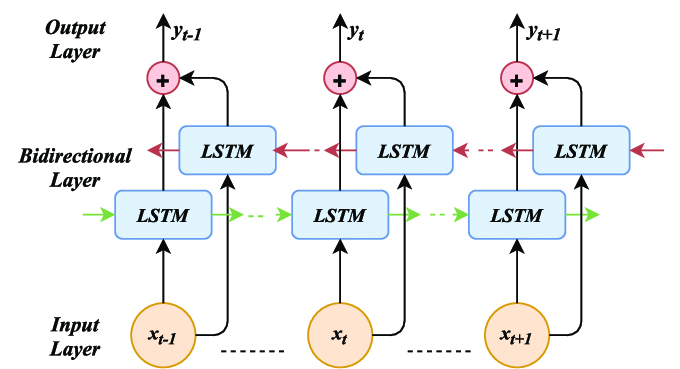
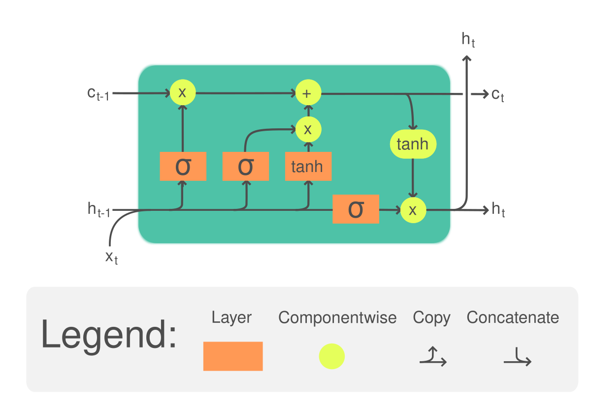

# Contents
- `LSTM` [operator (real)](#real)
- `LSTM` [operator (FP16, FP32, FP64, BFLOAT16)](#float)

Operator `LSTM` computes the output of an architecture including one or several Long Term Short Term Memory cells. Cells are organized in a number of layers equal to the length of the input sequences. The organization can be forward, reverse or bi-directional.

The following figure presents the use of a LSTM cell in a bidirectional architecture presenting three layers.



LSTM Cell internal diagram for input, memory and output gates controlled by sigmoïds and flow activated by hyperbolic tangent.




### Notations

These constants are used to define tensor shapes:
- `seq_length`: Number of layers in the archirecture. The same LSTM cell, with the same parameters is repeated at each layer of the architecture for each direction. I.e. when there are two directions there are only two sets of parameters. For forward architectures each layer corresponds to a time step of the simulation of the dynamic behavior of a single LSTM cell with delayed feedbacks of the state cell $c_{t-1} \gets c_t$ and the hidden layer $h_{t-1} \gets h_t$.
- `batch_size`: size of the batch.
- `input_size`: number of feature of the input tensor.
- `num_directions` : 1 if forward or reverse LSTM, 2 if bidirectional LSTM.

$\odot$ identifies the Hadamard product, i.e. element wise multiplication.

<a id="real"></a>
# `LSTM` operator (real)

### Signature
`Y = LSTM(X,W,R,B,sequence_lens,initial_h,initial_c,P)`
where
- `Y`: the output tensor
- `X`: the input tensor
- `W`: the weight tensor
- `R`: the recurrence weight tensor  
- `B`: the bias tensor
- `sequence_lens`: the lengths of the sequences in a batch
- `initial_h`: the value of hidden vector h at $t_0$
- `initial_c`: the value of the cell tensor c at $t_0$
- `P`: the weight tensor for peepholes.


#### Inputs and outputs

##### `X`

Tensor `X` is the input tensor.
The shape of tensor `X` is $(seq\textunderscore length \times batch\textunderscore size \times input\textunderscore size)$.

##### `W`

Tensor `W` is the weight input tensor.

The shape of tensor `W` is $(num\textunderscore directions \times 4*hidden\textunderscore size \times input\textunderscore size)$.

$$
     W = 
     \begin{bmatrix}
     W_{i} \\
     W_{o} \\
     W_{f} \\ 
     W_{g} \\
     \end{bmatrix}
$$

##### `R`

Tensor `R` is the recurrence weight input tensor.

The shape of tensor `R` is $(num\textunderscore directions \times 4*hidden\textunderscore size \times hidden\textunderscore size)$.

$$ 
     R = 
     \begin{bmatrix}
     R_{i} \\
     R_{o} \\
     R_{f} \\ 
     R_{g} \\
     \end{bmatrix}
$$

##### `B`

Tensor `B` is the bias input tensor.

The shape of tensor `B` is $(num\textunderscore directions \times 8*hidden\textunderscore size)$.

$$
     B =
     \begin{bmatrix}
     B_{wi} \\
     B_{wo} \\
     B_{wf} \\ 
     B_{wg} \\
     B_{ri} \\
     B_{ro} \\
     B_{rf} \\
     B_{rg}
     \end{bmatrix}
$$

##### `sequence_lens`:

Optional tensor specifying lengths of the sequences in a batch. If not specified - assumed all sequences in the batch to have length `seq_length`. It has shape [`batch_size`].

##### `initial_h`:

Optional initial value of the hidden state. If not specified - assumed to be 0. It has shape [`num_directions`, `batch_size`, `hidden_size`].

##### `initial_c`:

Optional initial value of the cell. If not specified - assumed to be 0. It has shape [`num_directions`, `batch_size`, `hidden_size`].

##### `P`

The weight tensor for peepholes. Concatenation of P[iof] and PB[iof] (if bidirectional) along dimension 0. It has shape [`num_directions`, 3*`hidden_size`]. Optional: If not specified - assumed to be 0.

##### `Y`

Tensor `Y` is the output tensor.

The shape of tensor `Y` is $(seq\textunderscore length \times num\textunderscore directions \times batch\textunderscore size \times hidden\textunderscore size)$.

#### Attributes

##### `activation_alpha`

Optional scaling values used by some activation functions. The values are consumed in the order of activation functions, for example (f, g, h) in LSTM. Default values are the same as of corresponding ONNX operators.For example with LeakyRelu, the default alpha is 0.01.

##### `activation_beta`

Optional scaling values used by some activation functions. The values are consumed in the order of activation functions, for example (f, g, h) in LSTM. Default values are the same as of corresponding ONNX operators.

##### `activations`

The value is a string of 3 comma separated values 'act1, act2, act3' where act_i $\in$ {`Relu`, `Tanh`, `Sigmoid`}

Defaults to 'Sigmoid, Tanh, Tanh'.

if `direction` is `bidirectional`, the value is a string of 6 comma separated values. 
The first 3 values corresponding to the forward layer, the 3 last values correponding to the reverse layer.

Defaults to 'Sigmoid, Tanh, Tanh, Sigmoid, Tanh, Tanh'.

#### `clip`

Cell `clip` threshold. Clipping bounds the elements of a tensor in the range of [-threshold, +threshold] and is applied to the input of activations. No `clip` if not specified.

##### `direction`

Specify if the RNN is forward, reverse, or bidirectional. Must be one of `forward` (default), `reverse`, or `bidirectional`.

##### `hidden_size`

Number of neurons in the hidden layer. Shall be set to the hyper-parameter `hidden_size`

##### `input_forget`

Couple the input and forget gates if 1.
$$
 c_t = (1 - act1(i_t)) \odot c_{t-1} + act1(i_t) \odot act2(g_t)
$$

and $W_f$, $R_f$, $B_{wf}$ and $B_{rf}$ not relevent.

##### `layout`

The shape format of inputs X, initial_h, initial_c and outputs Y, Y_h, Y_c. If 0, the following shapes are expected: X.shape = [seq_length, batch_size, input_size], Y.shape = [seq_length, num_directions, batch_size, hidden_size], initial_h.shape = Y_h.shape = initial_c.shape = Y_c.shape = [num_directions, batch_size, hidden_size]. If 1, the following shapes are expected: X.shape = [batch_size, seq_length, input_size], Y.shape = [batch_size, seq_length, num_directions, hidden_size], initial_h.shape = Y_h.shape = initial_c.shape = Y_c.shape = [batch_size, num_directions, hidden_size].

### Informal specification

The algorithm of the LSTM Cell is the following:
```
Y = LSTM(X,W,R,B,sequence_lens,initial_h,initial_c,P){
   if direction is bidirectional
        Y_for = LSTM_Forward(X, ...)
        Y_rev = revert(LSTM_Forward(revert(X), ...))
        Y = concat(Y_for, Y_rev)
   else if direction is forward
        Y =  LSTM_Forward  (X, ...)
   else if direction is reverse
        Y =  revert(LSTM_Forward(revert(X), ...))
}

revert(X) returns the reversed X tensor along `seq_length` axis.
concat(X1,X2) concatenates X1 and X2 tensor along `seq_length` axis.
```

#### Mathematical definition of LSTM_Forward

$$
     \forall t \in [1, seq\textunderscore length],
$$
$$
     h_0 = initial\textunderscore h
$$
$$
     c_0 = initial\textunderscore c
$$
$$
     x_t = X[t-1]
$$
$$
     \begin{bmatrix}
     i_t \\
     o_t \\
     f_t \\
     g_t 
     \end{bmatrix}
     =
     \begin{bmatrix}
     W_{i} & R_{i} \\
     W_{o} & R_{o} \\
     W_{f} & R_{f} \\
     W_{g} & R_{g}
     \end{bmatrix}
     \times
     \begin{bmatrix}
     x_t \\
     h_{t-1}
     \end{bmatrix}
     +
     \begin{bmatrix}
     B_{wi} + B_{ri} \\
     B_{wo} + B_{ro} \\
     B_{wf} + B_{rf} \\
     B_{wg} + B_{rg}
     \end{bmatrix}
$$
$$
     c_t = act1(f_t) \odot c_{t-1} + act1(i_t) \odot act2(g_t)
$$
$$
     h_t = act1(o_t) \odot act3(c_t)
$$
$$
     Y[t-1] = h_t
$$

For peephole architecture the equations are the following:

$$
\begin{bmatrix}
     i_t \\
     o_t \\
     f_t \\
     g_t 
     \end{bmatrix}
     =
     \begin{bmatrix}
     W_{i} & R_{i} & 0     & P_{i} \\
     W_{o} & R_{o} & P_{o} & 0     \\
     W_{f} & R_{f} & 0     & P_{f}\\
     W_{g} & R_{g} & 0     & 0
     \end{bmatrix}
     \times
     \begin{bmatrix}
     x_t \\
     h_{t-1} \\
     c_t \\
     c_{t-1}
     \end{bmatrix}
     +
     \begin{bmatrix}
     B_{wi} + B_{ri} \\
     B_{wo} + B_{ro} \\
     B_{wf} + B_{rf} \\
     B_{wg} + B_{rg}
     \end{bmatrix}
$$

$P_i$, $P_o$ and $P_f$ are diagonal matrices.


Where
- $i$ is the input gate matrix,
- $o$ is the output gate matrix,
- $f$ is the forget gate matrix,
- $g$ is the cell input gate matrix,
- $c$ is the cell state,
- $h$ is the hidden state,

<a id="float"></a>
# `LSTM` operator (FP16, FP32, FP64, BFLOAT16)

#### Accuracy

Activation functions required accuracy is 1 ULP.

### SONNX restrictions

The following input and attributes shall be explicitely defined:
- `W` and `R` shall be set to constant tensors.
- `initial_h`, `initial_c` shall be set to constant tensor or to a 0 tensor if not used.
- `B` shall be set to a constant tensor or a 0 tensor if not used.
- `batch_size` shall be set to 1 when batch is not supported.
- `sequence_lens` shall be set to a constant tensor or to `batch_size` if not used.
- `P` shall be set to a constant tensor or 0 tensor if not used. 
- `input_forget` shall be set to 0 if not used.
- `layout` shall be set to 0 if not used.
- `activation` is restricted to 'Sigmoid, Tanh, Tanh' or 'Relu, Tanh, Tanh'

