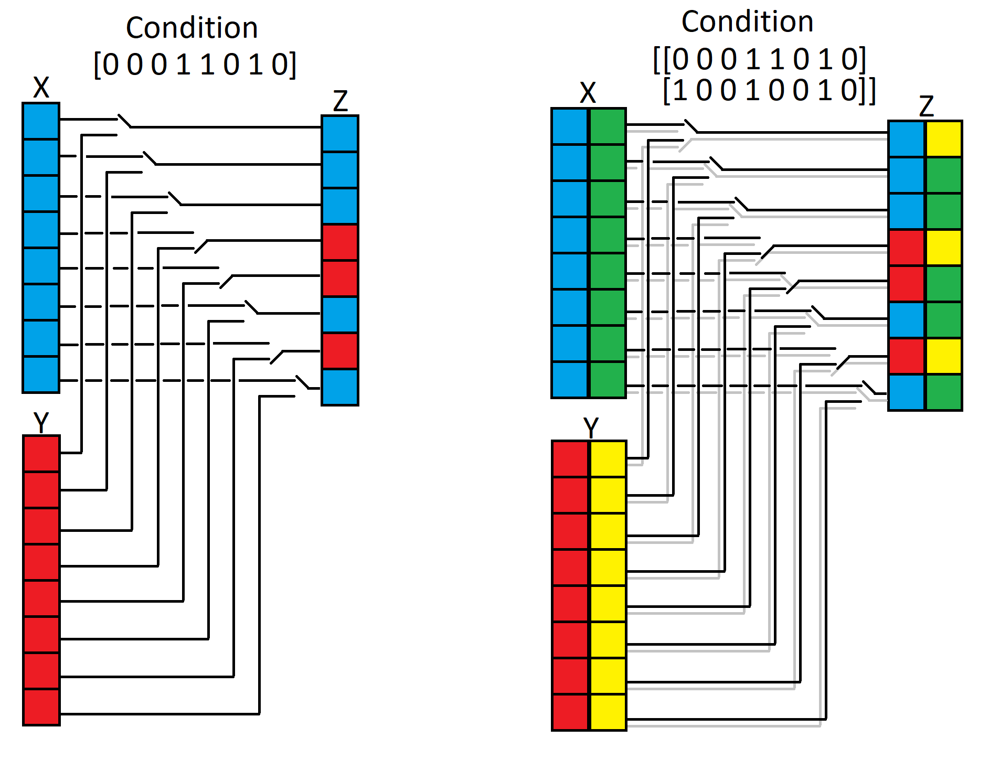

# Preliminary remarks
## Types
- Operators are first described for values in the domain of real numbers. Because the `Where` put in ouput the same type of X or Y according to the condition the output is of the same type of X or Y and could be of every possible type as tensor(bfloat16), tensor(bool), tensor(complex128), tensor(complex64), tensor(double), tensor(float), tensor(float16), tensor(int16), tensor(int32), tensor(int64), tensor(int8), tensor(string), tensor(uint16), tensor(uint32), tensor(uint64), tensor(uint8). The dimension size of a tensor is defined by $N(tensor)$.

# `Where` operator (real)

### Restrictions
The following restrictions apply to the `Where` operator for the SONNX profile:
- The operator does not support sparse tensors `[R1]`
- The tensors `condition`, `X`, and `Y` must have the same shape `[R2]`
- All X and Y inputs elements shall have the same explicit types `[R3]` 
- No broadcasting allowed for the tensors `condition`, `X`, and `Y` even if they are broadcastable to a common shape, the broadcasting is forbidden because dynamic computation time according to the shape is not deterministe (depend of  dynamic dimension X,Y,Z and could crash) `[R4]`

### Signature
`Z = Where(condition, X, Y)`
where
- `condition`: a tensor of boolean values where 0 represents False and non-zero represents True
- `X`: input tensor to pick values from when `condition` is True
- `Y`: input tensor to pick values from when `condition` is False
- `Z`: output tensor based on the `condition`, `X`, and `Y`

#### Informal specification

The `Where` operator selects elements from two input tensors `X` and `Y` based on the values of the `condition` tensor. For each element, if the corresponding entry in `condition` is True (different of false), the resulting tensor `Z` contains the element from `X`. Otherwise, the resulting tensor `Z` contains the element from `Y`.

The mathematical definition of the operator is given hereafter.

$$
Z[i] = 
\begin{cases} 
X[i] & \text{if } condition[i] & \text{is different of false} \\
Y[i] & \text{otherwise}
\end{cases}
$$

Where
- $i$ is an index covering all dimensions of the tensors.

The effect of the operator is illustrated on the following examples. In these examples:
- `condition` is a tensor of boolean values
- `X` and `Y` are tensors holding numerical data



Example 1:
```math
`condition` = \begin{bmatrix} True & False & True \end{bmatrix}
```
```math
`X` = \begin{bmatrix}  9 & 8 & 7 \end{bmatrix}
```
```math
`Y` = \begin{bmatrix}  6 & 5 & 4 \end{bmatrix}
```
Result `Z` will be : 
```math
`Z` =  \begin{bmatrix} 9 & 5 & 7 \end{bmatrix}
```


Example 2:
```math
`condition` =  \begin{bmatrix} True & True \\ True & False \\ False & True \end{bmatrix}
```
```math
`X` = \begin{bmatrix} 1 & 2 \\ 3 & 4 \\ 5 & 6 \end{bmatrix}
```
```math
`Y` =  \begin{bmatrix} 12 & 11 \\ 10 & 9 \\ 8 & 7 \end{bmatrix}
```
Result `Z` will be  :
```math
`Z` =  \begin{bmatrix} 1 & 2 \\ 3 & 9 \\ 8 & 6 \end{bmatrix}
```

Note in python is is equivalent to do :
```python
>>> import numpy as np
np.where([[True, True], [True, False],[False, True]],[[1, 2], [3, 4],[5, 6]],[[12, 11], [10, 9], [8,7]])
array([[1, 2],
       [3, 9],
       [8, 6]])
```

#### Inputs and outputs

##### `condition`

Tensor `condition` is a tensor of boolean values indicating which elements to choose from `X` and `Y`.

The shape of tensor `condition` should be the same as `X` and same as `Y`. `[R2]`. Broadcastable tensor is forbidden.`[R4]`.

###### Constraints

- (C1) Shape consistency
    - Statement: The shapes of `condition`, `X`, and `Y` must be the same. $N(condition)=N(X)=N(Y)$ `[R2]`. Broadcastable tensor is forbidden.`[R4]`.

##### `X`

Tensor `X` is one of the two input tensors from which elements are picked based on `condition`.

The shape of tensor `X` should be the same as `condition` and `Y`. $N(X)=N(Y)$ `[R2]`. Broadcastable tensor is forbidden.`[R4]`.

###### Constraints

- (C1) Shape consistency
    - Statement: The shapes of `condition`, `X`, and `Y` must be the same. `[R2]`. Broadcastable tensor is forbidden.`[R4]`.

##### `Y`

Tensor `Y` is one of the two input tensors from which elements are picked based on `condition`.

The shape of tensor `Y` should be the same as `condition` and `X`. `[R2]`. Broadcastable tensor is forbidden.`[R4]`.

###### Constraints

- (C1) Shape consistency
    - Statement: The shapes of `condition`, `X`, and `Y` must be the same. $N(condition)=N(X)=N(Y)$ `[R2]`. Broadcastable tensor is forbidden.`[R4]`.

#### Outputs

##### `Z`

Tensor `Z` is the output tensor formed by picking values from `X` and `Y` based on `condition`.

`Z` will have the resulting shape of `condition`, `X`, and `Y` and must be the same. `[R2]`. Broadcastable tensor is forbidden.`[R4]`.

###### Constraints

- (C1) Consistency in shape
    - Statement: The shape of `Z` will match the `condition`, `X`, and `Y` shape. $N(Z)=N(condition)=N(X)=N(Y)$ `[R2]`. Broadcastable tensor is forbidden.`[R4]`.


#### Attributes
The `Where` operator has no attribute.

### Formal specification

The formal specification of the `Where` operator using the Why3 language[^1] is provided below. This specification ensures the consistency and desired behavior of the operator within the constraints described.

```ocaml
(**
    Specification of Where operation on tensors.
 *)

module Where
  use int.Int
  use map.Map
  use utils.Same
  use tensor.Shape
  use tensor.Tensor

  let function where (cond : tensor bool) (a b : tensor 'a) : tensor 'a =
  {
    shape = same cond.shape (same a.shape b.shape) ;
    value = fun i -> if cond.value[i] then a.value[i] else b.value[i] ;
  }

end
```


[^1]: See [Why3 documentation](https://www.why3.org/)

[^2]: See [Frama-C
    documentation](https://www.frama-c.com/html/documentation.html)
