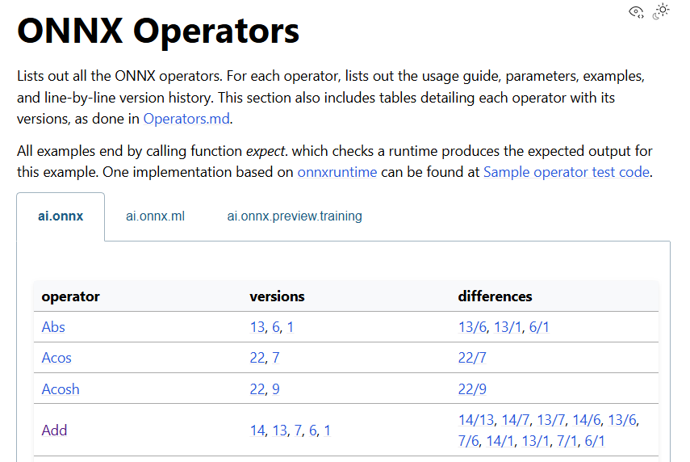

### Object: discussion about 4 points raised by Andreas and Sebastian:

 1) One if not the central meeting at Onnx is the SIG Operators meeting. It takes place every month. We should actively bring our points there to
 a) Get a discussion about our thoughts, from the experts who know operators, know how the way would be to implement them.
 b) We could also draw more attention to our initiative there.

 2) The next Onnx Community Meetup will probably take place in June 2025.
 (https://github.com/onnx/steering-committee/blob/main/meeting-notes/2025/20250305.md)
 There we will have the opportunity to present what we are doing and what we have achieved.

 3) I think we need to create a lot more issues at  https://github.com/onnx/onnx in order to work out the concerns more clearly, or to be able to discuss them even more with the community there, or to be able to refer to them in the Operators Meeting.

 4) As there are certainly already issues concerning SONNX at the moment, I could well imagine a new label “sonnx” for this, so  that we can filter even better according to the topics. 

### Participants
Andreas, Sebastian, Jean, Eric

### Main conclusions

- We need to formalize issue processing and push the issues to ONNX
  - Decisions: 
    - Issues reported by the WG member are proposed to the WG (use the existing [issues file](../../documents/issues.md))
    - Issues are discussed during the meeting to determine whether or not they must be pushed to ONNX with the sonnx tag
    - If there is an agreement, an ONNX issue is created and tagged "sonnx"
    - Should the issue deserves it (or should there be too many "sonnx" issues not processed by ONNX), we may request a time slot to the ONNX operators SIG.
- We need to present our work to ONNX
  - Results to be presented to the ONNX meetup in June
- We need to make our work more visible
  - (Push our work more regularly to ONNX...)
  - (Update our landing page to point to the main results...)
- We need to decide how our results (operator spec, ref implementation, etc.) will actually be integrated in ONNX and become visible to the ONNX users. 
  - One possibility could be to add a SONNX tab to the ONNX operators page (see below).
  - To be discussed wit the WG

- We need to be careful when putting restrictions on operators not to repel potential SONNX users.  
  - Restriction shall be justified. 
  - We have two main categories of restrictions:
    - restrictions related to a specific requirement  (see [specs](../../documents/reqs.md))
    - restrictions aimed at simplifying our work considering (i) the use case we target , (ii) the resource we have
  -  Restrictions in the second category may be relaxed upon demand, as long as someone (the demander?) does the specification, verification and implementation work
  
### Actions

- [ ] (2003-1, Andreas) Create a "sonnx" label and a group with the appropriate rights to tag issues.
- [ ] (2003-2, Eric) Update SONNX landing page to point to intersting material...
​- [ ] (2003-3, Eric ) Initiate discussion in WG about ONNX integration and propose  solutions to ONNX
​- [ ] (2003-4, Eric ) Give an example of the two categories of restrictions

