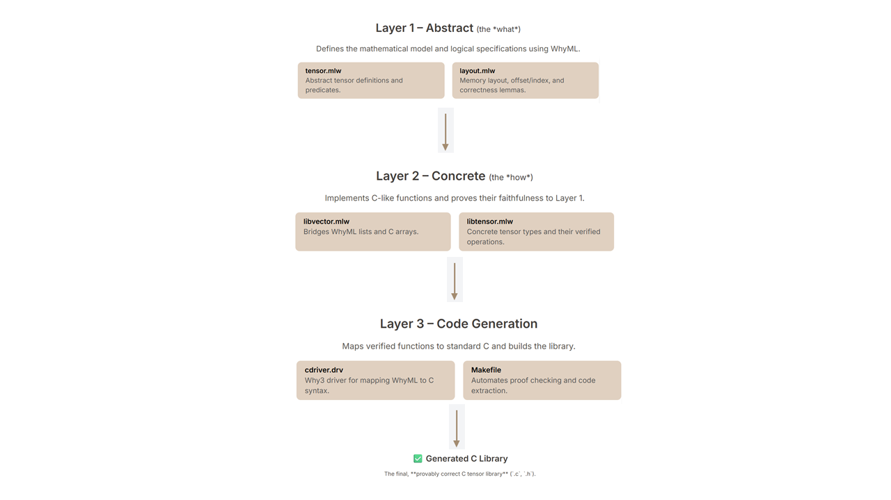

# Formally Verified C Tensor Library

This project is a provably correct tensor library written in C, with its correctness formally verified using **Why3** and its **WhyML language**.  
The primary goal is to demonstrate how formal verification can be applied to ensure that low-level C code for numerical operations behaves exactly as intended by a high-level mathematical model.

---

## Project Structure

These files provide a **formal verification system** for a tensor library, primarily using the **WhyML language** with **Why3**.  
The goal is to **prove the correctness of C-like tensor operations**.
This repository contains:
   - Formal specification files (`.mlw`)
   - The C driver file (`.drv`)
   - A `Makefile` to automate the process

### File Breakdown

#### `tensor.mlw`
This file is the **core of the formalization**, defining the fundamental mathematical concepts and data structures for tensors.  
It serves as a **foundational library** for other modules.

- **Range module**  
  - `size`: Calculates the total number of elements in a tensor (recursive multiplication of dimensions).  
  - `positive`: Predicate that checks all dimensions are positive integers.  
  - `valid`: Verifies coordinates are within the valid range for given dimensions.  

- **Tensor module**  
  - `data`: Represents tensor elements as a map from coordinates to values.  
  - `tensor`: Record with dimensions (`dims`), data (`data`), and background value.  
  - **Predicates**: `~`, `~=`, `==` define equality and similarity notions for tensors.  
  - **Ghost Functions**:  they are for verification only and won't be compiled to C
    - `scalar`: Single-valued tensor  
    - `zero`: Tensor of all zeros  
    - `const`: Tensor with a constant value  

---

#### `layout.mlw`
This file (module **CFlat**) focuses on the **memory layout of tensors**.

- **Functions**  
  - `offset`: Maps multidimensional coordinates to a flat memory address (generalized row-major offset).  
  - `index`: Inverse of `offset`, mapping an address back to coordinates.  

- **Lemmas**  
  - `index_of_offset`: Proves correctness and reversibility of `offset` and `index`.

---

#### `libvector.mlw`
This module bridges **abstract concepts** with **concrete C arrays**.

- **Types and Functions**  
  - `iarray`: Pointer to a C array of 32-bit integers.  
  - `ivector`, `islice`: Convert `iarray` to WhyML lists.  
  - `cdim_size`: C implementation of total size calculation, proven equivalent to the abstract definition.  
  - `coffset`: C implementation of memory offset, proven equivalent to `layout.mlw`’s `offset`.

---

#### `libtensor.mlw`
Provides a **C-like representation of tensors** and proofs linking them to abstract models.

- **Types**  
  - `ctensor`: Concrete C representation (rank, dimensions array, data array).  

- **Ghost Functions**  
  - `tensor`, `tensorb`: Convert `ctensor` into abstract `tensor`.  

- **C Functions (with proofs)**  
  - `ctensor_clear`: Fills tensor with zeros → proven equivalent to `Tensor.zero`.  
  - `ctensor_reset`: Fills tensor with constant → proven equivalent to `Tensor.const`.  
  - `ctensor_where`: Conditional element assignment → proven equivalent to `opwhere`.

---

#### `cdriver.drv`
A **Why3 driver file** that specifies mappings from WhyML to C.

- **std.Clib**: Maps standard C library functions (`stdlib.h`, `stdint.h`).  
- **std.Cfloat**: Maps floating-point operations (`+`, `-`, `*`, `/`) to C equivalents.  
- **Other modules**: Headers like `cindex.h` for extracted code.

---

#### `Makefile`
Automates the **build and verification process**.

- `prove`: Runs Why3 proofs on all `.mlw` files.  
- `doc`: Generates HTML documentation.  
- `lib`: Extracts verified WhyML to C and compiles into a library.  
- `clean`: Removes generated files.  

---
### Dependency Diagram



---

## Building and Verification

The `Makefile` simplifies the entire process with a few commands:

### Prove all properties
```bash
make prove
```
This command runs the Why3 proof engine on all the .mlw files to check that all logical properties and correctness conditions hold. 
### Generate the C library:
```bash
make lib
```
This command first extracts the verified WhyML code into C source files and then compiles them into a library.

### Generate documentation
```bash
make doc
```
This command creates an HTML documentation from the formal specifications in the WhyML files.

### Clean the project
```bash
make clean
```
Removes all generated files, including the C library and documentation. and insert the figure in the right place

