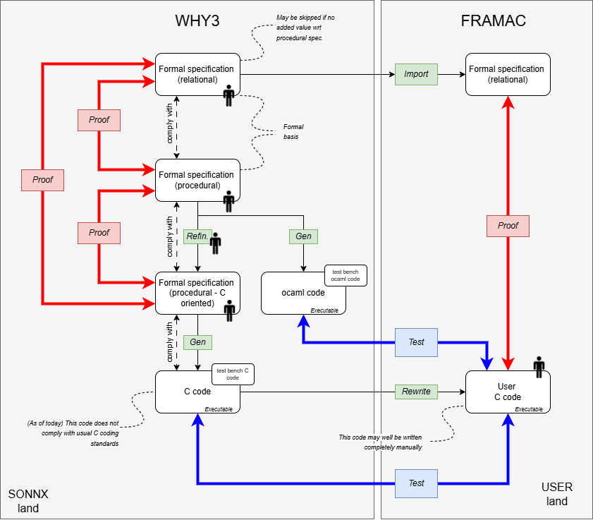

# 2026/02/XX

# 2025/06/20

## Agenda

[Schéma global](./imgs/2025-06-20/image.png)

- (Mariem, Salomé, Eric et Jean) Présentation pour retour critique, de trois formalisations ainsi que des problèmes rencontrés
  - concat : concat (repo)
    - Problèmes rencontrés :
      - Complexité de la formalisation de l'opérateur : La nature "variadique" de l'opérateur combinée à la possibilité d'avoir des tenseurs de diverses dimensions
      - Introduction de clauses de spécification formelle (requires, ensures)
      - Appréhension des mécanismes de preuve
      - Exploitation efficace (?) des modules préexistants, comme Sequences et Tensors
  - conv 2D standard : repo (repo)
    - Problèmes rencontrés
      - Est ce qu'il y a des améliorations et/ou simplifications à proposer.
      - Comment gérer les erreurs de preuve (Exemple: la fonction conv2d_output_value)?
      - Est-il possible de généraliser le type des tenseurs pour éviter de réecrire la spécification pour le type real.
  - graphe ONNX : [graph](../../documents/profile_formal/onnxgraph.mlw) (repo)
    - Problèmes rencontrés : (voir [ici](#formalisation-du-graphe) en fin de ce document
- (Loïc) Preuves de l'existant
  - Obligations de preuve générées par l'outil
  - Propriétés utilisateurs
  - Processus de preuve
- (Mariem, Salomé, Eric et Jean) Besoin de spécification de type "relationnel" (voir schéma ci-dessus) en plus de la spécification fonctionnelle
  - Utile si la fonctionnelle n'est pas une redite de la relationnelle.
    -  Exemples :
      - Utile pour concat
      - Inutile pour where (l'opérateur traité lors de la première session).
- (Loïc) Processus de preuve spec fonctionnelle vs spec relationnelle
- Synthèse méthodologique
- Conclusion


### Formalisation du graphe

Voir le code [WhyML](../../documents/profile_formal/onnxgraph.mlw).

#### Q1: Choix de modélisation / implémentation

Pour implémenter la fonction qui associe une valeur à un tenseur, j'utilise une liste de (clé, valeur). Est-ce un bon choix? 

#### Q2 : Bibliothèques d'implémentation

Existe-t-il un "catalogue" d'implémentations des types de la bibliothèque standard?  Par exemple, une implémentation de `Map` sur la base des listes?

#### Q3 : Documentation et apprentissage

Existe-t-il une liste de "bons exemples" dont nous pourrions nous inspirer?

#### Q4: Démonstration simple qui n'aboutit pas...

Soit le petit exemple suivant :
``` whyml
let rec fold_left (f: 'acc -> 'a -> 'acc) (acc: 'acc) (l: list 'a) : 'acc
  variant { l }
= match l with
  | Nil -> acc
  | Cons x xs -> fold_left f (f acc x) xs
  end

predicate all_true (l: list bool)  = 
    forall b: bool. mem b l -> b = true

lemma and_true_true:
    forall a: bool, b: bool.  Bool.andb a b -> a /\  b
    
lemma  fold_left_and_equiv_all_true:
  forall l: list bool.
    fold_left Bool.andb true l = true <-> all_true l
```

Quelle approche préconiserais-tu pour spécifier la fonction "fold_left" ?

#### Q5 : Approche de preuve
Lorsqu'une preuve n'aboutit pas, il est difficle (pour un novice) de savoir comment procéder pour 
- déterminer s'il s'agit d'une incapacité du prouveur à réaliser la preuve ou une réelle erreur de spécification / implémentation
- corriger l'erreur (de spécification ou d'implémentation)...
Quelle démarche doit-on suivre pour traiter une preuve qui n'aboutit pas?

#### Q6 : Approche pour la preuve
Existe--il des constructions à éviter pour faciliter la preuve (et, réciproquement), existe-t-il des constructions à éviter (antipatterns?

#### Q7 : Lien entre spécification et implémentation
Je souhaite spécifier les fonctions en utilisant les constructions les plus abstraites possibles. Par exemple, je défini l'état d'un graphe comme une application d'un ensemble de tenseurs vers un ensemble de valeurs.

La déclaration est la suivante :
```
type graph_state = Map.map tensor (option value)
```
Je voudrais donc que ma spécification du comportement du graphe fasse référence à ce type abstrait. En pratique, la Map.map est implémentée au moyen d'une liste de (tenseur, valeur) :
```
type fmap = list (tensor,  option  value)
```
Je spécifie deux fonctions sur le type fmap: get et set.
- `fget_logic`
- `fset_logic`

J'implémente ces 2 fonctions (`fget` et `get`). 

Je démontre que 
- `fget` implémente bien `fget_logic` 
- `fset` implémente bien `fset_logic`  

Dans ce cas, il n'y a pas de différence entre l'implémentation et la spécification.

Maintenant, je souhaite établir le lien entre mon implémentation et la `Map` abstraite.

J'introduis deux lemmes montrer que les deux fonctions `fget` (resp. `fset`) et `Map.get` (resp. `Map.set`) retournent toujours les mêmes valeurs.

Est-ce la bonne approche?

#### Q8: Problème de preuve

Voir les lemmes `get_set_eq` et `get_set_neq` dans le  code [WhyML](../../documents/profile_formal/onnxgraph.mlw).


# 2025/03/20
## Agenda
- Tutorial by Loïc Correnson (CEA) on Why3
- Documentation about Why3 can be found [here](https://www.why3.org/).
- For the tutorial, we will use [Why3find](https://git.frama-c.com/pub/why3find) which "Why3find "provides a collection of utilities to ease the development
of Why3 project".

## Participants
Mariem, Loïc, Edoardo, Nicolas, Jean, Christophe G., Henri, Eric 

## Minutes
- The Why3 code (written by Loïc...) can be found [here](./code)
- Discussion about the role of Why3 in our process. See diagram below
  - Why3 is used to specify the operators (and the graph execution semantics). For the moment, focus is placed on the operators.
  - The specification may be relational or operational, depending on the operation. In some cases (e.g., `sqrt`) a relational specification (`sqrt(x)` is such that `sqrt(x)^2=x`) is simpler than the operational specification (which will describe how to compute the square root).
  - In our case, most of the operations (not all) will need to be described operationally.
  - We need to provide a test oracle to the user. 
    - The oracle may be an ocaml executable program (which can be generated automatically from some specs).
    - It may also be the C code that can also be generated automatically from the spec if it has been written to allow this generation (see example of max value computation)
  - The generated code is supposed to be compliant with the procedural specification since it has been generated from it (the code generator may still need to be qualified...)
  - The generated C code may not comply with one's coding standard. It is up to him/her to refactor this code to make it comply with the coding rules. 
  - The modified C code may be proved to comply with the specification thanks to the FramaC toolchain. In that case, the ASCL spec may be directly imported from the Why3 spec. The loop invariants will still to be added manually... 
  - The FramaC part is not addressed by SONNX.
   
-  The specification must be kept as simple and readable as possible, with no fancy optimizations. 
   -  The formal specification shall be as traceable as possible to the informal spec. (off-meeting: It may be the case that we have to formalize this traceability)
   -  In SONNX, we have limited the number of dimensions of tensors (e.g., 2 spatial dimensions for `conv`). This simplifies the implementation (e.g., the number of loop for convolution is bounded). (off-meeting: to we accept 1 dimension? if yes the code generator will have to handle this level of variability)
-  As far as possible, we shall specify the operators as **total functions**, since it strongly simplifies the specification and proof effort (we don't have to demonstrate systematically that we are in the operator's domain). 
   - We consider that providing the `requires` clause is important because, at the end of the day, the operator will only be usable in the domain defined by these clauses (the functions will not be total). And we have to demonstrate that all levels of the specification comply with the top-most spec. 
   -  We may favor total functions and still add `require` clauses in order to restrict the domain .   
- Work on the formalization of tensors (see code). We tried two representations: 
  - a "flattened" representation in which tensor elements are "stored" in a mono-dimensional array.
    - This representation raises strong difficulties when it comes to traversing all dimensions of the tensor. It also raises problem if the indexes are not in the domain allowed by the size of the tensor's array. So we moved to a second representation...
  - a "hierarchical" representation in which the tensor elements are "represented" by a total function mapping an index to the value domain. This representation is based on the `seq`module that provides most of the needed constructs.
- Work on the `where` operator
  - Note: a version of this operator has been generated by Henri using ChatGPT. We have not checked thoroughly if this specification was correct (it looks like...), but it remains interesting. Surprisingly, chatGPT seems to "know" Why3 pretty well and can be used as a means to generate part of a spec or explanations about existing Why3 code. 
- Next steps: complete the work initiated during this meeting on the `where` operator: 
  - [ ] generate the ocaml code and build the test bench to be able to execute it 
  - [ ] build the procedural, C oriented, formal specification 
  - [ ] Prove the compliance of the C-spec to the top level spec
  - [ ] generate the C code and build the test bench to be able to execute the spec

# 2025/01/28
## Agenda
The objectives of the meeting are the following :
- Determine the approach for operators and graphs specification. On the basis of Loïc’s proposal:
    * Option 1: use C code
        * The reference implementation (in C) is the specification. Compliance of an implementation to this specification will be demonstrated by     testing with epsilon precision. No formal specification language (e.g., ACSL, Why3, etc.) is required.
    * Option 2: use Why3
        * O2.1:  Write a reference algorithm in Why3 (without loops). Compliance of an implementation to this specification will be demonstrated by testing with epsilon precision.
        * O2.2: O2.1 + Prove the correctness of the C reference implementation against the Why3 reference algorithm under the assumption F = ℝ
        * Algebraic Properties: Show some good algebraic properties of the reference algorithm in Why3 (in ℝ) (e.g., linearity, commutativity,     associativity, distributivity with respect to addition, existence of a neutral element, symmetry, etc.).
    * Option 3: use ACSL
      * Similar to the Why3 versions above, but using ACSL/Frama-C.
- Determine the formalism for operators specification     
- Determine the process/worksharing for developing the operator (starting with CONV)

## Participants
Edoardo, Loïc, Nicolas, Jean, Christophe Gar., Eric, Augustin, Mariem
## Minutes
This document summarizes the discussions and conclusions from our meeting on the specification approaches for ONNX operators and graphs.
### What is the purpose of the specification (ACSL or Why3)? What is the added value? Is the C reference algorithm not enough? (Eric)
- (Loïc) It depends on our needs. If we only require tests, then the C implementation is sufficient. However, if we need proofs, we require a specification in a formal language.
The specification cannot be written in C. It should either be a reference implementation (in Coq, Why3, etc.) or a mathematical specification.
- (Jean) ACSL specification is suitable for industrial purposes.
- (Eric) We have to ensure that what we propose is useful and useable for the type of targeted systems, operators, etc. If people develop fancy optimized implementations, proof will be complex, possibly out of the economically-viable domain with respect to the targeted development assurance level.  
### What can we do with Why3 specification?
- Execute the specification, which may contribute to its validation.
- Generate C program that complies with the specification 
- Generate coq program
- Provide the axiomatization to facilitate ACSL-level verifications (easier than doing everything in ACSL)
- Even if no formal proof is done, Why3 is an appropriate and efficient formalism to describe the operators' algorithms.  
### What do we need to succeed with the Why3 specification?
  - Developing libraries such as matrices, algebraic signatures, logical signatures, etc. would reduce the specification effort. 
  - Having a detailled Why3 description of those libraries are not mandatory in the first place. We may rely on C implementations to execute the spec. 
### Is graph specification the same as operator specifications?
(Loïc) No, it is not the same. It is a separate subject and likely more complex than operator specifications.
The specification technique used for graph specification differs from that used for operator specifications, as we need to find a way to describe the graph.
### Conclusion on objectives 1 and 2
- We will use the Why3 specification approach. This involves describing the reference algorithm of ONNX operators in Why3.
- From the Why3 implementation, it is possible to generate C programs and other implementations.
- This template can be integrated into Edge.
### How will we proceed with developing the reference operator (e.g., convolution or others)?
- We will organize a workshop in Toulouse in March. During this workshop, Loïc will provide all the necessary foundations and knowledge about Why3, and we will develop the reference operator together.
### Conclusion on objective 3
- We will implement the specification of the reference operator together during a workshop to be held in Toulouse in March.
- The date of the workshop is to be determined.
### New Actions
[ ] (280125-01 - Mariem) Organize Why3 workshop (mid-march)
[ ] (280125-02 - Eric) Check how this work fits wit DeepGreen's objectives and check possible funding. 
[ ] (280125-03 - All) Check if/how we could fund this work... 


# 2024/11/29

## Agenda

The objective of the meeting is to answer the following quesiotns:
- Do we need a formal specification?
- For what purpose?
  - Documentation only?
  - Support to certification?
  - Implementation generation / implementation verification?
- Using which formal language?
- With what short-term objectives (PoC)?

## Participants

Dumitru, Nicolas, Christophe Gar., Mariem, Augustin, Jean, Eric [ed.]

## Minutes
- Supporting slides are available [here](./slides/slides-29-11.pdf).

### Can the code be a specification?
- For some simple operators, the code may be a sufficient specification. For others, the code may be more complicated (e.g., broadcasting). The combination of the informal specificaiton and the code can be sufficient.
### How to trust the formal specification?
- If there is a strong proximity between the code and the formal specification (as in the case of `CONV`, for instance), proving that the code complies with the formal spec may be a plus but, still, the formal specification remains to be verified.
  - In our exercize on `CONV` we have actually "tested" the formal specification by verifying that some simple code for which we knew *a priori* the expected result complied with the specification...
  - The formal spec may be reviewed, but it woiuld be nice to leverage on the fact that it is formal to verify that the spec satisfies some basic properties (for instance, the convolution of M and somewhell chosen F returns M).  
  - This kind of verification of the formal spec is a usual practice of people using formal verification. 
  - See e.g., work of [Basile Clément](https://basile.clement.pm/thesis.html)
  - Trying to prove "false" is one typical smoke test (there are others). Care shall be taken that the proof actually ends: it is times-out, what is the conclusion?
  - [ ] (Loïc) how do you proceed to verify the spec ('smoke test')?
  - [ ] (all) What coud be those properties for the type of operators we are dealing with?
  - This effort could be done once and delivered as a library...
### The multiple uses of formal specification
- The formal specification may be useful in different ways:
  - The formal specification may be directly used to prove the end-user's implementation. 
    - In that case, the choice of the formalism is very important since it must support th verification tool (otherwise, the specification will have to be translated)?
    - This scenario will probably be very rare (end-users doing formal verification are pretty rare, and they use these techniques for th most critical apps...)
  - The formal specification may be used to verify (prove) the reference implementation that will be used by the developper to test his/her own implementation. *This is what we plan to do...*
  - The formal specification  may be used by the developer as the implementation specification. In that case, the formal specification must be readable, understandable. 
### On the complexity of the proofs
- Proving operators with many loops is not that trivial (loop invariants must be written) but seems feasible, at least in $R$ and for some operators. When floating point number are used, the effort may be much greater, possibly requiring the use of other, specific tools (e.g., fluctuat). 
- Experiences on other types of operations (on quaternions) show that formal verification it may become quite complex...
- Note that we have not done proved complianc ot the `CONV` code to its ACSL specification
- [ ] (IRT) Complete the proof with the help of CEA...
- In any case, formal proof of a complete graph is out of reach (but htis is not our objective).
### On the specification of the graph execution
- What about reccurrent networks? 
  - Those network can be handled by managing the state out of the graph or by using dedicated operators (e.g; LSTM).
  - In any case, handling recurrent networks remaijns a matter of executing operators in the correct order. It does not make the specification of the graph execution more complex. The semantic of the graph execution remains the same and is simple. 
- [ ] (Eric) Ask Loïc if doing proofs on graphs (acyclic graph) is feasible with ACSL? With what effort?
- [ ] (Augustin) See with Virgile is FramaC has some specific capability ("greffon" suchas AORAI...) to handle this. 
### On the question of floating point numbers and accuracy
- This problem was briefly addressed. The accuracy of basic operators (e.g., $log$) shows to be extremely variable. 
- Verification of floating point operations is complex and may not scale up. 
- [ ] (Augustin) Ask Franck what he thinks about our problem... 
- This raises the remaining question of the specification of accuracy.
- We could specify the operator in $R$. But in that case, the proof will be incomplete: the code will be proved to be correct when using real numbers, but nothing can be said about the same operation manipulating floating points...
- The strategy of AI is to combine formal proof with verification with the use of Fluctuat to handle floating point computations. 
-  [ ] (All) Problem of floating point number remains to be addressed...
-  [ ] (Eric) See work of Pierre Roux at ONERA
### On the ONNX format
- An ONNX file is written according to a syntax defined in the standard. The syntax could be "formally" defined by a grammar. But the semantic of a given text written in this language must be defined to.  For instance, if we define formally what is a graph, we have to express formally how a given part of the ONNX file translates to a graph.
- [ ] (all) Formal specification of the file format to be investigated (secondry subject)
### On the choice of the formalism
- We have to chose a formalism for we we have the skill at hand, that is not too complicated and, if possible, that is already familiar to end-users.
- ACSL seems to be the right choice.
  - If someone uses another formal language, s/he will haev to do the translation.
- The `CONV` example uses a flattened representation of arrays, which makes it difficult to read and match with the informal spec. TThis has been done because we started with a flattened representation in Why3. It should be rewritten so as to use multidimentional arrays.
### On the "reasonable effort"
- Formal methods are not used by all industrialists. So, we have to be reasonnable (in SONNX) about the effort that we will spend on that spect of the problem. It is likely that covering informally a large set of operators will be a more better results (for most end users) than formally specifying a very small set of operators... 
