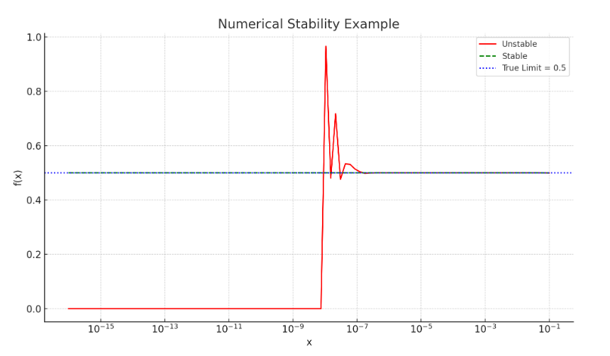

<!-- Generated by ChatGPT and slightly edited --> 

## Python Example: Stable vs Unstable Computation

We'll compute the function: 
$f(x) = \frac{1 - \cos(x)}{x^2}$ as $x \rightarrow 0$. 

This form is **numerically unstable** due to cancellation (subtracting two nearly equal numbers).

### Stable Alternative:
Use the Taylor expansion:

$1 - \cos(x) \approx \frac{x^2}{2} - \frac{x^4}{24}$

So $f(x) \approx 0.5 - \frac{x^2}{24}$

### Python Code

```python
import numpy as np
import matplotlib.pyplot as plt

# Unstable implementation
def f_unstable(x):
    return (1 - np.cos(x)) / x**2

# Stable implementation using Taylor series
def f_stable(x):
    return 0.5 - x**2 / 24

# Values close to 0
x_vals = np.logspace(-16, -1, 100)
y_unstable = f_unstable(x_vals)
y_stable = f_stable(x_vals)

plt.figure(figsize=(10, 6))
plt.plot(x_vals, y_unstable, label="Unstable", color='red')
plt.plot(x_vals, y_stable, label="Stable", linestyle='--', color='green')
plt.axhline(0.5, color='blue', linestyle=':', label="True Limit = 0.5")
plt.xscale('log')
plt.xlabel("x")
plt.ylabel("f(x)")
plt.title("Numerical Stability Example")
plt.legend()
plt.grid(True)
plt.tight_layout()
plt.show()
```
On the following picture, you can see that the unstable version (red line) becomes wildly inaccurate as x gets very small, due to numerical errors. The stable version (green dashed line) stays close to the true limit of 0.5 (blue dotted line).




## Cheat sheet

### Common Pitfalls & Fixes

| ❌ Unstable Pattern                      | ✅ Stable Alternative                             |
|-----------------------------------------|--------------------------------------------------|
| `a - b` where `a ≈ b`                   | Algebraic manipulation or Taylor expansion       |
| Matrix inversion: `inv(A) @ b`          | Use `np.linalg.solve(A, b)`                      |
| Classical Gram-Schmidt                  | Use **Modified Gram-Schmidt**                    |
| Small `x`: `(1 - cos(x)) / x^2`         | Use series: `0.5 - x^2 / 24`                     |
| Large/small values in matrix            | Rescale or normalize data                        |

---

### Stability Best Practices

- Avoid subtracting nearly equal numbers
- Use backward stable algorithms
- Normalize inputs when scales vary wildly
- Use high-precision types (`float64`, `mpmath`)
- Prefer library routines (NumPy, SciPy, LAPACK)


###  Tools to Assess Stability

| Tool                             | Description                                        |
|----------------------------------|----------------------------------------------------|
| `np.linalg.cond(A)`              | Matrix condition number (sensitivity)              |
| `np.seterr(all='warn')`          | Catch floating-point warnings                      |
| Compare multiple methods         | Sanity check results across techniques             |
| Refine resolution or input size  | See how solution evolves (esp. in ODEs/PDEs)       |

---

### Stability Testing Techniques

#### Forward Error Analysis
Compare computed output to exact result:  
```
Forward Error = || y_computed - y_exact ||
```

#### Backward Error Analysis
Show computed output is exact for a nearby input:  
```
A * x_computed = b + δb  → Backward Stable
```

#### Condition Number
Estimates sensitivity of problem:  
```
κ = ||A|| * ||A⁻¹||  (depends on chosen norm)
```
Large `κ` ⇒ ill-conditioned ⇒ sensitive to input errors


