# SONNX — Formalization Guidelines

==all coding examples in here should have syntax highlighting if possible==

A structured guide for writing formal specifications of SONNX operators in Why3.

This guidelines do not cover the basics of Why3, so familiarity with its syntax, semantics and features is expected.

---

## Table of Contents

- [Part 1 — Formalization Styles](#part-1--formalization-styles)
  - [1.1 — Abstract Formalization](#11-abstract-formalization)
  - [1.2 — Concrete Formalization](#12-concrete-formalization)
  - [1.3 — Link between the two levels](#13-link-between-the-two-levels)
- [Part 2 — Guidelines for Abstract Formalization](#part-2--guidelines-for-abstract-formalization)
  - [2.1 — Module Structure](#21-module-structure)
  - [2.2 — Function Declarations](#22-function-declarations)
  - [2.3 — Contracts on the Main Function](#23-contracts-on-the-main-function)
  - [2.4 — Data Function Pattern](#24-data-function-pattern)
  - [2.5 — Operator tensor types](#25-operator-tensor-types)
- [Part 3 — Guidelines for Concrete Formalization](#part-3--guidelines-for-concrete-formalization)
  - [3.1 — Module Structure](#31-module-structure)
  - [3.2 — Auxiliary helper functions](#32-auxiliary-helper-functions)
  - [3.3 — Main operator function](#33-main-operator-function)
  - [3.4 — Invariants](#34-invariants)
- [Part 4 — Tips, Hints and Strategies](#part-4---tips-hints-and-strategies)
  - [4.1 — Scope Resolution](#41-scope-resolution)
  - [4.2 — IDE Transformations and Prover Hints](#42-ide-transformations-and-prover-hints)
  - [4.3 — How to Debug](#43-how-to-debug)

  

<br>

---

<br>

# Part 1 — Formalization Styles

In SONNX, every operator must be formalized at two distinct levels: abstract formalization and concrete formalization. 

Each level serves a different purpose and follows a different style.

We start from an abstract formalization — which captures the mathematical semantics of the operator and serves as the **source of truth** for correctness — and progressively refine it into a concrete formalization that is close enough to the target implementation to be automatically extracted into C code - reasoning about memory, bounds, and machine data types.

Understanding both is essential before writing any specification.

## 1.1 Abstract Formalization

At this level the operator must be specified making no reference to any implementation detail, and therefore it should be **implementation-agnostic**.

It shall be **traceable** to the **informal specification**, being easy to validate, first and easy to read and understand, second. ==add link to informal spec== Traceability must be enforced:

- first by keeping the formal specification as close to the informal specification (e.g., stick to the mathematical specification given in the informal specification)

- second by providing explicit link via `[tags]` to specific parts of the informal specification.

No implementation details should be present at this level, which means that the specification of tensors shall remain as abstract as possible, focusing on their mathematical properties.

### Tensors

- **Type**: At this level tensors are specified as **polymorphic structures**, i.e., they are parameterized by the type of the values they contain. <br>
            This means that the specification author should be as generic as possible when defining an operator. <br>
            More details in - [2.5 - Operator tensor types](#25-operator-tensor-types).

- **Representation**: Tensors are represented as structures containing the following records:

  - `dims` - List of integers representing the shape

  - `data` - A map from [indexes](../../../spec/informal/common/definitions.md) to values

  - `background` - The default value for indexes out of the bounds defined by the shape

  A "valid index" is an index compatible with the dimension of the tensor, i.e. the i-th components of the index is strictly positive and strictly less than the i-th dimension of the tensor
  
  The data mapping is complete since it maps all possible indexes to values, but the value mapped by invalid indexes is the `background` value.

- **Type Invariants**: There are two important invariants that must be satisfied by this tensor representation:

  1. **Positive Dimensions**
    
      All dimensions in the `dims` list of a tensor must be **strictly positive integers**. <br>
      This constraint may be relaxed in a lated version of the specification to support tensors with **null** dimensions. [***Work in Progress***]

    - Predicate `positive`

      ```why3
      predicate positive (ds : list int) =
      match ds with
      | Nil -> true
      | Cons d ds -> 0 < d /\ positive ds
      end
      ```
    - `invariant { positive dims }`

  2. **Valid values**
  
      Indexes are either valid for the tensor shape or the value mapped by those indexes is the `background` value.
     
    - Predicate `valid` ==the code below returns true for an empty index access to an empty tensor. This will be a problem when we introduce null tensors==

      ```why3
        predicate valid (ks ds : list int) =
          match ks , ds with
          | Nil , Nil -> true
          | Cons k ks , Cons d ds -> 0 <= k < d /\ valid ks ds
          | _ -> false
          end
      ```
    - `invariant { forall k. valid k dims \/ data k = background }`
  
  <br>

  These invariants are extremely important as they will sometimes define how the operator should be formalized. 
  
  For example, while computing the data of the tensor it is **highly recommended** to use the predicate `valid`, essentially to capture and pass the invariant.

  An alternative was to define the data through recursive definitions once the shape is already computed, but this approach is much more complex and usually requires auxiliary lemmas to help the proof. ==This sentence is a bit obscure for the casual reader. If the message is important, and it might be as it seems to contain a recommendation on how to do things, I suggest expanding the explanation to two-three sentences==

  The above predicates and invariants are available in the [tensors library](../../../spec/formal/common/libs/tensor/).

### Specification Style

Throughout this level, the specification should be carried out in a **purely functional style** meaning that there should be no side effects and no mutable state (functions do not modify state, they receive one as input and return a new one as output).

Users should specify the operator based on mathematically and recursive definitions, avoiding loops and mutable state, increasing the **provability** and **ease of proof** of this specification.

## 1.2 Concrete Formalization

The concrete level describes the **imperative implementation** that will be extracted to C code.

It describes it based on a **target C representation** for tensors called **ctensors** which are essentially structures backed by flat arrays in memory.

### Tensors

- **Type**: At this level the type of tensor elements is fixed to be `float32`, `float64`, `int32`, `int64`, etc. and the operator should be defined specifically for that type.

- **Representation**: Tensors are represented as pointers to structures that contain:

  - `t_rank`: Number of dimensions

  - `t_dims`: Pointer to a flat array containing the tensor dimensions - pointer to `int32` array ==What happens if the tensor dimension (or number of dimensions) is larger that the max value of int32? It is a ridicolous case in practice, but may happen in a cybersec attack scenario==

  - `t_data`: Pointer to a flat array containing the tensor elements - pointer to `type` array (where type is `float32`, `float64`, `int32`, `int64`, ...)

<br>

Note that, unlike the previous level, here the tensors are defined based on a target C representation - tensors are essentially flat arrays in memory. 

Moreover, there is no `background` value in this representation - **only valid indexes must be used to access values of tensors** (i.e. coordinates that are within the bounds of the tensor shape).==Any rationale behind this choice, e.g. computational efficiency? What happens if we try to access an invalid index? Do we guarantee that it can never happen?==

### Specification Style

In this level, the specification should be carried out in an **imperative style** meaning that **loops and mutable state** are allowed and often necessary to express the implementation.

### Importance of this level

It provides the necessary details to extract executable C code and reason about memory, bounds, and machine data types.

## 1.3 Link between the two levels

### Why is it important to have two levels?

- We need somehow to express that the **concrete specification** is correct with respect to the **operator's intended behavior** - which is captured by the **abstract specification**.

- The abstract spec is easy to **read, understand, and reason about** — it directly mirrors the mathematical definition from its informal specification.

- The concrete spec is necessary to **extract executable C code** and reason about memory, bounds, and machine datatypes.

- The two levels are connected through a **refinement relationship**. The concrete implementation must be proven to produce the same result as the abstract specification. ==Maybe "same result" is a little strong, especially regarding numerical error with floating point. I can easily see how the abstract specification defines a set of possible correct executions, and the concrete specification chooses only one (or a small subset of them)==

The following image gives a high-level overview of the relationship between the two levels and how they connect through refinement:

<a id = "refinement-mapping"></a> 

<p align="center">
  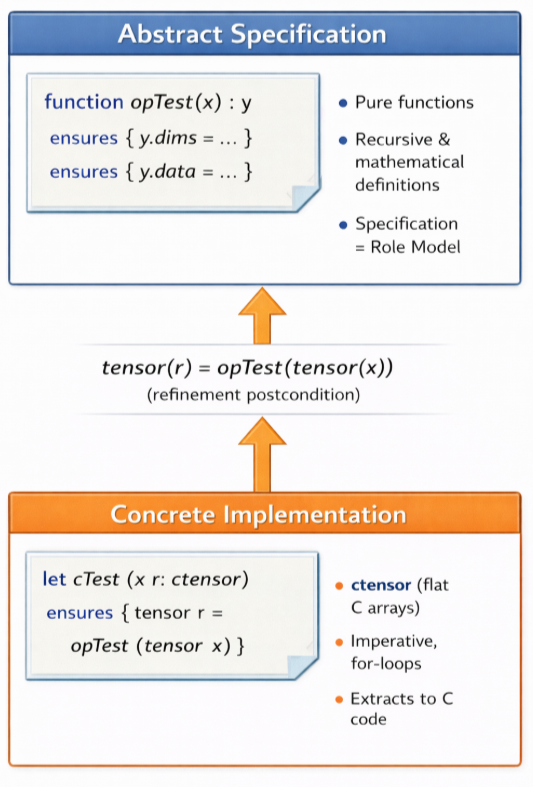
</p>

The refinement relationship is expressed through a **postcondition** in the concrete implementation that states that **the result of the concrete implementation** (after converting it to an abstract tensor) must be **equal** to the **result of the abstract specification**. ==Again, I can see that the result of the concrete execution is valid/compatible according to the abstract spec, but I feel equality will be impossible for floating point data types==

Such relation will be explored in [3.2](#32-auxiliary-helper-functions) and [3.3](#33-main-operator-function) sections.

---
<br>

# Part 2 — Guidelines for Abstract Formalization

## 2.1. Module Structure

Each abstract module should follow this general structure:

<a id="file-structure-proposal"></a>
```
module OP<OperatorName>
  (* 1. Imports *)
  (* 2. Auxiliary predicates *)
  (* 3. Auxiliary helper functions *)
  (* 4. Dimension-computing function *)
  (* 5. Data-computing function *)
  (* 6. Main operator function *)
end
```

If any section is not needed, it can be left empty, but the overall structure must be maintained for consistency and readability across different operator specifications.

## 2.2 Function Declarations

Why3 supports several ways to declare functions, each with different purposes and objectives. 

In order to fully understand each one of this features please take into account that whyml supports **two different programming namespaces**, a **logical** and a **programming** one, each one of them built upon a different syntax and with different features. For instance both of them support **conjunctions** but while the logical one expresses it through $\land$, the programming one expresses it through the `&&` operator.

<a id="functions_def"></a>
We can have any of the following function signatures:==If an introduction to Why3 namespaces is really needed, I would prefer a more structured one. E.g. organise it by keyword (let, function, rec, ghost) rather than covering all possible combinations thereof.==

- `function`: Belongs to the **logical namespace** and is used to define purely logical functions. Contracts are not supported.

- `let`: Belongs to the **programming namespace** and defines a non recursive function.

- `let rec`: Belongs to the **programming namespace** and defines a recursive function.

- `let function`: Belongs to the **programming namespace**, however, it represents **pure functions**, that are **non recursive** and allows them to be used at the logical namespace as well.

- `let rec function`: Belongs to the **programming namespace**, however, it represents **pure functions**, that are **recursive** and allows them to be used at the logical namespace as well.

- `let ghost function`: Belongs to the **programming namespace**, however, it represents **pure functions**, that are **non recursive** and **can only** be used at the **logical namespace**.

- `let rec ghost function`: Belongs to the **programming namespace**, however, it represents **pure functions**, that are **recursive** and **can only** be used at the **logical namespace**.

-  A precise definition of these constructs is given in the [Why3 manual, section 6.5.5](https://why3.org/doc/syntaxref.html)

Ideally, **at the abstract level** we should only declare function with the signature `function` and no contracts (`requires` / `ensures`) for auxiliary functions should be used.

> Recall why this is considered as good practice.==This is probably the most important piece of information. Recording the "why" of your design choices is crucial==

### 2.2.1 Termination and Variants

==This subsection is a bit weak: (1) it contradicts the recommendation above that the abstract specification must only use the "function" keyword (by showing when to use "let rec ghost function"), (2) it is written in the style of a tutorial with examples, instead of a set of guidelines (e.g. "you shall only use function unless non-trivial recursion is absolutely needed")==

It is not always possible to define all the necessary functions with the `function` construct, especially when we need to define recursive functions whose termination is not trivially provable by Why3.

In order to understand that==,== have a look at the following module which computes the unit summation in the range $[0, n-1]$. This might not be the most traditional way of computing a summation, although, it intentionally resembles the iterative way of computing a summation, starting from 0 up to $n-1$.

```why3
module OPSummation
  use int.Int

  function summation (i : int) (iter : int) : int =
      if i < iter then
          1 + summation (i + 1) iter
      else
      0
end
```
In this case, if you attempt to open the why3 ide the following error will be shown:

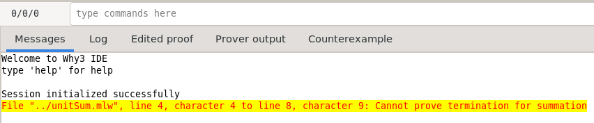

In fact, `functions` are not supposed to be used in recursive definitions, unless their termination is trivially provable by Why3 such as recursive calls over the tail of a list. ==So, function _can_ be recursive? How is "trivially provable" defined?==

Intead one should use a `let rec ghost function` declaration, which allows to define recursive functions with a **variant** (some expression that repeatedly decreases with each recursive call) that can only be used in the logical namespace.

```why3
  let rec ghost function summation (i : int) (iter : int) : int =
    variant { iter - i}
    if i < iter then
      1 + summation (i + 1) iter
    else
      0
```

### 2.2.2 Verification Conditions and Requires Clauses

Note that, pure logical functions declared by the keyword `function` never generate verification conditions, even if some of the functions called inside it need to hold some **pre-conditions**. ==Lack of guidelines here. Do we want all functions to specify pre-conditions? If not, do we have a rule to know which ones should?==

Recalling the [definitions](#functions_def)==,== it is clear that `function` and `let rec ghost function` belong to different namespaces, although both of them can only be used at the logical namespace. As a consequence, since `let rec ghost function` is not a definition but an actual executable function, it generates verification conditions for all the functions called inside it that have preconditions.

That's why, under such circumstances, requires clauses can be added **only** to properly prove such verification conditions.

To compare such different behaviors, check the examples below:

**Explicitly need for requires clauses** ==I find this example confusing for two reasons: (1) there is no explicit recommendation, so i do not know _why_ you are reminding me of this specific feature of Why3, (2) I cannot understand what calculate_dY0 does==

```why3
  (** Helper function to extract element from list at given position **)

  let rec function get_dim (dims : list int) (idx : int) : int
    requires { 0 <= idx < length dims }
    variant { dims }
    = match dims with
      | Nil -> 0  (* should not happen due to precondition *)
      | Cons h t -> if idx = 0 then h else get_dim t (idx - 1)
      end
```

```why3
  let rec ghost function calculate_dY0 (x : tensor real) (axis : int) (i : int) : int
    =
    if Int.(i >= axis) then
        1
    else
        get_dim x.dims i * calculate_dY0 x axis Int.(i + 1)
```

This piece of code - from the [flatten formalization](./examples/flatten.mlw) - will generate verification condition because the function is signed with `let rec function` and `get_dims`, which is called inside it, has **preconditions** stating that the value being accessed is valid within the list. 

Consequently, verification conditions will be generated as is depicted in the picture below:

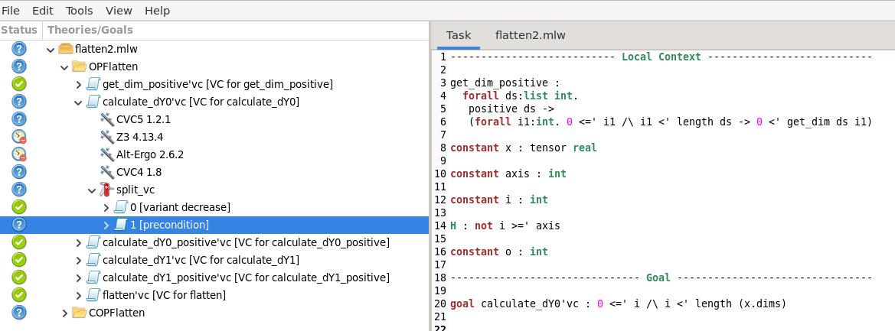

In such cases we need explicitly to provide all the requires clauses raised by the verification conditions of the called functions. 

Therefore, the code above should be adapted to include such contracts:

```why3
  let rec ghost function calculate_dY0 (x : tensor real) (axis : int) (i : int) : int
    (*Need this requires because of get_dim requires*)
    requires { 0 <= axis <= length x.dims }
    requires { 0 <= i <= axis }
    variant { axis - i }
    =
    (...)
```

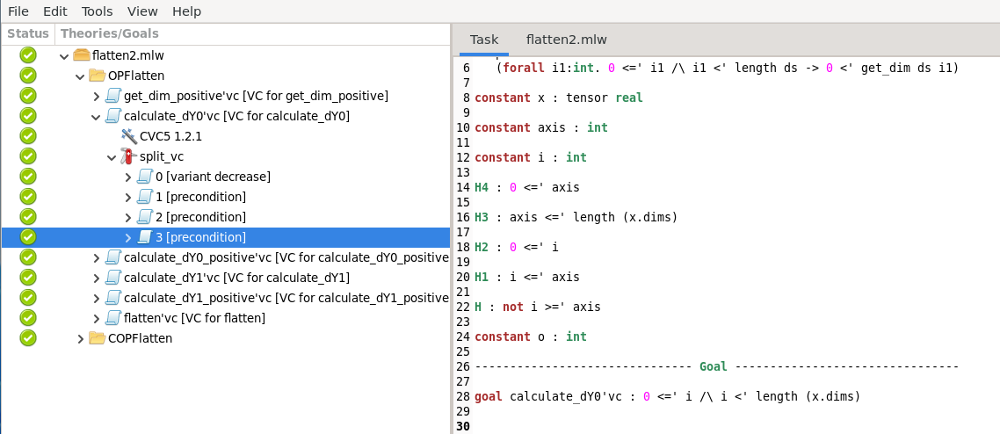

**No need for requires clauses**

```why3
  function calculate_dims (x : tensor real) (axis : int) : list int
    =
    let dY0 = calculate_dY0 x axis 0 in
    let dY1 = calculate_dY1 x axis axis in
    Cons dY0 (Cons dY1 Nil)
```
<br>

The code written above will not generate any verification conditions, even if the functions referenced inside it explicitly need **requires clauses**. 

Therefore, no verification conditions were raised and the function `calculate_dims` does not appear on the Verification Conditions menu (left panel in the picture above).

### 2.2.3 TypeInvariant Lemmas

When using `let rec function` declarations, their logical context sometimes does not propagate to subsequent functions, or it may appear only in axiomatic form.=="sometimes" is a worryingly ambiguous thing to read in a guideline document. If it is well-known Why3 behaviour, add a link to further documentation==

As a consequence, proving the type invariants of tensors — in particular, ensuring that the output dimensions satisfy the positivity invariant — requires explicit lemmas that establish these properties.==Do we have a strict requirement that type invariants must be proven? Where is it listed? Add reference to relevant doc.==

The `calculate_dY0` function defined above is a concrete example of this issue. 

The following lemma is needed to guarantee that the result produced by `calculate_dY0` is strictly positive:

```why3 
    let rec lemma calculate_dY0_positive (x: tensor real) (axis: int) (i: int)
    requires { positive x.dims }
    requires { 0 <= axis <= length x.dims }
    requires { 0 <= i <= axis }
    ensures  { 0 < calculate_dY0 x axis i }
    variant  { axis - i }
    =
    if i >= axis then
        ()
    else
        let d = get_dim x.dims i in
        calculate_dY0_positive x axis (i + 1)
```

The different kinds of lemmas and how to use them will be covered in section [3.4](#34-invariants), [4.2](#42-ide-transformations-and-prover-hints).

### 2.2.4 Main Operator Function

To enforce traceability, as [previously mentioned](#traceability), the main operator function should capture the constraints present in the informal specification as preconditions (`requires`) while providing postconditions (`ensures`) for every record of the output tensor.

To capture such contracts one needs to define a construct that belongs to the programming namespace. ==Does it mean we have to do this only for the concrete spec? The guidelines above explicitly state that we should use the logical namespace for the abstract spec...== Moreover, since this function is only used to specification purposes it is not supposed to be used in any implementation context. To enforce that this function can only be used at the logical level sign it as **ghost**.==To quote the beginning of Section 2.2 "at the abstract level we should only declare function with the signature function and no contracts should be used." But the rest of Section 2 seems to implicitly stress that contracts are _very important_, which is confusing==

Therefore, the main operator function should be declared as `let rec ghost function` with full contracts.

```why3
module OPSummation
    use int.Int

    let rec ghost function summation (i : int) (iter : int) : int =
        variant { iter - i}
        if i < iter then
            1 + summation (i + 1) iter
        else
        0
    
    let ghost function unitSum (n: int) : int =
        requires { n >= 0 }
        ensures { result = n }
        summation 0 n
end
```

### Examples

Besides the summation example above, here are some examples of such formalization styles:

- **Clip**: [Clip abstract specification](./examples/clip.mlw)

- **MatMul**: [MatMul abstract specification](./examples/matmul.mlw)

## 2.3. Contracts on the Main Function

Until now, we have stated that no function should have contracts except for the `main function` or any other function declared with `let rec ghost function`. ==This is the first time you state this requirement. Indeed, in Sections 2.2.2 and 2.2.3 many examples of non-main functions containing the require keyword are given==

The `main function`, **must** include as preconditions (`requires`) all the necessary constraints that are present in the informal specification for the inputs and the attributes. Output constraints (such as shape) will not be included at this point.

On the other hand, the postconditions (`ensures`) of the main operator function **must** include the following three postconditions:==You literally just said "output constraints (such as shape) will NOT be included". This is extremely contradictory==

| Postcondition | Purpose |
|:---|:---|
| `ensures { result.dims = ... }` | Specifies the **output shape** |
| `ensures { result.data = ... }` | Specifies the **output data** (as a map) |
| `ensures { result.background = ... }` | Specifies the **background value** |

### Example

```why3
let ghost function opclip (x l m : tensor real) : tensor real
  requires { is_scalar_tensor l }
  requires { is_scalar_tensor m }
  ensures  { result.dims = x.dims }                     (* ← shape *)
  ensures  { result.data = dclip x l m }                (* ← data  *)
  ensures  { result.background = x.background }         (* ← background *)
= 
  { dims = x.dims; data = dclip x l m; background = x.background }
```

## 2.4. Data Function Pattern

Whenever we want to specify the operator along all possible coordinates we can follow any of the following pattern==s==:


### Anonymous function declaration

Create an **anonymous function** for the data that takes the coordinates as input and defines the value at those coordinates based on the operator's semantics. 

We are basically stating that for all possible coordinates, the value at those coordinates is defined by this function. 

Note that, **not all coordinates are valid**, so we need to **check the validity of the coordinates** first and **return the background value for invalid coordinates**. 

That's why we need to compute the output shape, prior to this computation, as proposed in the [previous section](#file-structure-proposal).==I see what you mean, but the section you link only gives the order in which functions should be declared in the code, which (as far as I understand the semantic of Why3) has no influence on the order of computation.==

```why3
let ghost function d<operator_name> (x: tensor a') (output_shape: list int) : data a'
= 
fun ks ->
    if valid ks output_shape then
      ...
    else
      <background>
```

The construct `fun ks -> ...` is an anonymous function that takes `ks` as input and defines the value at coordinates `ks` based on the operator's semantics. 

The condition `if valid ks output_shape then ... else ...` checks if the coordinates `ks` are valid (i.e., within the bounds of the output shape) and returns the appropriate value based on the operator's semantics. 

This construct returns a map from coordinates to values, which is exactly what we need for the `data` field of the output tensor.

### Recursive dimensions constructs

An alternative way would be to define as ==many== recursive helper functions as the number of dimensions and then define the data function based on these recursive functions.

This approach is much more complex both to write and to read and usually requires auxiliary lemmas to help the proof.

As a standard we will stick with the `anonymous function` definition. ==Why propose this alternative if it introduces complexity for no reason? Is there some operator for which the anonymous function approach is impossible?==

### Examples

- **Clip**: [Clip abstract specification](./examples/clip.mlw)

- **MatMul**: [MatMul abstract specification](./examples/matmul.mlw)


## 2.5 Operator tensor types

Until now, all the examples we have provided, explicitly stated the type of the tensor at the abstract level. 

For example [Clip](./examples/clip.mlw) and [Matmul](./examples/matmul.mlw) are explicitly specified for `real` tensors. 

However, there are operator whose abstract tensor type can be completely polymorphic. 

Take a look ==at== the example below:

```why3
module OPWhere
  use tensor.Tensor

  function dwhere (c : data bool) (a b : data 'a) : data 'a
      = fun ks -> if c ks then a ks else b ks

  let ghost function opwhere (c : tensor bool) (a b : tensor 'a) : tensor 'a
    requires { a ~= b }
    requires { c ~ a ~ b }
    ensures { result ~= a ~= b }
    ensures { result = dwhere c a b }
    (*proof*)
    = { dims = c.dims ; data = dwhere c.data a.data b.data ; background = a.background }
    (*qed*)
end
```
<br>

Unlike, the previous examples, this operator is defined for tensors with a polymorphic datatype `'a`.

Once for clip and matmul we need to compute values, there is no other option but to have an abstract datatype which is in fact **numerical**. 

Nevertheless, **where** doesn´t resort to any mathematical handling whatsoever and that's why its abstract datatype can be polymorphic. 

So whenever possible one should resort to **polymorphic** abstract datatypes. 

This is the case for the vast majority of the structural operators: **flatten**, **reshape**, among others.


# Part 3 — Guidelines for Concrete Formalization

## 3.1. Module Structure

The concrete module should follow this general structure:

```why3
  module COP<OperatorName>
    (* 1. Imports *)
    (* 2. Auxiliary helper functions *)
    (* 3. Main operator function *)
  end
```

### 3.2 Auxiliary helper functions

All the functions that are used on the **abstract side** to compute the data need to be translated to this level as well. 

Note, however, that this translation usually implies redefining the function in an imperative style - **for loops**, **memory allocation**, ...

Under this context, translation means:

- Defining the function in an imperative style

- Check that the concrete level function is indeed a refinement of the respective abstract function. <br>
Equivalent to what is presented in the image [here](#refinement-mapping)

To better understand this, check the `coords_from_X_p` function, presented in the [conv](./examples/conv.mlw):

```why3
  (* Abstract level *)
  function coords_from_X_p (x: tensor real) (x_p_coords : list int) ( pad_top pad_left :int) : real
  =
    let b = get_dim x_p_coords 0 in
    let c = get_dim x_p_coords 1 in
    let n = (get_dim x_p_coords 2) - pad_top in
    let m = (get_dim x_p_coords 3) - pad_left in
    let x_coords = Cons b (Cons c (Cons n (Cons m Nil))) in
    if valid x_coords x.dims then
      x.data x_coords
    else
      0.0
```

```why3
  (* Concrete level *)
  let coords_from_X_p (x: ctensor) (x_p_coords : iarray) ( pad_top pad_left :int32) : (float, bool) = 
    requires { valid_tensor x }
    requires { x.t_rank = 4 }
    requires { valid_range x_p_coords 0 4 }
    requires { writable x_p_coords }
    requires { in_bounds (value_at x_p_coords 2 - pad_top) }
    requires { in_bounds (value_at x_p_coords 3 - pad_left) }

    ensures { let (value, flag) = result in
              flag -> coords_from_X_p (tensor x) (ivector x_p_coords 4) (to_int pad_top) (to_int pad_left) = value
            }

    let ref flag = False in
    let b = x_p_coords[0] in
    let c = x_p_coords[1] in
    let n = (x_p_coords[2]) - pad_top in
    let m = (x_p_coords[3]) - pad_left in
    let x_coords_array = malloc (to_uint32 4) in
    if is_not_null x_coords_array then begin
      flag <- True;
      x_coords_array[0] <- b;
      x_coords_array[1] <- c;
      x_coords_array[2] <- n;
      x_coords_array[3] <- m;

      assert { ivector x_coords_array 4 = Cons (to_int b) (Cons (to_int c) (Cons (to_int n) (Cons (to_int m) Nil))) } ;
      
      let x_coords = coffset x_coords_array x.t_dims x.t_rank in
      if x_coords >= 0 then begin
        (x.t_data[x_coords], flag)
      end
      else begin
        ((f32 0.0), flag)
      end
    end
    else begin
      flag <- False;
      ((f32 0.0), flag)
    end
```

These two functions perform the same exact computation. 

To better understand how these two relate one can compare both specifications:

**Coordinates**

- On the **abstract side** the indices of the coordinates are captured with the `get_dim` function while on the **concrete level** the indices are captured by directly accessing the `iarray` with the `[]` operator.

  - These functions are equivalent and such equivalence proof is already available in the tensors library

- To define the whole coordinates, on the **abstract side**, we only need a **list constructor**. On the **concrete level** such process is performed in two distinct steps:

  - **Firstly**, the appropriate space is allocated with the `malloc` function

  - **If the malloc is successful**, we then set each index of the array with the appropriate value.

  - Once again an equivalence must be established between these two constructs. That's exactly what is performed by the `assert` clause.

**Computation**

- On the **abstract side** we perform the computation by checking the validity of the coordinates on the dimensions of tensor x using the predicate **valid**. If the coordinates are valid we are going to return the value that is on that coordinates, else we are going to return 0.==Aren't we supposed to return the background value, rather than 0?==

- On the **concrete side** we perform the computation by calculating the flatindex, of the coordinates on the tensor x dimensions, if the flatindex is a valid index, then we return the value on that index, else we are going to return 0.

- The equivalence is captured by the postcondition present on the `coffset` function and the `if clause` which follows the same pattern at both levels.==there is no postcondition on the coffset function in the code above==

**Refinement mapping**

- The refinement mapping relation is expressed with an ensures. In this function this ==relation== is expressed by:

  ```
  ensures { let (value, flag) = result in
            flag -> coords_from_X_p (tensor x) (ivector x_p_coords 4) (to_int pad_top) (to_int pad_left) = value
          }
  ```

- This is the most important relation between both levels, as it states the values returned by both functions are exactly the same. Ultimately this prove that the function specified at the concrete level is correct with respect to the expected one presented at the abstract level, therefore ensuring that the behavior is the same at both levels.

- Note that, in the concrete level, we need to explicitly check that the `malloc` was successful and return a flag indicating whether the coordinates were successfully computed or not. This is not necessary on the abstract level because we are working with mathematical constructs and we can assume that such constructs are always successfully created.

### 3.3 Main operator function

This is naturally the most important function and the one whith more details to be taken into account.

#### 3.3.1 Contracts

The **main operator function** must include contracts at both levels.

**Requires**

- On the **abstract level** the preconditions should include `requires` for all the necessary constraints that are present in the informal specification for the inputs and the attributes. Output constraints (such as shape) will not be included at this point.==the guidelines for the abstract specification are covered in Section 2, do not repeat them here==

- On the **concrete level** we should have preconditions for:

  1. Expressing the **validity of the input tensors**. At this level the tensors are passed as arguments and therefore we need to evalute whether they are **valid tensor**

  2. Verify if the output tensor (already passed as an argument) has the appropriate shape, computed with the abstract function with such objective. Such verification should be performed by checking the dimensions of the output tensor with the dimensions computed by the abstract function. Moreover, we should also check that the output tensor has the appropriate **rank**.

  3.  All the **preconditions** already present at the abstract level. The **concrete** ==level== will essentially have the exact same copy of the abstract preconditions but adapted to the concrete level (the way the accesses are performed for instance will change).

**Ensures**

- On the **abstract level** the postconditions should cover each record of the abstract tensor - **dimensions**, **data** and **background**:==already covered in Section 2: remove==

- On the **concrete level** the only needed clause is the refinement mapping, indicating that the concrete implementation is correct with respect to the abstract specification. This is usually expressed by a postcondition of the form:

  - `ensures { tensor result = <operatorName> (tensor x) ... }`

The example below gives a better understanding of the above guidelines. The full file is available [here](./examples/flatten.mlw).

- **Concrete level**

  ```why3
    let flatten (x r : ctensor) (axis: int32)
      (* Requires*)
      (* 1 - Valid tensors *)
      requires { valid_tensor x }
      requires { valid_tensor r }
      
      (* 2 - Shape match *)
      requires {  let axis_normalized = normalize_axis (to_int axis) (length (tensor x).dims) in  
                  (ivector r.t_dims r.t_rank) = calculate_dims (tensor x) axis_normalized }
      requires { r.t_rank = 2 }
      
      (* 3 - Informal Spec *)
      requires { -length (tensor x).dims <= (to_int axis) <= length (tensor x).dims }
      requires { vdim x.t_dims x.t_rank = vdim r.t_dims r.t_rank }

      (* Ensures *)
      ensures { tensor r = flatten (tensor x) (to_int axis) }
      =
      let m = cdim_size r.t_dims r.t_rank in
      for i = 0 to m - 1 do
          invariant { forall k. 0 <= k < i -> value_at r.t_data k = value_at x.t_data k }
          r.t_data[i] <- x.t_data[i]
      done;

      assert { tensor r == flatten (tensor x) (to_int axis) }
  ```

**Requires**

Regarding the `requires` clause, expressing the validity of the **ctensors** is really quite simple, one just needs to call the `valid_tensor` predicate with any of the operator input tensors.

Expressing the **shape match** on the other hand is not that trivial. 
There are multiple ways of doing this match. 
The one we propose here is performed by literally calculating the shape with the abstract module and then check if they are the same.
To do so, we need first to convert `ctypes` into the `appropriate abstract datatypes`.

- `tensor`: Converts a **ctensor** into an **abstract tensor**

- `to_int`: Converts `int32` - **machine integers** into the respective abstract datatype `int`

- `ivector`: Converts an `array` into a `list`. There are neither arrays on the abstract side nor lists on the concrete level and that=='==s why such convertion is important.
    
  - Takes as inputs: the **pointer** to convert and the **desired size** of conversion

For the other preconditions, what we do is a literal copy of the requirements already present at the abstract level but adapted to the concrete level.

Translating the preconditions from the abstract level to the concrete level can be done in two different ways:
  
  1. Translate `c entities` into the respective abstract ones and then literally express the same preconditions

  2. Express that precondition, but resort to `concrete predicates` instead of the abstract structure.

In the example above, the first precondition follows the `1.` pattern, while the second one follows the `2.`. There is not really a standard for this, as sometimes one is more readable and even provable than the other, so it is up to the specification author to choose which one to use.==Which guideline should the spec author follow? Prioritise readability? Prioritise provability?== Having said so, the second **precondition** could also have been expressed through abstract terms:

- `requires { size (tensor x) = size (tensor r) }`

To verify that you have correctly expressed all these requirements you can call the respective **abstract function** and evaluate ==whether== or not the verification conditions generated are automatically proved. ==you say "can", but do you mean "must" (since these are guidelines)?==

This will help you undersand both if you have captured all the necessary requirements (among the ones already present) and what is the best way to express them. 

Check the following example: ==The following is valuable advice, but not necessarily a "guideline". Perhaps put it in a different separate subsection and clearly mark it as "advice/tutorial". In general, there are a few of such practical advice sections throughout the document. All of them should be clearly marked==

```why3
  let flatten (x r : ctensor) (axis: int32)
    requires { valid_tensor x }
    requires { valid_tensor r }
    requires {  let axis_normalized = normalize_axis (to_int axis) (length (tensor x).dims) in  
                (ivector r.t_dims r.t_rank) = calculate_dims (tensor x) axis_normalized }
    requires { r.t_rank = 2 }
    requires { vdim x.t_dims x.t_rank = vdim r.t_dims r.t_rank }
    requires { -length (tensor x).dims <= (to_int axis) <= length (tensor x).dims }
    ensures { tensor r = flatten (tensor x) (to_int axis) }
    =
    let ghost _ = flatten (tensor x) (to_int axis) in
    (...)
```

This a pure strategy for debugging the formal spec and therefore, it should not be included in the final version of the operator. 

The next images provide a better understanding of this strategy, depicting the verification conditions generated by the call to the abstract function and whether or not they are proved

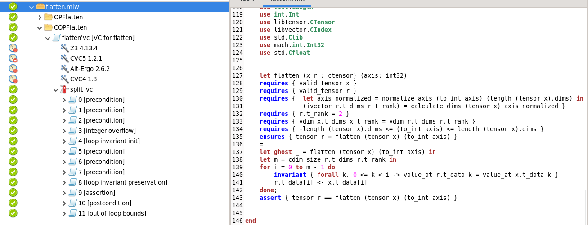

If one had forgotten to include this precondition:

```
requires {  let axis_normalized = normalize_axis (to_int axis) (length (tensor x).dims) in  
              (ivector r.t_dims r.t_rank) = calculate_dims (tensor x) axis_normalized   }
```

then, the strategy proposed above would have generated the following verification condition which is not automatically proved:

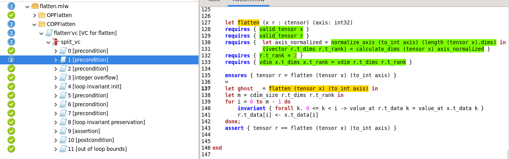

By inspecting the task menu, the specification author would be able to understand which precondition is missing and add it to the specification.


**Ensures**

Our final goal is to prove the **ensures** clause stating the refinement between both levels. 

Usually the following pipeline is followed to do so:

$$\texttt{ensures} \xrightarrow{\text{proved by}} \texttt{assert} \xrightarrow{\text{proved by}} \texttt{invariants}$$

Whenever your invariants fail to prove the assertion, you can start by inspecting the invariants and they are likely to be wrong or at least lacking information relevant to achieve the proof. 

### 3.4 Invariants

**Nested Loop Invariants**

Operators such as Conv produce outputs whose number of dimensions is known at specification time. Their concrete implementations compute the output data through nested loops — one loop per output dimension. To prove refinement between the concrete and abstract functions — specifically, that the `data` field of the output tensor is correct — we must show that, for every valid coordinate traversed by the loops, the value written to the output tensor equals the value computed by the abstract specification at that same coordinate. Since these implementations rely on nested loops, the proof requires **loop invariants**.

A loop invariant must satisfy two proof obligations:

1. **Initialization** — the invariant holds for the first iteration.

2. **Preservation** — ==the invariant== continually holds for all iterations up to the last one, inclusive.

When loops are nested, these obligations form a dependency chain: 

- an **outer** loop's invariant helps prove the **initialization** of the immediately inner loop's invariant

- an **inner** loop's invariant helps prove the **preservation** of its enclosing outer loop's invariant. 

The following example illustrates this:

```why3
let ref sum = (f32 0.0) in
(* ... *)
for i = 0 to rows - 1 do
    invariant { sum = 0.0 }             
    for j = 0 to cols - 1 do
        invariant { sum = 0.0 }          
        for k = 0 to iter - 1 do
            invariant { sum = dot_product (tensor a) (tensor b) i j 0 k } 
            (* ... *)
        done;
        sum <- 0.0;
    done;
done;
```

The innermost loop (`k`) accumulates a dot product in `sum`. ==the code seems to overwrite sum, rather than accumulate it==

For this accumulation to start correctly, `sum` must be `0.0` at the beginning of each `k`-loop — this is exactly what invariant $I_j$ states. ==the notation $I-j$ appears from nowhere. Can you add it inside the code (e.g. as comments)?== In turn, proving the initialization of $I_j$ requires $I_i$ to guarantee that `sum = 0.0` when the `j`-loop begins. The initialization chain is therefore:

$$I_i \xrightarrow{\text{initializes}} I_j \xrightarrow{\text{initializes}} I_k$$

In the opposite direction, once the `k`-loop terminates and `sum` is reset to `0.0`, $I_j$ is preserved, which in turn preserves $I_i$.

### Loop Invariants for Proving Data Refinement

 ==The implicit SONNX guideline here is something like: "the invariants in the concrete specification must be automatically proven by Why3", then the rest is a tutorial on how to achieve it. I would prefer if this distinction is made clear.==

**Example 1 - Unit Summation**

To reason about this, please check the [summation](./examples/summation.mlw) example, which basically computes the unit summation over a given range.

The invariant essentially captures the idea that until the current iteration `k`, the iterative summation has the same value as the recursive one. 

The image below depicts the verification conditions raised by such invariant as well as the reason why it does not prove:

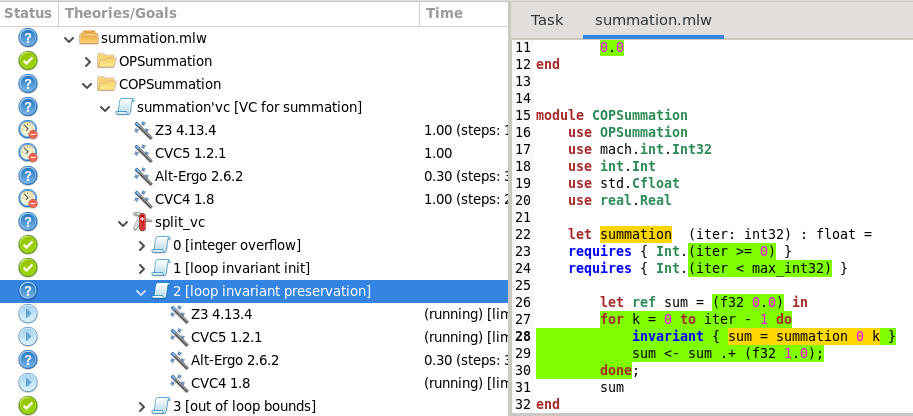

The goal and the respective logical context are below:

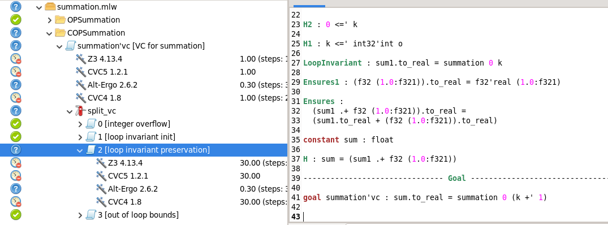

What the solver is trying to tell us is that it does not yet have enough information to garantee that at the invariant proves to be valid after the current iteration.

To solve this, we should somehow bridge the gap between the current iteration `i` and the next one `i + 1` also at the abstract level. 

Consider the following lemma, which states that the summation at iteration `i` is equal to the summation at iteration `i + 1` plus 1:

```why3
  let rec lemma summation_lemma (i iter : int)
    requires { i < iter }
    ensures  { 1 + summation (i + 1) iter = summation i iter }
    variant  { iter - i }
    =
    if i >= iter then
        ()
    else
        summation_lemma (i + 1) iter
```

After adding this, the invariant preservation is easily proved. 

This [file](./examples/summation2.mlw) already contains the lemma proposed above and the respective proof of the invariant preservation.

**Example 2 - Dot Product**

The example presented above is a very simple one, but the same strategy can be applied to much more complex operators.

Let's have a look at a `dot_product` example, which is extremely useful to the `matmul` operator. 

The file is available [here](./examples/dot_product.mlw).

Once again the proof is not achievable and the task menu displays the following:

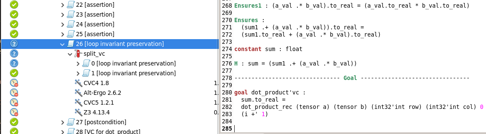

To solve this, we need a lemma that captures the relation above. Let us take into consideration the previous example lemma. 

The strategy is essentially the same:

```why3
  let rec lemma dot_product_lemma (a b: tensor real) (row col i k iter: int)
  requires { Int.(i <= k < iter) }
  variant { Int.(k - i) }
  ensures {
      let a_val = a.data (Cons row (Cons k Nil)) in
      let b_val = b.data (Cons k (Cons col Nil)) in
      dot_product_rec a b row col i Int.(k + 1) =
          Real.(dot_product_rec a b row col i k + a_val * b_val)
  }
=
  if i < k then 
    Real.(dot_product_lemma a b row col (i + 1) k iter) 
  else 
    ()
```

==I don't understand the expression $k + a_val * b_val$ in the code above, why are we mixing indices (k) and data?==

This lemma is enough to prove the invariant preservation, however, the why3 will fail to prove the invariant if we only add the lemma. 

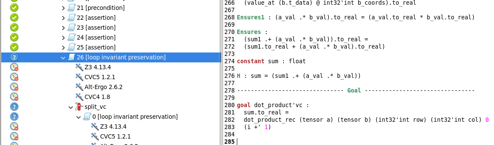

To solve this, we need to explicitly call the lemma in the body of the loop, instantiating it with the appropriate variables.

We will do so by introducing a ghost block:

```why3
ghost begin
    dot_product_lemma (tensor a) (tensor b) (to_int row) (to_int col) (to_int i) (to_int iter)
end
```

After this, the invariant preservation is easily proved.

More information regarding lemmas ==instantiation== in [4.2](#42-ide-transformations-and-prover-hints).

==Example 3== - **Convolution**

The Conv operator iterates over four output dimensions (`N`, `M`, `Y_H`, `Y_W`), producing four nested loops. ==Is this a 2D convolution only? As far as I recall, the ONNX operator supports different sizes==

Each loop carries an invariant stating that all output positions covered by completed iterations already hold the correct value — the same value that the abstract specification computes for those coordinates. 

Proving that the output data matches the abstract specification therefore requires four invariants, each satisfying initialization and preservation, linked together in the chain described above.

The function `w_channels_calculate` computes the output value at coordinate `(nn, mm, yy_hh, yy_ww)`, corresponding to the current loop iteration. 

This concrete function is equivalent to the one used in the abstract specification of Conv, so the value it produces at any coordinate is exactly the value prescribed by the abstract specification at that same coordinate. 

The loop invariants ensure that this relationship holds for every coordinate traversed by the loops, thereby establishing data refinement. 

Among the four, the outermost invariant (for `nn`) is the most important: once the `nn`-loop terminates, it establishes the correspondence between the concrete and abstract computations for all coordinates in the output tensor.

Below are the four loop invariants used in the concrete Conv implementation:

```why3
  for nn = 0 to n - 1 do
    invariant { 
      forall nn_: int. 0 <= nn_ < nn ->
        (forall mm: int. 0 <= mm < m ->
          (forall yy_hh: int. 0 <= yy_hh < y_h ->
            (forall yy_ww: int. 0 <= yy_ww < y_w ->
              let coords = Cons (nn_) (Cons (mm) (Cons yy_hh (Cons yy_ww Nil)) ) in
              let dims = ivector r.t_dims r.t_rank in
              let off = CFlat.offset coords dims in
              value_at r.t_data off = w_channels_calculate (tensor x) (tensor w) (to_int (value_at w.t_dims 1)) 0 (to_int(value_at w.t_dims 2)) (to_int(value_at w.t_dims 3)) nn_ mm yy_hh yy_ww str_h str_w dil_h dil_w pad_top pad_left
            )
          )
        )
    }
    r_coords_array[0] <- nn;
    for mm = 0 to m - 1 do
      invariant { value_at r_coords_array 0 = nn }
      invariant {
        forall mm_. 0 <= mm_ < mm ->
          (forall yy_hh. 0 <= yy_hh < y_h ->
            (forall yy_ww. 0 <= yy_ww < y_w ->
              let coords = Cons (nn) (Cons (mm_) (Cons yy_hh (Cons yy_ww Nil)) ) in
              let dims = ivector r.t_dims r.t_rank in
              let off = CFlat.offset coords dims in
              value_at r.t_data off = w_channels_calculate (tensor x) (tensor w) (to_int (value_at w.t_dims 1)) 0 (to_int(value_at w.t_dims 2)) (to_int(value_at w.t_dims 3)) nn mm_ yy_hh yy_ww str_h str_w dil_h dil_w pad_top pad_left
            )
          )
      }
      r_coords_array[1] <- mm;
      for y_hh = 0 to y_h - 1 do
        invariant { value_at r_coords_array 0 = nn /\ value_at r_coords_array 1 = mm }
        invariant {
          forall yy_hh. 0 <= yy_hh < y_hh ->
            (forall yy_ww. 0 <= yy_ww < y_w ->
              let coords = Cons (nn) (Cons (mm) (Cons yy_hh (Cons yy_ww Nil)) ) in
              let dims = ivector r.t_dims r.t_rank in
              let off = CFlat.offset coords dims in
              value_at r.t_data off = w_channels_calculate (tensor x) (tensor w) (to_int (value_at w.t_dims 1)) 0 (to_int(value_at w.t_dims 2)) (to_int(value_at w.t_dims 3)) nn mm yy_hh yy_ww str_h str_w dil_h dil_w pad_top pad_left
            )
        
        }
        r_coords_array[2] <- y_hh;
        for y_ww = 0 to y_w - 1 do
          invariant { value_at r_coords_array 0 = nn /\ value_at r_coords_array 1 = mm /\ value_at r_coords_array 2 = y_hh }
          invariant {
            forall yy_ww. 0 <= yy_ww < y_ww -> 
              let coords = Cons (nn) (Cons (mm) (Cons (y_hh) (Cons yy_ww Nil))) in
              let dims = ivector r.t_dims r.t_rank in
              let off = CFlat.offset coords dims in
              (value_at r.t_data off) = w_channels_calculate (tensor x) (tensor w) (to_int (value_at w.t_dims 1)) 0 (to_int(value_at w.t_dims 2)) (to_int(value_at w.t_dims 3)) ( nn) ( mm) ( y_hh) yy_ww ( str_h) (to_int str_w) (to_int dil_h) (to_int dil_w) (to_int pad_top) (to_int pad_left)
          }
          r_coords_array[3] <- y_ww;
          let (value, flag) = w_channels_calculate x w nn mm y_hh y_ww str_h str_w dil_h dil_w pad_top pad_left in
          if flag then begin
            let r_coords = coffset r_coords_array r.t_dims r.t_rank in
            r.t_data[r_coords] <- value;
```

The invariants alone are not sufficient for Why3 to discharge all proof obligations automatically. 

The core issue, which manifests at multiple levels of the loop nest, is always the same: when a value is written to `r.t_data[r_coords]`, the provers cannot automatically determine that previously written positions remain unaffected. 

They do not know that **distinct coordinates map to distinct flat indices**, and therefore that no position is ever overwritten. 

This must be asserted explicitly each time.

### The innermost loop

== The header is larger than the parent header (Example 3 - Convolution)==

The first failure occurs on the **preservation** of the innermost invariant (the `y_ww` loop):

```why3
  invariant {
    forall yy_ww. 0 <= yy_ww < y_ww -> 
      let coords = Cons (nn) (Cons (mm) (Cons (y_hh) (Cons yy_ww Nil))) in
      let dims = ivector r.t_dims r.t_rank in
      let off = CFlat.offset coords dims in
      (value_at r.t_data off) = w_channels_calculate (tensor x) (tensor w) (to_int (value_at w.t_dims 1)) 0 (to_int(value_at w.t_dims 2)) (to_int(value_at w.t_dims 3)) ( nn) ( mm) ( y_hh) yy_ww ( str_h) (to_int str_w) (to_int dil_h) (to_int dil_w) (to_int pad_top) (to_int pad_left)
  }
```

The fix is to assert that, for every previously visited `yy_ww` coordinate, the coordinate vector differs from the one currently being written, the coordinate is within valid range, and the resulting flat offsets are distinct:

```why3
  assert { forall yy_ww. 0 <= yy_ww < y_ww -> 
            let coords = Cons (nn) (Cons (mm) (Cons (y_hh) (Cons yy_ww Nil)) ) in
            coords <> (ivector r_coords_array r.t_rank)
          };
  
  assert  { forall yy_ww. 0 <= yy_ww < y_ww -> 
            let coords = Cons (nn) (Cons (mm) (Cons (y_hh) (Cons yy_ww Nil)) ) in
            Range.valid coords (ivector r.t_dims r.t_rank)
          };

  assert { forall yy_ww. 0 <= yy_ww < y_ww -> 
            let coords = Cons (nn) (Cons (mm) (Cons (y_hh) (Cons yy_ww Nil)) ) in
            let dims = ivector r.t_dims r.t_rank in
            let off = CFlat.offset coords dims in
            let off1 = CFlat.offset (ivector r_coords_array r.t_rank) dims in
            off <> off1 
          };
  
  assert {
          forall yy_ww. 0 <= yy_ww < y_ww -> 
                    let coords = Cons (nn) (Cons (mm) (Cons (y_hh) (Cons yy_ww Nil)) ) in
                    let dims = ivector r.t_dims r.t_rank in
                    let off = CFlat.offset coords dims in
                    off <> r_coords
        };
```

With these assertions in place, the proof of the innermost invariant succeeds.

### The outer loops

The preservation of the outer invariants still fails.

To understand why, consider the proof obligation that Why3 generates for the `y_hh` loop invariant:

```why3
constant yy_hh : int

H3 : 0 <=' yy_hh

H2 : yy_hh <' (y_hh +' 1)

constant yy_ww : int

H1 : 0 <=' yy_ww

H : yy_ww <' int32'int y_w

constant coords : list int =
  Cons nn (Cons mm (Cons yy_hh (Cons yy_ww (Nil: list int))))

constant dims : list int = ivector (r.t_dims) (int32'int (r.t_rank))

------------------------------- Goal --------------------------------

goal c_conv'vc :
  (value_at (r.t_data) @ offset1 coords dims).to_real =
  w_channels_calculate (tensor x) (tensor w)
  (to_int2 (value_at (w.t_dims) @ 1)) 0 (to_int2 (value_at (w.t_dims) @ 2))
  (to_int2 (value_at (w.t_dims) @ 3)) nn mm yy_hh yy_ww (int32'int str_h)
  (int32'int str_w) (int32'int dil_h) (int32'int dil_w) (int32'int pad_top)
  (int32'int pad_left)
```

Inspecting the logical context more closely, we find the hypothesis corresponding to the `y_hh` loop invariant:

```
LoopInvariant2 :
  forall yy_hh1:int.
   0 <=' yy_hh1 /\ yy_hh1 <' y_hh ->
   (forall yy_ww1:int.
     0 <=' yy_ww1 /\ yy_ww1 <' int32'int y_w ->
     (let coords'unused =
        Cons nn (Cons mm (Cons yy_hh1 (Cons yy_ww1 (Nil: list int))))
      in
      (value_at (r1.t_data)
       @ offset1
         (Cons nn (Cons mm (Cons yy_hh1 (Cons yy_ww1 (Nil: list int)))))
         (ivector (r1.t_dims) (int32'int (r1.t_rank)))).to_real =
      w_channels_calculate (tensor x) (tensor w)
      (to_int2 (value_at (w.t_dims) @ 1)) 0
      (to_int2 (value_at (w.t_dims) @ 2)) (to_int2 (value_at (w.t_dims) @ 3))
      nn mm yy_hh1 yy_ww1 (int32'int str_h) (int32'int str_w)
      (int32'int dil_h) (int32'int dil_w) (int32'int pad_top)
      (int32'int pad_left)))
```

At first glance, the hypothesis and the goal look nearly identical. 

However, there is a subtle but critical difference: `LoopInvariant2` refers to `r1.t_data`, whereas the goal refers to `r.t_data`.

The only relationship between `r` and `r1` available in the logical context is:

```why3
H13 : r = ctensor'mk (r1.t_rank) (r1.t_dims) (r.t_data)
```

Meanwhile, from the innermost loop invariant, the following hypothesis is also available:

```
LoopInvariant1 :
  forall yy_ww1:int.
   0 <=' yy_ww1 /\ yy_ww1 <' (int32'int o +' 1) ->
   (let coords'unused =
      Cons nn (Cons mm (Cons y_hh (Cons yy_ww1 (Nil: list int))))
    in
    (value_at (r.t_data)
     @ offset1 (Cons nn (Cons mm (Cons y_hh (Cons yy_ww1 (Nil: list int)))))
       (ivector (r.t_dims) (int32'int (r.t_rank)))).to_real =
    w_channels_calculate (tensor x) (tensor w)
    (to_int2 (value_at (w.t_dims) @ 1)) 0 (to_int2 (value_at (w.t_dims) @ 2))
    (to_int2 (value_at (w.t_dims) @ 3)) nn mm y_hh yy_ww1 (int32'int str_h)
    (to_int2 str_w) (to_int2 dil_h) (to_int2 dil_w) (to_int2 pad_top)
    (to_int2 pad_left))
```

The underlying problem is the same as before: the provers know the values are correct, but they cannot establish that distinct coordinates yield distinct flat indices. 

This time, however, assertions cannot be placed directly at the `y_hh` loop level, because no writes to the output tensor's data occur within the `y_hh` loop body itself — all writes happen inside the inner `y_ww` loop.

The solution is to **carry the `y_hh` loop invariant into the `y_ww` loop** as an additional invariant:

```
for y_ww = 0 to y_w - 1 do
    invariant { value_at r_coords_array 0 = nn /\ value_at r_coords_array 1 = mm /\ value_at r_coords_array 2 = y_hh }
    invariant {
        forall yy_hh. 0 <= yy_hh < y_hh ->
            (forall yy_ww. 0 <= yy_ww < y_w ->
            let coords = Cons (nn) (Cons (mm) (Cons yy_hh (Cons yy_ww Nil)) ) in
            let dims = ivector r.t_dims r.t_rank in
            let off = CFlat.offset coords dims in
            value_at r.t_data off = w_channels_calculate (tensor x) (tensor w) (to_int (value_at w.t_dims 1)) 0 (to_int(value_at w.t_dims 2)) (to_int(value_at w.t_dims 3)) nn mm yy_hh yy_ww str_h str_w dil_h dil_w pad_top pad_left
            )
    }
    invariant {
        forall yy_ww. 0 <= yy_ww < y_ww -> 
            let coords = Cons (nn) (Cons (mm) (Cons (y_hh) (Cons yy_ww Nil))) in
            let dims = ivector r.t_dims r.t_rank in
            let off = CFlat.offset coords dims in
            (value_at r.t_data off) = w_channels_calculate (tensor x) (tensor w) (to_int (value_at w.t_dims 1)) 0 (to_int(value_at w.t_dims 2)) (to_int(value_at w.t_dims 3)) ( nn) ( mm) ( y_hh) yy_ww ( str_h) (to_int str_w) (to_int dil_h) (to_int dil_w) (to_int pad_top) (to_int pad_left)
    }
    r_coords_array[3] <- y_ww;
    let (value, flag) = w_channels_calculate x w nn mm y_hh y_ww str_h str_w dil_h dil_w pad_top pad_left in
    if flag then begin
    let r_coords = coffset r_coords_array r.t_dims r.t_rank in
    r.t_data[r_coords] <- value;

```

By placing the `y_hh` invariant inside the `y_ww` loop, the preservation of the original `y_hh` invariant is automatically discharged — as established earlier, an inner loop's invariant helps prove the preservation of its enclosing outer loop's invariant.

However, Why3 still cannot prove the **preservation** of this newly carried invariant within the `y_ww` loop.

The reason is the same: when we write to `r.t_data[r_coords]`, the provers cannot determine that coordinates from earlier `y_hh` iterations are not being overwritten.

The same pattern of assertions resolves this:

```why3

assert { forall yy_hh. 0 <= yy_hh < y_hh -> 
            (forall yy_ww. 0 <= yy_ww < y_w ->
            let coords = Cons (nn) (Cons (mm) (Cons yy_hh (Cons yy_ww Nil)) ) in
            coords <> (ivector r_coords_array r.t_rank)
            )
        };
assert { forall yy_hh. 0 <= yy_hh < y_hh -> 
            (forall yy_ww. 0 <= yy_ww < y_w ->
            let coords = Cons (nn) (Cons (mm) (Cons yy_hh (Cons yy_ww Nil)) ) in
            Range.valid coords (ivector r.t_dims r.t_rank)
            )
        };

assert { forall yy_hh. 0 <= yy_hh < y_hh -> 
            (forall yy_ww. 0 <= yy_ww < y_w ->
            let coords = Cons (nn) (Cons (mm) (Cons yy_hh (Cons yy_ww Nil)) ) in
            let dims = ivector r.t_dims r.t_rank in
            let off = CFlat.offset coords dims in
            let off1 = CFlat.offset (ivector r_coords_array r.t_rank) dims in
            off <> off1
            )
        };

assert { forall yy_hh. 0 <= yy_hh < y_hh -> 
            (forall yy_ww. 0 <= yy_ww < y_w ->
            let coords = Cons (nn) (Cons (mm) (Cons yy_hh (Cons yy_ww Nil)) ) in
            let dims = ivector r.t_dims r.t_rank in
            let off = CFlat.offset coords dims in
            off <> r_coords
            )
        };
```

Applying this same strategy to the remaining outer loops (`mm` and `nn`) — carrying each outer invariant into the innermost loop and adding the corresponding non-aliasing assertions — completes the proof of preservation for all invariants, and thus establishes the data refinement of the Conv operator.

The completed file is available [here](./examples/conv.mlw).

# Part 4 - Tips, Hints and Strategies

==I did not review the below in detail==

## 4.1. Scope Resolution

When using modules that export functions with the same name (e.g., `+` from both `Int` and `Real`), it is probably the case that Why3 will automatically infer the wrong one and cause type errors. 

Take a look at the following example:

```why3
module OPSummation
    use int.Int
    use real.Real

    let rec function summation (i : int) (iter : int) : real 
        variant { iter - i }
    =
        if i < iter then
            1.0 + summation (i + 1) iter
        else
        0.0
end
```

If you attempt to open the Why3 ide with the above code, you will get the following error:

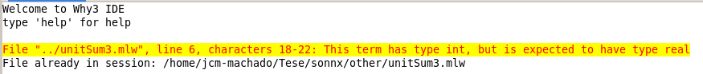

This happens usually when a given function returns `a-datatype` whereas its auxiliar cauculus perform operations over elements with `b-datatype`. 

In that case, Why3 will infer the operations to be over `a-datatype` which is not what we want and will cause type errors. To solve this, we need to explicitly specify the scope of the operations by prefixing them with the module name.

In the example above there are several operations whose operators are defined both for the `Int` and `Real` modules. 

Since we are returning a `Real` Why3 will try to perform every operation under the `Real` scope. 

To solve the issue we will have to specify the scope operations on the `Int` domain:


$$(iter - i) \rightarrow Int.(iter - i)$$

$$i < iter \rightarrow Int.(i < iter)$$

$$1.0 + summation (i + 1) iter \rightarrow 1.0 + summation Int.(i + 1) iter$$

The corrections applied to the code above are the following:

```why3
module OPSummation
    use int.Int
    use real.Real

    let rec function summation (i : int) (iter : int) : real 
        variant { Int.(iter - i) }
    =
        if Int.(i < iter) then
            1.0 + summation Int.(i + 1) iter
        else
        0.0
end
```

## 4.2. IDE Transformations and Prover Hints

Although Why3 supports fully automated proving (by selecting proof levels 0–3), it is also possible to apply manual transformations and proof tactics to help the prover discharge difficult goals.

Below are techniques we have found useful in practice.

The full list of available transformations and tactics can be found under the **Tools** menu in the Why3 IDE.

---

### Lemma / Axiom Instantiation

When an axiom or lemma is stated universally, for example:

```why3
axiom test:
    forall x: int. P(x) -> Q(x)
```

The automated prover may either fail or take significantly longer to apply it in a specific context.

Manually instantiating the axiom with the concrete variables involved can make the proof faster and successful.

**Example — Mean Value Theorem:**

Consider the following axiom:

```why3
(* Lagrange Mean Value Theorem *)
axiom mean_value_theorem_sigmoid:
    forall x y: real.
        exists c: real.
            (x <= c <= y \/ y <= c <= x) /\
            sigmoid_real x - sigmoid_real y = sigmoid_derivative c * (x - y)
```

And the following lemma to be proved:

```why3
lemma lipschitz_sigmoid:
    forall x y: real.
        abs (sigmoid_real x - sigmoid_real y) <= 0.25 * abs (x - y)
```

To prove `lipschitz_sigmoid`, the prover needs to apply the Mean Value Theorem.

Instantiating the axiom with the specific variables `x` and `y` greatly helps.

**IDE instantiation syntax:**

```
instantiate <axiom_name> <ide_variable_name>
```

If the axiom has more than one universally quantified variable, each variable must be instantiated in a separate step.

The hypothesis produced by each instantiation is typically named `Hinst`, and subsequent instantiations should target it.

This command is entered in the **"Type command here"** input field, located beneath the task list in the Why3 IDE.

---

### Instantiation via Lemma Functions

Instead of instantiating lemmas manually through the IDE, the same effect can be achieved by calling **lemma functions** directly in the body of the function being proved. 

This is the preferred approach, as it keeps the proof self-contained and reproducible.

**Example — `valid_bounds_2` lemma function:**

The following recursive lemma verifies that, given two `iarray` values `ks` (coordinates) and `ds` (dimensions), all coordinates within the range `[p, q[` are valid with respect to those dimensions:

```why3
let rec lemma valid_bounds_2 (ks ds: iarray) (p q: int)
  requires { p <= q }
  requires { valid_range ks p q }
  requires { valid_range ds p q }
  requires { pdim ds p q }
  requires { forall i. p <= i < q -> 0 <= value_at ks i < value_at ds i }
  ensures  { Range.valid (islice ks p q) (islice ds p q) }
  variant  { q - p }
  = if p < q then
      begin
        assert { islice ks p q = Cons (Int32.to_int (value_at ks p)) (islice ks (p+1) q) };
        assert { islice ds p q = Cons (Int32.to_int (value_at ds p)) (islice ds (p+1) q) };
        valid_bounds_2 ks ds (p+1) q
      end
```

Now consider the `dot_product` function, which allocates coordinate arrays at runtime:

```why3
let dot_product (a b: ctensor) (row col iter: int32) : (float, bool) =
    requires { value_at a.t_dims 1 = value_at b.t_dims 0 = iter }
    requires { a.t_rank = b.t_rank = 2 }
    requires { iter >= 0 }
    requires { row >= 0 /\ row < value_at a.t_dims 0 }
    requires { col >= 0 /\ col < value_at b.t_dims 1 }
    (* ... *)
        let ref sum = (f32 0.0) in
        let ref flag = False in
        let a_coords_array = malloc (to_uint32 2) in
        let b_coords_array = malloc (to_uint32 2) in
        if is_not_null a_coords_array && is_not_null b_coords_array then begin
            flag <- True;
            for i = 0 to iter - 1 do
                invariant { sum = dot_product (tensor a) (tensor b) row col 0 i }
                set_ofs a_coords_array 0 row;
                set_ofs a_coords_array 1 i;
                set_ofs b_coords_array 0 i;
                set_ofs b_coords_array 1 col;

                ghost valid_bounds_2 a_coords_array a.t_dims 0 2;
                (* Rest of code ... *)
```

Although it follows directly from the preconditions that `a_coords_array` always holds valid coordinates for `a.t_dims`, Why3 does not infer this on its own.

Calling `valid_bounds_2` as a ghost lemma function instantiates the lemma with the concrete arrays, giving the prover the exact fact it needs to continue.

---

### Function Unfolding

When a proof goal involves a function call, it can be helpful to force the expansion of that function so that the goal becomes more explicit and easier for the prover to handle.

Two transformations are available for this purpose: `unfold` and `compute_in_goal`. Both are entered in the **"Type command here"** field, beneath the task list in the Why3 IDE.

**`unfold`** expands a specific function by its definition at the point where it appears in the goal.

To use `unfold` transformation, enter the following command in the **"Type command here"** field:
```
unfold <function_name>
```

Before applying `unfold`:

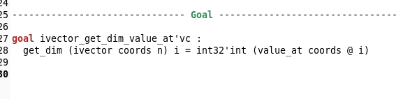

After applying `unfold`:

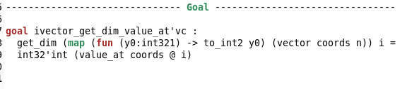

**`compute_in_goal`** performs a more aggressive expansion, reducing all computable expressions in the goal simultaneously. 

It requires no arguments:

```
compute_in_goal
```

Result after applying `compute_in_goal`:

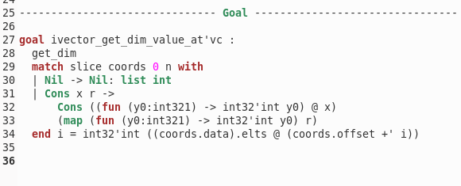


---

## 4.3. How to Debug

"Debugging" a formal proof means figuring out why the logical context is not sufficient to discharge a given goal.

There are two common root causes:

1. **The goal is false** — the specification, loop invariant, or postcondition is incorrect. The only fix is to correct what is being stated.

2. **The goal is true, but the context lacks the necessary information** — the prover has the right goal but is missing a hypothesis, a lemma instantiation, or a rewrite step to connect the pieces.

The most effective approach in either case is to carefully compare the **goal** with the **available hypotheses** in the logical context, looking for what bridges the gap.

### Reading the Logical Context

Consider the following goal:

```
------------------------------- Goal --------------------------------

goal w_cools_calculate'vc :
  to_extended_real max_value =
  w_cools_calculate (tensor x) (to_int2 h) (ww +' 1) 0 (to_int2 b)
  (to_int2 c) (to_int2 m) (to_int2 n) (to_int2 dil_h) (to_int2 dil_w)
  (to_int2 pad_top) (to_int2 pad_left) (to_int2 pad_bottom)
  (to_int2 pad_rigth) (to_int2 str_h) (to_int2 str_w)
```

In the logical context, among other hypotheses, we have:

```
constant x_val : float

constant aux_flag : bool

Ensures4 :
  aux_flag = True ->
  coords_from_X_p (tensor x) (ivector x_p_coords_array 4) (to_int2 pad_top)
  (to_int2 pad_left) = to_extended_real x_val

constant ww1 : int321

constant ww : int = int32'int ww1

H31 : 0 <=' ww

H30 : ww <=' int32'int o2

LoopInvariant :
  to_extended_real max_value1 =
  w_cools_calculate (tensor x) (to_int2 h) ww 0 (to_int2 b) (to_int2 c)
  (to_int2 m) (to_int2 n) (to_int2 dil_h) (to_int2 dil_w) (to_int2 pad_top)
  (to_int2 pad_left) (to_int2 pad_bottom) (to_int2 pad_rigth) (to_int2 str_h)
  (to_int2 str_w)

H1 :
  w_cools_calculate (tensor x) (int32'int h) (int32'int ww1 +' 1) 0
  (int32'int b) (int32'int c) (int32'int m) (int32'int n) (int32'int dil_h)
  (int32'int dil_w) (int32'int pad_top) (int32'int pad_left)
  (int32'int pad_bottom) (int32'int pad_rigth) (int32'int str_h)
  (int32'int str_w) =
  max_extended_real
  (coords_from_X_p (tensor x)
   (Cons (int32'int b)
    (Cons (int32'int c) (Cons x_h (Cons x_w (Nil: list int)))))
   (int32'int pad_top) (int32'int pad_left))
  (w_cools_calculate (tensor x) (int32'int h) (int32'int ww1) 0 (int32'int b)
   ...)

Ensures :
  to_extended_real (max max_value1 x_val) =
  max_extended_real (to_extended_real max_value1) (to_extended_real x_val)

constant max_value : float

H : max_value = max max_value1 x_val
```

The logical context is sufficient to prove the goal. Here is the reasoning:

**Left-hand side of the goal.**

From `H`, we know `max_value = max max_value1 x_val`, so:

```
to_extended_real max_value = to_extended_real (max max_value1 x_val)
```

Applying `Ensures`:

```
= max_extended_real (to_extended_real max_value1) (to_extended_real x_val)
```

**Right-hand side of the goal.**

Since `ww = int32'int ww1` (constant definition), the call `w_cools_calculate ... (ww +' 1) ...` in the goal is identical to `w_cools_calculate ... (int32'int ww1 +' 1) ...`, which is exactly the left-hand side of `H1`. Applying `H1`:

```
w_cools_calculate ... (ww +' 1) ...
  = max_extended_real
      (coords_from_X_p (tensor x) (Cons (int32'int b) (Cons (int32'int c) (Cons x_h (Cons x_w Nil)))) (int32'int pad_top) (int32'int pad_left))
      (w_cools_calculate (tensor x) (int32'int h) (int32'int ww1) 0 (int32'int b) ...)
```

From `LoopInvariant`, we know that `to_extended_real max_value1 = w_cools_calculate ... ww ...`, and since `ww = int32'int ww1`, the second argument of `max_extended_real` above equals `to_extended_real max_value1`.

For the first argument, `Ensures4` tells us (given `aux_flag = True`) that:

```
coords_from_X_p (tensor x) (ivector x_p_coords_array 4) (to_int2 pad_top) (to_int2 pad_left)
  = to_extended_real x_val
```

So it appears we have everything needed to close the goal — both sides reduce to `max_extended_real (to_extended_real max_value1) (to_extended_real x_val)` (up to commutativity). 

However, Why3 cannot discharge the goal automatically.

**Why Why3 doesn't make the proof**

The first argument of `max_extended_real` in `H1` is expressed using an explicit list constructor:

```
coords_from_X_p (tensor x)
  (Cons (int32'int b) (Cons (int32'int c) (Cons x_h (Cons x_w Nil))))
  (int32'int pad_top) (int32'int pad_left)
```

whereas `Ensures4` refers to the same coordinate vector as `ivector x_p_coords_array 4`.

These two representations are semantically identical, but Why3 treats them as syntactically distinct and cannot unify them on its own. 

The connection must be made explicit with an intermediate assertion:

```why3
assert { ivector x_p_coords_array 4 =
           Cons (to_int b) (Cons (to_int c) (Cons (to_int x_h) (Cons (to_int x_w) Nil))) };
```

This assertion bridges the gap: once Why3 knows that `ivector x_p_coords_array 4` expands to that exact list, `Ensures4` can be matched against `H1` and the proof goes through.