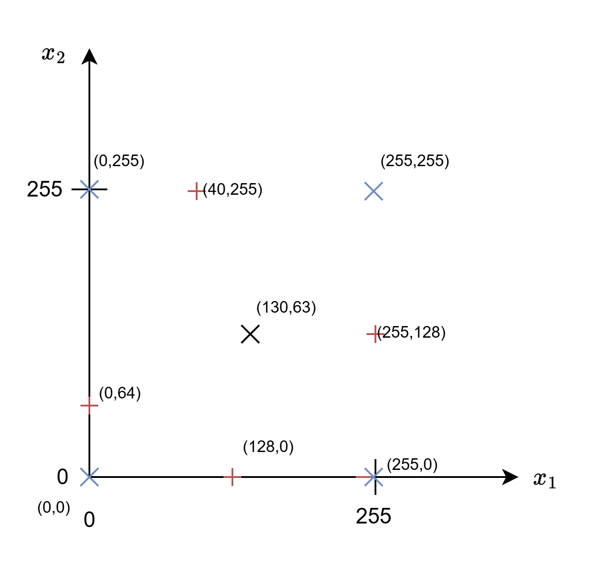
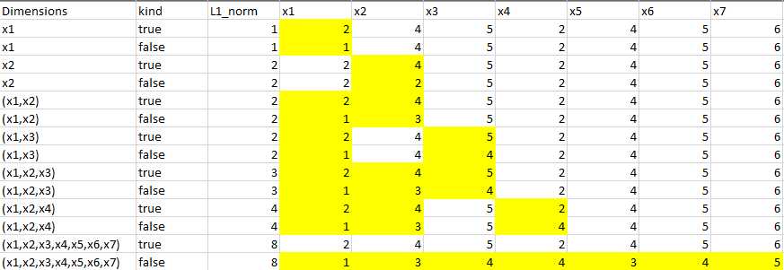

## Introduction
This document proposes an approach to develop tests of the SONNX operators. 

Note that it does not (yet) cover the actual implementation of tests (using [Hypothesis](https://hypothesis.works/) or any other test framework such as [pytest](https://docs.pytest.org/en/stable/), [doctest](https://docs.python.org/3/library/doctest.html), etc.). This will be done in a future version of the document.

The current version of this note is organized as follows:
- The first section recalls the objectives of testing in the context of SONNX and give some elements about the test strategy,
- The second section focuses on the practical implementation of the test strategy for SONNX operators 
### Test objectives and scope in SONNX

In SONNX, tests target two main objectives:
- **Validating** the informal specification through comparison with existing implementations (e.g., ONNX runtime) 
- **Verifying** implementations of the SONNX specification, using the SONNX reference implementation as the test oracle. 

Concerning the first objective, it could be interpreted at first sight as some sort of "retro-engineering" activity in which the specification is derived from the implementation. *This is clearly not the case*. Tests against an implementation is a way to increase our confidence in the SONNX specification by comparing it to existing reliable implementations. 
In case of discrepancy, no immediate conclusion can be drawn since the error may be either in the specification or in the implementation. However, this reveals a problem in either or both sides that needs to be addressed. This approach has already  been fruitful by raising issues both in our specification and in the ONNX runtime implementation. 

Concerning the second objective, it is worth noting that passing all tests developed in SONNX does not **guarantee** full  conformance with the SONNX specification. In particular, in the context of the development of a certified system, demonstration of conformance remains the responsibility of the applicant.
### Test strategies
#### Functional *vs. implementation-based* tests

In SONNX, tests are essentially *functional*. They only refer to the specification of operators -- i.e., *what* the operators are expected to do. They do not consider *how* they will be implemented. 

Note: This statement is not completely true. In practice, some implicit hypothesis about possible implementations may be done (for instance, the search algorithm implemented to find a maximum) and some tests may target those algorithms. But those tests will always be complementary to those based on the sole specification.  
#### Equivalence class-based testing
Except for very simple cases such as e.g., **Add** on int8 scalars, it is generally impossible test an operator against all its possible input values. Therefore, tests are generally performed with a selected subset of all possible values.

One strategy to select those value can be based on the definition of *equivalence classes*. 

Two values $x$ and $y$ belong to the same equivalence class with respect to testing (i.e., $a R b$) if the capability of those values to reveal some design or implementation error are *expected* to be the same. For instance, testing **Add(x1,x2)** with $a=(x_1:10,x_2:20)$ is considered to reveal the same kind of errors as with $b=(x_1:15, x_2:-10)$. 

This definition clearly shows that equivalence classes rely on some *hypotheses* about some "reasonable" underlying fault model. For instance, in the previous example, nothing prevents a specific implementation to behave correctly for $x=10,y=20$ and incorrectly for $x=15,y=-10$. For instance:
```
int add(int x, int y) {
	if ((15 == x) && (-10 ==y) 
		return 42;
	else
		return x+y;
}
```
But in general, such fault model -- which is some kind of "easter-egg" in this case -- is simply deemed  very unlikely and is not considered in the definition of the equivalence classes. 

Reciprocally, some fault models are well-known. This is, for instance, the case of faults concerning the incorrect handling of domain boundaries, whether it is the bounds of an array, the min and max values of some data type, some "special" functional values (e.g., a null denominator for a division), etc.  

Since we are considering *functional* testing,  classes of equivalence are based on the specified behaviour of the operator, not on any specific implementation. 

#### Domains and equivalence classes

##### Simple domains
 In some cases, equivalence classes are derived from the domains of valid values of variables. A domain by be defined by the type of the variable (for instance, $[0,255]$ for an unsigned integer, $[-128,127]$ for a signed integer, etc.), or by  some constraint  involving one or multiple variables. 

Once the domain is defined, several equivalence classes can be built, for instance: 
- the class of all values on the boundary of the domain
- the class of all values inside the domain defined by the boundary (the boundaries themselves being excluded).

Let us consider a domain defined by some predicate $p_i(x_1,x_2,...,x_n)$ over a subset of the operator input variables. A predicate can be an inequality or an equality relation involving some input variables. For instance:  $x_1+x_2\leq x_3$ or $x_1^2+x_2^2=c$, etc. A domain is defined by the set of predicates $P={p_1,p_2,...,p_m}$. 

We may decompose the first class by (i) taking each possible subset $s$ of predicates in $P$ and replacing each predicate $p_i$ in $s$ by a new predicate $p'_i$ expressing the condition at the boundary and (ii) forming a new system of predicates composed of all $p'_i$ and the remaining predicates in $P\setminus s$.  Note that for equality relations, $p'=p$. Consequently, all values are on the boundary and the second class does not exist.

Let us take for example the following set of constraints, with $x_i \in \mathbb{N}$: 
- $p_1(x_1) \Leftrightarrow x_1 < 100$
- $p_2(x_1,x_2) \Leftrightarrow x_1+x_2 < 150$

The predicate $p_i(x_1)\Leftrightarrow x_1 < 100$ gives $p'_i(x_1) \Leftrightarrow x_1 = 99$ . (In the float domain, the predicate would be  replaced by $p_i(x_1) \Leftrightarrow x_1 = 100-\epsilon$ .)

The predicate $p_2(x_1,x_2) \Leftrightarrow x_1+x_2 < 150$  gives by $p'_2(x_1,x_2) \Leftrightarrow x_1+x_2 = 149$ . 

This system of constraints will lead to the following domains:
1. $x_1=99 \wedge x_1+x_2=149$ 
2. $x_1 = 99 \wedge x_1+x_2 < 150$
3. $x_1<100 \wedge x_1+x_2=149$ 
4. $x_1< 100 \wedge x_1+x_2<150$ (all the points that are not on the boundary of the domain) 

Note that this is not a partition since, for example, point $(x_1=99, x_2=149)$ satisfies the first 3 equations and, consequently, belongs to the three domains. 

In order to create a partition, we can consider the constraints in a specific order, for instance from the first to the last, and exclude values covered by the first n-1 equations from the n-th.  

In our example, this would give :
1. $x_1=99 \wedge x_1+x_2=149$ 
2. $x_1 = 99 \wedge x_1+x_2 < 150 \wedge \neg (x_1=99 \wedge x_1+x_2=149)$
3. $x_1<100 \wedge x_1+x_2=149 \wedge \neg (x_1=99 \wedge x_1+x_2=149) \wedge \neg (x_1 = 99 \wedge x_1+x_2 < 150)$ 
4. $x_1< 100 \wedge x_1+x_2<150  \wedge \neg (x_1=99 \wedge x_1+x_2=149) \wedge \neg (x_1 = 99 \wedge x_1+x_2 < 150) \wedge \neg(x_1<100 \wedge x_1+x_2=149)$  

The second condition can be rewritten as:
$$ x_1 = 99 \wedge x_1+x_2 < 150 \wedge \neg (x_1=99 \wedge x_1+x_2=149) $$
$$ x_1 = 99 \wedge x_1+x_2 < 150 \wedge (x_1 \neq 99 \vee x_1+x_2 \neq 149) $$
$$ (x_1 = 99 \wedge x_1+x_2 < 150 \wedge x_1 \neq 99) \vee (x_1 = 99 \wedge x_1+x_2 < 150 \wedge 
 x_1+x_2 \neq 149) $$
The first member of the predicate cannot be satisfied. This leads to:
$$x_1 = 99 \wedge x_1+x_2 < 150 \wedge  x_1+x_2 \neq 149 \Leftrightarrow x_1 = 99 \wedge x_1+x_2 < 149 $$
The third equation is\[  
$$\begin{aligned}  
&x_1 < 100 \\  
&\wedge\ x_1 + x_2 = 149 \\  
&\wedge\ \neg (x_1 = 99 \wedge x_1 + x_2 = 149) \\  
&\wedge\ \neg (x_1 = 99 \wedge\ x_1 + x_2 < 150)  
\end{aligned}  
$$
or
$$\begin{aligned}  
&x_1 < 100 \\  
&\wedge\ x_1 + x_2 = 149 \\  
&\wedge\ (x_1 \neq 99 \vee x_1 + x_2 \neq 149) \\  
&\wedge\ (x_1 \neq 99 \vee x_1 + x_2 \ge 150)  
\end{aligned}  
$$

so
$$x_1 < 99 \wedge x_1 + x_2 = 149$$

Now, let's consider the simple case of the **Add(x1,x2)** for `unsigned int8` values.
Variable $x_1$ is in the domain $[0,255]$, variable $x_2$ is in the domain $[0,255]$.

The system of equations is:
- $p_1 \Leftrightarrow x_1\ge 0$
- $p_2 \Leftrightarrow x_1\le 255$
- $p_3 \Leftrightarrow x_2 \ge 0$
- $p_4 \Leftrightarrow x_2 \le 255$

(Note that we may also consider the constraint about the type of the output, e.g., $x_1+x_2 \leq 255$ for unsigned ints.)

This lead to the follow systems of equations: 
- 4 out of 4 combination
	- $P_{4/4} \Leftrightarrow p'1 \wedge p'_2 \wedge p'_3 \wedge p'_4$ 
- 3 out of 4 combinations 
	- $P_{3/4.1} \Leftrightarrow p'1 \wedge p'_2 \wedge p'_3 \wedge p_4 \wedge \neg P_{4/4}$ 
	- $P_{3/4.2} \Leftrightarrow p'1 \wedge p'_2 \wedge p_3 \wedge p'_4 \wedge \neg P_{4/4}$ 
	- $P_{3/4.3} \Leftrightarrow p'1 \wedge p_2 \wedge p'_3 \wedge p'_4 \wedge \neg P_{4/4}$ 
	- $P_{3/4.4} \Leftrightarrow  p1 \wedge p'_2 \wedge p'_3 \wedge p_4 \wedge \neg P_{4/4}$
- 2 out of 4 combinations
	- $P_{2/4.1} \Leftrightarrow  p'1 \wedge p'_2 \wedge p_3 \wedge p_4 \wedge \neg P_{3/4.i, i=1..4} \wedge \neg P_{4/4}$ 
	- ...
	- $P_{2/4.6} \Leftrightarrow  p1 \wedge p_2 \wedge p'_3 \wedge p'_4 \wedge \neg P_{3/4.i, i=1..4} \wedge \neg P_{4/4}$
- 1 out of 4 combinations
	- $P_{1/4.1} \Leftrightarrow  p'1 \wedge p_2 \wedge p_3 \wedge p_4 \wedge \neg P_{2/4.i, i=1..6} \wedge \neg P_{3/4.i, i=1..4} \wedge \neg P_{4/4}$ 
	- $P_{1/4.2} \Leftrightarrow p1 \wedge p'_2 \wedge p_3 \wedge p_4 \wedge \neg P_{2/4.i,i=1..6} \wedge \neg P_{3/4.i,i=1..4} \wedge \neg P_{4/4}$ 
	- $P_{1/4.3} \Leftrightarrow p1 \wedge p_2 \wedge p'_3 \wedge p_4 \wedge \neg P_{2/4.i, i=1..6} \wedge \neg P_{3/4.i, i=1..4} \wedge \neg P_{4/4}$ 
	- $P_{1/4.4} \Leftrightarrow p1 \wedge p_2 \wedge p_3 \wedge p'_4 \wedge \neg P_{2/4.i, i=1..6} \wedge \neg P_{3/4.i,i=1..4} \wedge \neg P_{4/4}$ 

Note that the formulae could be simplified. For instance, considering the 3 out of 4 combinations:
$$ P_{3/4.1} \Leftrightarrow p'1 \wedge p'_2 \wedge p'_3 \wedge p_4 \wedge \neg P_{4/4}$$
$$\begin{aligned}  
  p'1 \wedge p'_2 \wedge p'_3 \wedge p_4 \wedge \neg P_{4/4} 
  &= p'1 \wedge p'_2 \wedge p'_3 \wedge p_4 \wedge (\overline{p'1} \vee \overline{p'2} \vee \overline{p'3} \vee \overline{p'4} \\
& = p'1 \wedge p'_2 \wedge p'_3 \wedge p_4 \wedge \overline{p'4} \\  
\end{aligned}  
$$
so the terms for the 3 out of 4 combinations become: 
- $p'1 \wedge p'_2 \wedge p'_3 \wedge p_4 \wedge \overline{p'4}$
- $p'1 \wedge p'_2 \wedge p_3 \wedge p'_4 \wedge \overline{p'3}$
- $p'1 \wedge p_2 \wedge p'_3 \wedge p'_4 \wedge \overline{p'2}$
- $p1 \wedge p'_2 \wedge p'_3 \wedge p'_4 \wedge \overline{p'1}$

Similar algebraic simplifications could be done the the 2 out of 4 and 1 out of 4 terms.

Applied to our example, the problem simplifies since some of the predicates are incompatible (for instance $p'1$ and $p'_2$ cannot be true simultaneously), leading to the following predicates:
- $P_{4/4}:$ *no value*
- $P_{3/4.i, i=1..4}:$ *no value*
- $P_{2/4.1}: p'1 \wedge p'_2 \wedge p_3 \wedge p_4$ : *no value*
- $P_{2/4.2}: p'1 \wedge p_2 \wedge p'_3 \wedge p_4$ : $(x_1=0,x_2=0)$
- $P_{2/4.3}: p'1 \wedge p_2 \wedge p_3 \wedge p'_4$ : $(x_1=0,x_2=255)$
- $P_{2/4.4}: p1 \wedge p'_2 \wedge p'_3 \wedge p_4$ : $x_1=255,x_2=0)$
- $P_{2/4.5}: p1 \wedge p'_2 \wedge p_3 \wedge p'_4$ : $x_1=255,x_2=255)$
- $P_{2/4.6}: p1 \wedge p_2 \wedge p'_3 \wedge p'_4$ : *no value*
- $P_{1/4.1}:p'_1  \wedge p_2 \wedge p_3 \wedge p_4 \wedge \neg (P_{4/4} \vee P_{3/4.i,i=1..4} \vee P_{2/4.i, i=1..6})$ : $(x_1=0,x_2\in ]0,255[)$
- $P_{1/4.2}:p_1  \wedge p'_2 \wedge p_3 \wedge p_4  \wedge \neg (P_{4/4} \vee P_{3/4.i,i=1..4} \vee P_{2/4.i, i=1..6})$ : $x_1=255,x_2\in ]0,255[)$
- $P_{1/4.3}:p_1  \wedge p_2 \wedge p'_3 \wedge p_4  \wedge \neg (P_{4/4} \vee P_{3/4.i,i=1..4} \vee P_{2/4.i, i=1..6})$ : $x_1\in ]0,255[, x_2=0)$
- $P_{1/4.4}:p_1  \wedge p_2 \wedge p_3 \wedge p'_4 \wedge \neg (P_{4/4} \vee P_{3/4.i,i=1..4} \vee P_{2/4.i, i=1..6})$ : $x_12\in ]0,255[,x_2=255)$
the last class contains all values such that 
- $p_1 \wedge p_2 \wedge p_3 \wedge p_4 \wedge \neg (P_{4/4} \vee P_{3/4.i,i=1..4} \vee P_{1/4.i,i=1..4})$ 

The application of this strategy leads to consider 9 classes defined as follows:
- 4 classes corresponding to the 4 edges
- 4 classes corresponding to the 4 vertices without the edges 
- 1 class corresponding to the rest of the domain

This is illustrated on the following figure. The points represented by a red crosses correspond to 1 out of 4 combinations ; the points represented by blue crosses correspond to 2 out of 4 combinations. 



Note: this strategy may be augmented by values "close to the boundaries". Whether adding tests for these values is a matter of hypothesis about the underlying fault models since they are neither determined by the domain nor by the function itself (at least for the **Add** operator). They actually make sense considering that a "off-by-one" bound is a classical implementation error (e/.g., using 254 instead of 255, etc.
One may also argue that we should also test values close to the domain boundary, but outside the domain. 
This makes sense for robustness testing, which is not considered here. 

##### Complex domains

In the general case, the set of constraints can be more complex. 

For instance, in the case of the $Div(x,y)$ for signed integers, the domain of $y$ is $]-128,0[ \cup ]0, 127]$. By applying the same strategy, we end up with the following classes:
- Edges: (-128,-128),(-128,-0),(-128,127),(127,-128),(127,0),(127,127)
- Boundaries: 
	- $(x=-128, y \in ]-128,0[)$
	- $(x=-128, y \in ]0,127[)$ 
	- $(x=127, y \in ]-128,0[)$
	- $(x=127, y \in ]0,127[)$
	- $(x\in]-127,128[, y=-128)$
	- $(x\in]-127,128[, y=127)$
- and the rest of the domain

###### Multi-variable domains
Up to now, we have considered predicates involving a unique variable $p(x_1)$ or $p(x_2)$. Moreover, we have considered cases where, for a given variable, the boundary determined a single value. In reality, a boundary may involve multiple variables and have multiple solutions for a given variable our tuples of variables (e.g., $x_1^2+x_2^2 < x_3^2$ ).

This is for instance the case for some of the "constraints" (noted ``[Cx]``in the specification) that correspond to pre-conditions of the operators.

This is for example the case for the convolution operator (**Conv**). Indeed, we have the following constraint relating 7 variables (arguments and attributes): 

`[C2]` <a id="C2rattr1"></a> Consistency between the shape of tensors $X$, $W$, $Y$ and  attributes $pads$, $dilations$ and $strides$
$$\left\lfloor{\frac{alpha-((dilations[0] \cdot dW_2-1)+1)}{strides[0]}} \right\rfloor +1 = dY_2 \mbox{ with }  alpha=dX_2+pads[0]+pads[2]$$
      and      
  $$\left\lfloor{\frac{beta-((dilations[1] \cdot dW_3-1)+1)}{strides[1]}} \right\rfloor +1 = dY_3  \mbox{ with } beta=dX_3+pads[1]+pads[3]$$

These two constraints determine a complex boundary in a 14 (7+7)-dimension space. As the two constraints are independent (they do not involve common variables), the 14-variable domain can be partitioned in two 6-dimension domains for which tests can be defined separately (no combinations). 

Let $p(x_1,...,x_{7})$ be the predicate expressed by constraint C2 ($x_i$ corresponds to the i-th variable appearing in the first part of the contraint, namely:  $dilations[0]$, $dW_2$, $strides[0]$, $dY_2$, $dX_2$, $pads[0]$, $pads[2]$). 

One strategy consists to generate, for each variable $x_i$,  two test cases $X_i^T$ and  $X_i^F$  such that
- $p(X_i^T)$ is true and $p(X_i^F)$ is false,
-  $X_i^T$ and $X_i^F$ differ only by the value of $x_i$ (i.e., the other variables keep the same values).

This approach is similar to the one adopted for MC/DC testing. 

This strategy for one variable can then be extended to 2, 3, up to $n$ variables. An excerpt of the complete test set for C2 is given below. 

The yellow cells correspond to values that have changed between $X_i^T$ and $X_i^F$ . We only give some cases for 2D, 3D and 7D. 



**Using a solver**
The system of equations may be solved automatically using a SMT solver such as [Z3](https://github.com/z3prover/z3). 
Z3 provides a python  API. 

For instance, a set of 4 variables $(x_1,x_2,x_3,x_4)$ in $\mathbb{N}^4$ and the following set of constraints:
We have:
- $p_1(x_1) \Leftrightarrow x_1 > 0$ 
- $p_2(x_1) \Leftrightarrow x_1 < 100$ 
- $p_3(x_2) \Leftrightarrow x_2 > 10$ 
- $p_4(x_2) \Leftrightarrow x_2 \leq 125$ 
- $p_5(x_1,x_2,x_4) \Leftrightarrow x_1+2x_2<x_4$
- $p6(x_2,x_3,x_4) \Leftrightarrow x1+x3/x4 > 10$

A partial view of the result for $x_1$ and $x_2$ is given below. This result is generated by a [Jupyter notebook](https://colab.research.google.com/drive/16Zz0O82wFQMT4X_iX910LMnCyhDu8inT?usp=sharing).  $k$ represents the number of predicates of the form $p'$ in the system. 
```
  
##################################################
 BOUNDARY LEVEL k=6 : p1_x1_bot + p1_x1_top + p2_x2_bot + p2_x2_top + p4_eq1 + p5_eq2 ##################################################
(no new solutions at this level) 

################################################## 
BOUNDARY LEVEL k=5 : p1_x1_bot + p1_x1_top + p2_x2_bot + p2_x2_top + p4_eq1 ##################################################
(no new solutions at this level)

[...]
##################################################
 BOUNDARY LEVEL k=4 : p1_x1_bot + p2_x2_bot + p4_eq1 + p5_eq2 ##################################################
--- MODEL 1 ---
x1 = 1
x2 = 11
x3 = 0
x4 = 24
       
##################################################
 BOUNDARY LEVEL k=4 : p1_x1_bot + p2_x2_top + p4_eq1 + p5_eq2 ##################################################
--- MODEL 1 ---
x1 = 1
x2 = 124
x3 = -28250
x4 = 250

[...]
##################################################
 BOUNDARY LEVEL k=2 : p4_eq1 + p5_eq2 
################################################## 
--- MODEL 1 --- 
x1 = 76 
x2 = 12 
x3 = -2 
x4 = 101

[...]
```
Note that there are no solution of rank 6 and 5 for the very reasons that p1 and p2, and p3 and p4 are incompatible.

##### Dependent and independent variables

Up to now, we have considered all possible combinations of constraints without considering the actual dependencies between those predicates and, more generally, between variables. 

This has led us considering combinations of predicates that were incompatible. For instance, when the predicates  define the boundaries of an interval (its left and right bound),  they cannot be simultaneous true (i.e., a value cannot be the minimum and the maximum at once, except for intervals limited to one value). 

In general, we have to eliminate from our test set combinations of predicates (and variables) that are not pertinent with respect to the test objectives *because we do not expect a particular erroneous behaviour for that specific combination of values*. For instance, generating specific test cases for each combination of min and max values of each element of a tensor and the min and max values of the tensor rank may be deemed unnecessary because we do not see why such combination would exercise some particular behaviour. 

In that case, test cases may be generated separately for each independent subset of variables. In our previous example, this means generating a first set of test cases exercising all combinations of min and max values for the tensors elements for a given tensor shape, and generating a second set of test cases for the min and max values of rank and dimension sizes.  

However, the absence of dependency must be assessed. For instance, if we consider an operator that computes a matrix multiplication, we know that the accumulator creates a dependency between the size of the tensor and the values. Indeed, the greater the tensor and the greater the values contained in the tensor, the higher the value of the accumulator.  Since the accumulator may overflow (which is a classical fault model), we have to consider the specific combination of the largest dimension and the largest values! 
For instance, the **MatMulInteger** operator will overflow when multiplying two unsigned integer vectors of size $N> {2^{32}-1 \over 255^2}$  if all the values in the tensor are equal to 255.  

#### Test completeness

In our context, a test set is deemed complete relative to an operator specification if :
1. It covers every equivalence classes built upon data-types, for all data types supported by the operator
2. It covers every equivalence classes built upon the tensor shapes (rank and sizes)
3. It covers every equivalence classes built upon broadcasting
4. It covers every equivalence classes built upon the operator pre-conditions (so-called "constraints" in the specification)
5. It covers every equivalence classes built upon the operator functional specification 
6. (it covers every important implementation-risk pattern.)

#### Other considerations

- Symmetry and asymmetry
	- Consider the the `pads` parameter for the convolution. Besides testing the boundaries of the domain  (in 2D), we may also exercice certain relations between the parameters. For instance, we may want to exercize symmetric and asymmetric padding. It may be the case that by generating tests with respect to the bounds of the domain will also cover symmetric and asymmetric configurations (simply because we will generate a test for all combinations of min and max values for all paddings), but this is fortuitous. A good test strategy shall make this test against symmetry explicit. 
- Unbounded domains
	- Some bounds may be undefined. For instance, the right bound of the tensor ranks and sizes domains can be -- theoretically -- as large as $2^{32}-1$ , but, in practice, those limits are either impossible to reach (for instance a tensor of rank $2^{32}-1$ with each dimension of size $2^{32}-1$ usually cannot be created (memory bounds), and if it were, no convolution could be computed (time bounds). In that case, we can either define some arbitray "limit", but the meaning of this limit in no more the same as for (e.g., type domains). In reality, those limit are simply a particular case in the large equivalence class containing values that are inside the domain defined by the bounds. In that sense, they should not be treated in any particular way. 

### Domains
#### Type-specific domains

Type-specific domains are defined with respect to the data type.  They are independent of the semantics of operators.
##### Floating point numbers
For instance, for floating point number, the domains are the following (some domains are singletons): 
- NaN
- +inf, -inf
- +0, -0
- subnormal values (also called "denormalized" values)
	- for float: 
		- min positive: $2^{-149} \approx 1.45\times 10^{-45}$ 
		- max positive: $(1−2^{−23})\times 2^{−126} \approx 1.18×10^{-38}$
	- for double: 
		- min positive: $2^{-1074} \approx 4.9×10^{-324}$ 
		- max positive: $(1−2^{−52})\times2^{−1022} \approx 2.23\times 10^{-308}$
- normal value
	- for float:
		- min positive: $2^{-126} \approx 1.18×10^{-38}$ 
		- max positive: $(1-2^{-24})\times 2^{128} \approx 3.40 \times 10^{38}$
	- for double 
		- min positive: $2^{-1022} \approx 2.23\times 10^{-308}$ 
		- max positive:  $(1-2^{-53})\times 2^{1024} \approx 1.80 \times 10^{308}$

Note: Several reasons make subnormal values worth considering: 
- This is "where" underflows may occur (values rounded to 0)
- The relative precision of subnormal values is lower than for normal number. Indeed, normal numbers have *fixed relative* precision whereas subnormal numbers have *fixed absolute* spacing near zero. Therefore, their relative precision becomes worse as they get closer to zero. (However, note that accuracy is not addressed in the specification)
- The treatment of subnormal values may depend on the compiler / hardware platform
- The subnormal hey may expose corner cases in comparisons and branching (e.g., comparison to 0)

The domain is pretty complex, so a strict application of the test generation strategy will end-up with a very large number of test cases, even for an operator with two arguments. A strategy must be defined to restrict the number of combinations to be considered.  

##### Integer numbers
For integer numbers (uint, int):
- min int  (``minInt`` for the considered integer type)
- max int (``maxInt`` for the considered integer type)
#### Structure-specific domains

In the context of SONNX, a structure is a tensor characterized by its shape (number of dimensions -- or rank -- and a size per dimension).  The domains are defined with respect to these two parameters. 

In the context of SONNX, tests shall consider the 
- rank
	- scalar tensors (rank = 0)
	- vector (rank=1)
	- matrix (rank=2)
	- all other ranks
- dimension
	- null-tensors (at least one dimension with size zero)
	* multi-dimensional tensors reduced to a lower dimension tensor, such as a 2-dimensional tensor of shapes 1x1 (a scalar), 1xn (a line vector), nx1 (a column vector)
	* all other dimensions
#### Operator-specific domains

Operator-specific domains are derived from the operator semantics, that is to say from the informal (or formal)  specification. They do not concern pre-conditions (which have been covered in the previous sections). 

We consider two general cases:
- the case of "special values", which consist in identifying of values playing a "special" role in the specification,
- the case of "properties", which consists in identifying of special properties of the operator. 
##### Special values
The test designer has to consider the existence of:
- neutral values
- absorbing values
- dominating values 
- values representing a "discontinuity" in the function behavior (in the general and mathematical sense), including exceptional cases and error cases.

For instance:
- for **Add** 
	- 0 :  neutral element
- for **Mul** 
	- 1 :  neutral element
	- 0 :  absorbing element
- for **Div** 
	- 1 at denominator : neutral element
	- 0 at denominator :  discontinuity (division-by-zero)
- for **Relu** 
	- 0 :  Relu threshold
- for **Max** 
	- +inf : dominating value
	- -inf : neutral element
- etc.

Tests must be generated for all these values.

##### Properties
The test designer has to consider some generic properties of the operator such as :
- commutativity (**Add**, **Mul**, **Max**, etc.), 
- linearity (e.g., **Conv**(X+Y,W) = **Conv**(X,W)+**Conv**(Y,W)).
- invariance against a transformation (e.g., **Sin**(x)=**Sin**(x+2k\Pi), the indices returned by **MaxPool(** are invariant by the addition of a constant $c$ to all elements of the tensor). 

Tests must be generated to verify that these relations hold. 
