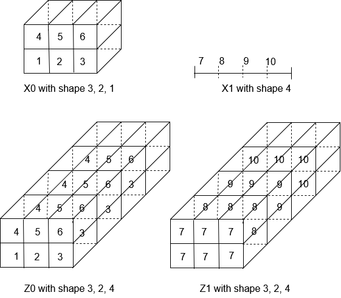
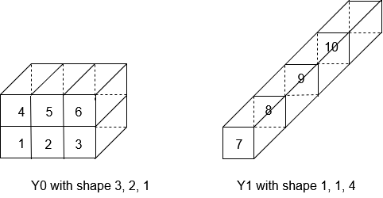
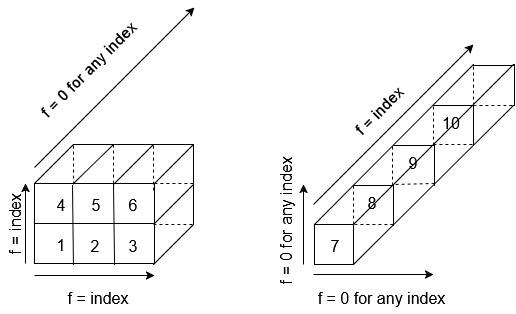

# Contents
- **Broadcast** functionality for type [real, float16, float, double, int8, int16, int32, int64, uint8, uint16, uint32, uint64, string, boolean](#any).

Based on ONNX documentation version 14, multidirectional broadcasting.

# **Broadcast**  (type, type, type...)

where type is in {real, float16, float, double, int8, int16, int32, int64, uint8, uint16, uint32, uint64, string, boolean}.

## Signature
Definition of functionality $\text{Broadcast}$ signature: $Z0, ..., ZL = \text{Broadcast}(X0, ... , XL)$

where
- $L \in [0, 2^{31}-1[$: number of tensors to be broadcasted minus one. Note that in ONNX broadcasting is applied to operators with 2 inputs, 3 inputs or a variable number of inputs between 1 and 2147483647 (operators Max https://onnx.ai/onnx/operators/onnx__Max.html , Mean, Min and Sum). 2^31 = 2147483648, thus 2^31-1 = 2147483647 is the maximum number of inputs. Moreover, note that L is the last index. I.e. the input tensors are numbered from 0 to L. In consequence the L is the number of inputs minus one.
- $X0$, ... , $XL$: tensors to be broadcasted.
- $Z0$, ... , $ZL$: broadcasted tensors.

## Link to ONNX description

https://github.com/onnx/onnx/blob/main/docs/Broadcasting.md

## Restrictions

No restriction.

## Informal specification

The broadcasting functionality allows element-wise operations, e.g. **Add** , **Mul** , etc., to take tensors with different shapes by explicitly normalising them to the same shape.

Broadcasting consists in producing a set of tensors with the same shape: I.e. each output tensor will have a number of dimensions $nZ$ and for each dimension $i$, a size $dZ_i$. To achieve this goal, each produced tensor $Zi$ contains elements from $Xi$ repeated as necessary.

The shape of a $Zi$ satisfies two conditions.

*Condition 1*: the number of dimensions of all output tensors is the largest number of dimensions among all the input tensors. When the number of dimensions is increased for a tensor:
- the extra dimensions to be completed are prepended before the lower indexes,
- those dimensions are set to a size equal to 1, and
- the access to the tensor data remains possible.

*Condition 2*: the size of each output dimension is equal to the maximum of the sizes of all the input tensors for that dimension after expansion. As a consequence the size of some dimensions in an output tensor might be larger than that of the corresponding input tensor. If that is the case, the data associated with indexes larger than the input tensor dimension size is the data associated to index value 0 in the input tensor. [Note that, after expansion, the size of the dimension is either the maximum size or one, cf. error condition.](#error)

The figure below shows an example of broadcasting two tensors, i.e. $Z0, Z1 = \text{Broadcast}(X0, X1)$.

The operation can be described in two steps:
- Step 1: make tensors with the same number of dimensions to ensure condition 1
- Step 2: make the tensor dimension sizes equal to ensure condition 2

Let us note $Y0$, ... $YL$ the tensors obtained after step 1, with a common number of dimensions $nY$ but with still different dimension sizes.

### Description of step 1

The common number of dimensions is the largest number of dimensions among the input tensors:

$$nY = \max_{m \in [0, L]} nXm$$

where $nXm$ is the number of dimensions of $Xm$ the $m^{\text{th}}$ input tensor.

The tensors with $nY > nXm$ have their dimensions prepended  with $nY - nXm$ times 1. That is:

$$\forall m \in [0,L] \forall i \in [0,nY-1] ~~~~~ dYm_i = 1 ~~~~~ \text{if} ~~~~~ i < nY - nXm, ~~~~~ dXm_{i-nY+nXm} ~~~~~ \text{otherwise}$$

Concerning the access to data through [tensor index](https://github.com/ericjenn/working-groups/blob/ericjenn-srpwg-wg1/safety-related-profile/sonnx/ops/spec/informal/common/definitions.md#tensor_index) we have the following relation:

$$Ym[i]=Xm[i']$$

with $i$ defined from $i'$:

$$i= \underbrace{0,...,0},i'
    \atop nY-nXm$$
### Description of step 2

Now $Y0$, ... $YL$ have a common number of dimensions but different dimension sizes. This common number of dimensions, is the number of dimensions of the output tensors:

$$ nZm = nY $$

In order to define the output we have to set each dimension to its maximum among all tensors and, for tensors with increased dimension, access always to the first element whatever the value of the index in this dimension.

For our running example, the figure below presents for the example of the figure above, the tensors obtained at the end of step 1.

#### Setting each dimension to its maximum

The size of dimensions $dY_0$, ... $dY_{nY-1}$ are defined as the maximum over all tensors, i.e. $dY_i = \max_{m \in [0, L] } dYm_i$ for all $i\in[0,nY-1]$ where $dYm_0$, ... $dYm_{nY-1}$ are the dimensions of tensor $Ym$. Overall, we have:

$$\forall m \in [0,L] \forall i \in [0,nZm-1] ~~~~~ dZm_i = dY_i$$

#### Access to data

Let $f(.,.,.)$ a function that provides an index value of 0 when the dimension size is not the maximum size and the current index of this dimension when the dimension size is equal to the maximum dimension size. This function is defined as:

$f(a,B,C) = a$ if $B=C$ and $f(a,B,C) = 0$ otherwise where:
- $a$ is the current index,
- $B$ is the size of the input dimension, and
- $C$ is the target size of the output dimension.

When, for a given dimension $k$, of size $dYm_k$, of a tensor $Ym$, $dYm_k \neq dY_k$ then  $f(i_k,dYm_k,dY_k)$ is 0 whatever the value of the index $i_k$. This way, $Zm$ relates always to the first element of $Ym$ in the $k^{\text{th}}$ dimension.

Then the relation between elements of broadcasted tensors $Z0,...ZL$ and tensors with common number of dimensions $Y0,...YL$ are:

$$Zm[i]=Ym[i']$$

with: 

$$i=i_0,...i_{nY-1}$$

$$i'=f(i_0,dYm_0,dY_0),...f(i_{nY-1},dYm_{nY-1},dY_{nY-1})$$

For our running example, the figure below presents for the example of the figure above, the way the function $f(.,.,.)$ allows to link elements of $Z0$ and $Z1$ with respectively elements of $Y0$ and $Y1$.

## Error conditions

The following error condition applies to broadcasting:

| Error    | Statement | Origin |
| -------- | ------- | ------- |
| `E1` | $\exists m \in [0, L], \exists i \in [0, nY-1]$ such that $dYm_i \neq dY_i$  and $dYm_i \neq 1$| https://github.com/onnx/onnx/blob/main/docs/Broadcasting.md|

For each tensor and each dimension, considering a common number of dimensions, the value of a dimension shall be either equal to the maximum dimension among all tensors or equal to one. If not, Error `E1` occurs.

## Inputs

### $Xm$ for $m \in [0,L]$: `type tensor`
$L-1$ input tensors with possibly different shapes.

#### Constraints

 - `[C1]`  Type consistency
   - Statement: For any $m \in [0,L]$ tensors $Xm$ and $Zm$ must have the same type.
 
## Outputs

### $Zm$ for $m \in [0,L]$: `type tensor`

$L-1$ output tensors with identical shapes.

#### Constraints

 - `[C1]` Type consistency
   - Statement: see constraint [<b>[C1]</b>](#C1ra) on tensor $Xm$.

## Attributes

No attribute.

## Formal specification
 
See the Why3 specification.

## Numerical Accuracy

Not applicable. I.e. the data values of the output tensors are stricly equal to the corresponding data values of the input tensors.

