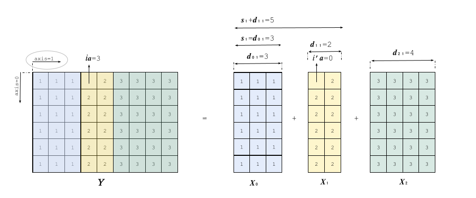

# Contents

- **Concat** operator for types [int8, int16, int32, int64, uint8, uint16, uint32, uint64, float16, float, double, bfloat16, string, bool](#concat_types)

Based on ONNX documentation [Concat version 13](https://onnx.ai/onnx/operators/onnx__Concat.html#concat-13).

# **Concat** (int8, int16, int32, int64, uint8, uint16, uint32, uint64, float16, float, double, bfloat16, string, bool)

## Signature

$Y = \textbf{Concat}(X_0, X_1, \dots, X_{n-1})$

where:
- $X_0, X_1, \dots, X_{n-1}$: input tensors to concatenate
- $Y$: result tensor from the concatenation of $X_0, X_1, \dots, X_{n-1}$

## Restrictions

[General restrictions](./../common/general_restrictions.md) are applicable.

The following specific restriction applies to the **Concat** operator:

| Restriction | Statement | Origin |
|---|---|---|
| `[R1]`  | Attribute `axis` is non-negative. | Transient |

## Informal specification

Operator **Concat** concatenates a variable number of input tensors $X_0, X_1, \dots, X_{n-1}$ along the dimension specified by attribute `axis` into a single output tensor $Y$. The operator **Concat** is not commutative, so the order of input tensors impacts the output tensor.

Let $a$ be the concatenation axis, $r$ be the rank of the tensors ($r = rY$), and $dX_{k,a}$ be the dimension of input tensor $X_k$ along axis $a$.

For any tensor index $[i_0, \dots, i_{r-1}]$ of output tensor $Y$:

$$
Y[i_0, \dots, i_{r-1}] = X_k[i_0, \dots, i_a', \dots, i_{r-1}]
$$

where:
- $k$ refers to the unique index of the source input tensor such that:
$$
s_k \le i_a < s_k + dX_{k,a}
$$
- $i_a'$ is the local index in $X_k$ along axis $a$, defined as:
$$
i_a' = i_a - s_k
$$
- $s_k$ is the cumulative offset along axis $a$ before input tensor $X_k$, defined as:
$$
s_k = \sum_{j=0}^{k-1} dX_{j,a}
$$

The effect of the operator is illustrated in the following example.

### Example 

Let us compute the concatenation illustrated in the example above:

$$
Y = \textbf{Concat}(X_0, X_1, X_2) \quad \text{along } \text{axis} = 1
$$

For index $i_a = 3$:

$$
Y[0, 3] = X_k[0, 3 - s_k]
$$

According to the inequality $s_k \le i_a < s_k + dX_{k,a}$:

$$
s_1 \le 3 < s_1 + dX_{1,a} \implies 3 \le 3 < 3 + 2 = 5 \implies k = 1
$$

Thus:

$$
Y[0, 3] = X_1[0, 3 - s_1] = X_1[0, 3 - 3] = X_1[0, 0]
$$

You can find more examples in [tests](./tests/.) folder.

## Error conditions

No error condition, as the **Concat** operator does not perform numerical computations.

## Attributes

### `axis`: int (required)

Attribute `axis` determines the axis along which concatenation is performed.

#### Constraints

- `[C1]`  Valid axis domain
  - Statement: `axis` shall identify a valid dimension of the input tensors.

- `[C2]`  SONNX axis restriction
  - Statement: `axis` shall be positive or null. `[R1]`

  Formally, for input tensors of rank $r$:

$$
0 \leq axis < r
$$

## Inputs

### $X_0, X_1, \dots, X_{n-1}$: variadic tensor list

Input tensors to be concatenated.
All input tensors shall have the same datatype. Supported datatypes are:

`INT8`, `INT16`, `INT32`, `INT64`, `UINT8`, `UINT16`, `UINT32`, `UINT64`, `FP16`, `FP32`, `FP64`, `BFLOAT16`, `STRING`, `BOOL`.

#### Constraints

- `[C1]`  Number of inputs
  - Statement: The number of input tensors shall be in the range $[1, 2^{31}-1]$.

- `[C2]`  Rank consistency
  - Statement: All input tensors shall have the same rank. 
  Formally:

$$
\forall i,k; rank(X_i) = rank(X_k)
$$

- `[C3]`  Shape consistency
  - Statement: All input tensors shall have the same shape on every axis except the concatenation axis.

Formally, for all axes $j$ such that $j \neq axis$:

$$
\forall i,k; dX_{i,j} = dX_{k,j}
$$

## Outputs

### $Y$: output tensor

Output concatenated tensor.

#### Constraints

- `[C1]`  Rank consistency
  - Statement: Tensor $Y$ shall have the same rank as the input tensors.

Formally:

$$
rank(Y) = rank(X_0)
$$

* `[C2]` Shape consistency

  * Statement: Tensor $Y$ shall have the same shape as the input tensors on every axis except the concatenation axis.

Formally, for all axes $j$ such that $j \neq axis$:

$$
dY_j = dX_{0,j}
$$

* `[C3]` Concatenation axis dimension

  * Statement: The size of tensor $Y$ on the concatenation axis shall be the sum of the input tensor sizes on this axis.

Formally:

$$
dY_{axis} = \sum_{k=0}^{n} dX_{k,axis}
$$

* `[C4]` Type consistency

  * Statement: Tensor $Y$ shall have the same datatype as the input tensors.

## Formal specification
See the Why3 specification.

## Numerical Accuracy
`concat` operator does not perform numerical operations thus numerical accuracy issues are not considered here. 

