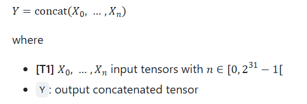
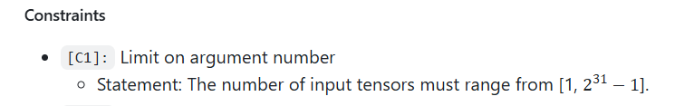

# Review of the Concat informal spec

## Concat

### Input interval tensors inconsistencies
**Two different** intervals are suggested for the **number of input tensors**.

Which one should be use:
- First definition (**on Signature**)



- Second Definition (**on input constraints**)



### Doubts on mathematical definitions
In this context we would like to know what does $dX_{i,j}$ mean.

Assuming that what is in the guidelines is correct and we understood it:
- $X_{i}$ - represents tensor the ith X tensor

- $dX_{i, j}$ - represents the dimension of $X_i$ along the j-axis (i.e the lenght of the j-axis)

#### Constraint axis [C1]
The formula stated here says:
```math
\forall i,k \text{  axis } \in [0, \sum dX_{i,j}-1]
```
The first thing we would like to highlight is that we are:
- **Quantifying** over **k** which is **never used**

- **Using j** which is **never quantified**

Furthermore, from our point of view and according to the previous assumption:
- $\sum dX_{i,j}$ - **iterates over all tensors and all axis** and **sums the length of the respective axis**
This means that an axis can take any value between **0** and the **total number of entries in all tensors combined**.
Are we missunderstooding something?
Should'nt the range of the axis be as follows:
```math
\forall i,j \text{  axis } \in [0, len(X_{i})-1]
```
- $len(X_{i})$ - What we want to express with this is the **number of dimensions** (**length of the shape** of **$X_{i}$**)

**Example:**
X = [   [0,0,0], 
        [0,0,0], 
        [0,0,0] 
    ]

X.shape = (3, 3)

len(X) = 2

#### Constraint Output [C1]


Once again we are **using unquantified variables**.
Moreover we believe that **r** stands for **rank**.
If so, and given the last doubt we don't understand how the rank is calculated.

In the second equation we think that the **left side** should be $dY_{j}$ instead of $dX_{j}$.