# Hypothesis Review

After some tests with hypothesis for the Conv operator we arrived to some conclusions.
 
Regarding the comparison between ONNX Runtime and the ONNX reference implementation (https://github.com/onnx/onnx/blob/main/onnx/reference/ops_optimized/op_conv_optimized.py), we identified the following inconsistencies:
- Limits on pad values
- Discrepancy in output values when AutoPad = NOTSET
- Discrepancy in output shapes when AutoPad ≠ NOTSET (SAME_UPPER and SAME_LOWER)
- Discrepancy in output values when AutoPad ≠ NOTSET (SAME_UPPER and SAME_LOWER)
 
## 1 - Limits on Pad

This inconsistency was detected using **Hypothesis** to generate all inputs and attributes (except for Auto_pad, which was fixed to NOTSET), while respecting all constraints on attributes and inputs as defined in the informal specification.
 
The ONNX reference implementation is unable to handle cases where the padding in a specific region (top, left, bottom, right) exceeds the corresponding spatial dimension of the kernel. In other words, this occurs whenever the kernel overlaps with X_padded during convolution but does **not intersect any original values of X**.
The following image illustrates an example of this scenario.

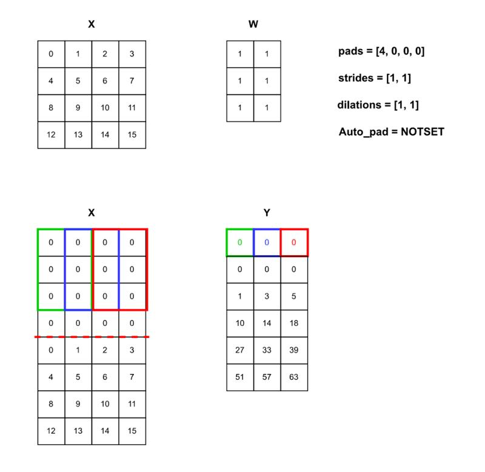

In this context, two possible scenarios were identified:

### 1.1 - Shape Errors
Although the ONNX reference implementation fails to run, ON**NX Runtime executes successfully and returns the expected result**.
In this specific case, we used **PyTorch** as a validation tool to confirm the correctness of ONNX Runtime's output.

```
Example:
x = np.ones((1, 1, 2, 1)).astype(np.float32)
w = np.zeros((1, 1, 2, 1)).astype(np.float32)
b = np.zeros(1).astype(np.float32)
auto_pad = "NOTSET"
dilations = [1, 1]
group = 1
kernel_shape = [2, 1]
pads = [0, 0, 3, 0]
strides = [1, 1]
```


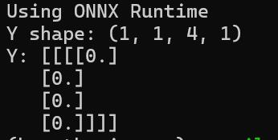


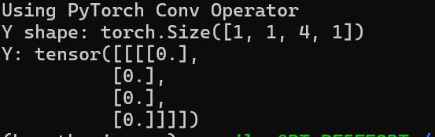
 
 
### 1.2 - Erroneous execution due to line and column Replication
Even more concerning than the previous case is the fact that there are specific inputs for which the **ONNX reference implementation does not raise an error**, but instead **computes the convolution incorrectly**.

We believe the error occurs because **Python allows access to list indices using negative numbers**.

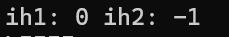

- ih1 should be the index where the window begins
- ih2 should be the index where the window ends

To determine whether this was indeed a problem with the reference implementation, we also validated the ONNX Runtime's execution using **PyTorch**.

The following image illustrates the tested example.


```
Example:
x = np.arange(16).reshape(1, 1, 4, 4).astype(np.float32)
w = np.ones((1, 1, 3, 2), dtype=np.float32)
b = np.zeros((1, 1), dtype=np.float32)
dilations = [1,1]
strides = [1,1]
pads= [4,0,0,0]
auto_pad = "NOTSET"
group = 1
kernel_shape = [3,2]  
```

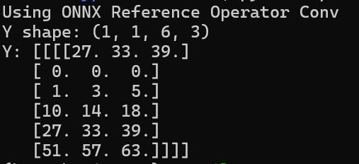

(The penultimate row is correct; however, the first row should have been entirely filled with zeros. This was not the case, as it was computed in the same way as the penultimate row.)

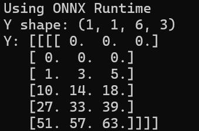

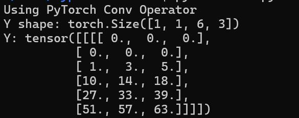

 
## 2 – Discrepancy in Output Values
This inconsistency was detected using **Hypothesis** to generate all inputs and attributes (except for Auto_pad, which was fixed to NOTSET), while respecting all constraints from the informal spec.
 
In this context, the output tensors computed by **ONNX Runtime** and the **ONNX Reference Implementation** diverge for certain inputs. 
We believe this may be due to **rounding differences** or **operations being performed in different orders**.

```
Example
x = np.full((1, 1, 4, 1), 17, dtype=np.float32)
w = np.array([
    [[[-999788.], [0.], [999785.]]],
    [[[999785.], [999785.], [999785.]]]], dtype=np.float32)
b = np.zeros((1, 1), dtype=np.float32)
dilations = [1,1]
strides = [1,1]
pads= [0,0,0,0]
auto_pad = "NOTSET"
group = 1
kernel_shape = [3,1]
```

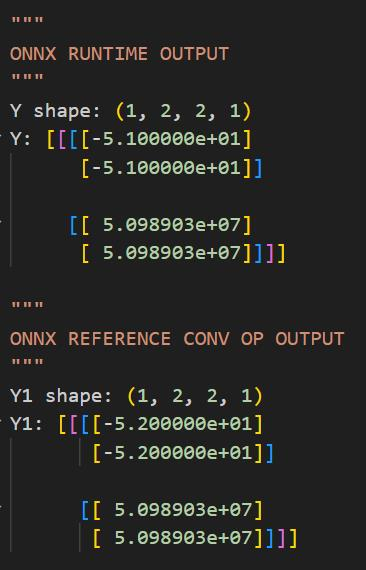

## 3 – Discrepancy in Output Shapes for AutoPad ≠ NOTSET (SAME_UPPER and SAME_LOWER)
This inconsistency was detected using **Hypothesis**, varying Auto_pad between SAME_UPPER and SAME_LOWER, while respecting all constraints from the informal spec.
 
The output dimensions from **ONNX Runtime** follow the formula:

$$output\_shape[i] = \left\lceil \frac{input\_shape[i]}{strides[i]} \right\rceil$$

(see [Conv - ONNX 1.20.0 documentation](https://onnx.ai/onnx/operators/onnx__Conv.html#l-onnx-doc-conv), Auto_Pad section)
ONNX Reference Implementation did not compute this correctly, resulting in **shape errors** and **empty tensors** in some cases.

We believe the issue stems from incorrect indexing in the reference code using indices 0 and 1 (batch size and input channels) instead of 2 and 3 (spatial dimensions).
 
```
Example
x = np.arange(10).reshape(2, 1, 1, 5).astype(np.float32)
w = np.ones((1, 1, 3, 3), dtype=np.float32)
b = np.zeros((1, 1), dtype=np.float32)
auto_pad = "SAME_LOWER"
dilations = [1,1]
strides = [2,2]
group = 1
kernel_shape = [3,3]
With the fixes we propose no shape inconsistencies were detected.
```

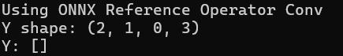

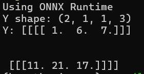

## 4 – Discrepancy in Output Values for AutoPad ≠ NOTSET (SAME_UPPER and SAME_LOWER)
This inconsistency was also detected using **Hypothesis**, varying Auto_pad between SAME_UPPER and SAME_LOWER, while respecting all constraints from the informal spec.
 
This particular error occurs on the **ONNX Runtime side**: when the input dimension value exceeds the stride for a given axis, the convolution is not computed correctly.
 

```
Example
x = np.array([[[[0, 1, 1, 1, 1]]]]).astype(np.float32)
w = np.ones((1, 1, 1, 1), dtype=np.float32)
auto_pad = "SAME_LOWER"
dilations = [1,1]
strides = [1,5]
group = 1
kernel_shape = [1,1]
```

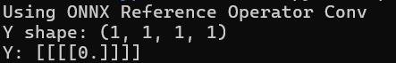

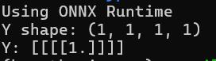
 
 
## Questions
- It’s now clear that ONNX Runtime and ONNX Reference Implementation diverge.

- To what extent should one be used over the other?

- Can one be reliably used to validate the other?

- When Auto_pad is different from NOTSET, it seems to introduce significant source of randomness.

- We have no control over how Auto_Pad is calculated in the Runtime, and given the inconsistencies we found, it’s not safe to assume it matches the reference.

- We were not able to found any documentation saying how the Valid option for Auto_Pad works. The only available states that: "VALID mean no padding" (ONNX version 1 for Conv Operator). However, in the reference implementation Valid is treated in the same way as SAME_UPPER.

- Are additional constraints needed beyond those in the informal spec?

- Given what is said above how should we continue?