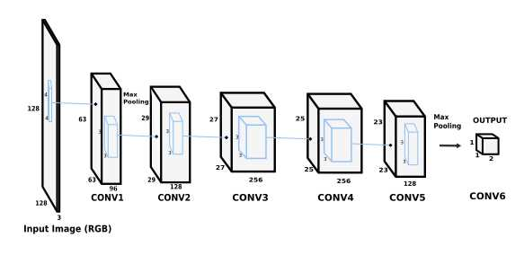

# Jean-Loup
- Convention section: I think that "i.e. the number of lines (resp. columns)" should be added to the notation "X.H"
- Restrictions subsection: I do not understand "with the tag". To which tag it refers?
- Informal specification subsubsection: I think that the use of "." for multiplication in the formula should be avoided because "." is also used for tensor characteristic in the same formula, cf. "W.H". \times, i.e., "x" should be used instead. For instance "m . strides[0]" should be "m x strides[0]".
- Inputs and outputs subsubsection: I think the the constraint X.C = Y.C is questionable. Indeed, to my understanding convolution is often used to transform a large image with 3 channels (R,G,B) to smaller image with a large number of channels, cf. image below .
- Attributes subsubsection: strides is not an integer, but an integer[2] or a list of integers.
- Attributes subsubsection: I am surprised by the inconsistency between the exemple "stride[0]=1, stride[1]=2" and the figure.
- Attributes subsubsection: I think that "is moved" is not appropriate. I suggest "Stride attribute determines the horizontal and vertical distance between kernel applying. For instance stride[0] = 2 and stride[1] = 3 indicates that closest kernel applying are separated by 2 columns for the horizontal dimension or by 3 lines for the vertical dimension."
- Attributes subsubsection: I think there are formatting issues in the auto_pad paragraph. See below .

