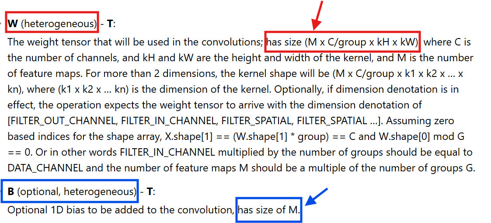

# Joao-Ricardo
# Doubts and Suggested Corrections

### Wrong Image Representation
- According to our calculations, the [image](../imgs/convwithoperators.png) does not reflect the correct convolution for the output tensor. The error occurs for the entries: $Y[3, 1]$ and $Y[3, 2]$. Instead of $5$ we believe the value should be $4$.
- We validated it afterwards with the ONNX.

> (eric) Exact (the result tensor should be symmetric...). To be corrected.

### Pads
- When referred for the first time, `pads` is said to be: $\text{pads} = [\text{left}, \text{right}, \text{top}, \text{bottom}]$, although, the image suggests otherwise, namely $\text{pads} = [\text{left}, \text{top}, \text{right}, \text{bottom}]$. 

> (eric) Exact. To be corrected.

- Additionally, on the first [image](../imgs/onnx_conv_padop.png), under the arrow it states $\text{pads} = (1, 3, 2, 2)$. According to this definition, shouldn't it be $\text{pads} = [1, 2, 2, 2]
$?

> (eric) Exact. To be corrected.

- See our suggestion bellow for the pads structure. 

### Strides
- For the strides definition, we intend that it represents the magnitude of the shift of the kernel during the convolution. According to the [image](../imgs/convwithoperators.png), strides is defined: $\text{strides} = [\text{shift between columns}, \text{shift between lines}]$. Shouldn't it be $[\text{shift between lines}, \text{shift between columns}]$?

> (eric) Exact. The order is rows (lines) *then* columns. To be corrected.

### Convolution Formula
- **Assuming this definition of strides:** $\text{strides} = [\text{shift between columns}, \text{shift between lines}]$,  **presented in the [image](../imgs/onnx_conv_padop.png)**:

$$
\begin{gathered}
   Y[b, c, m, n] = \sum_{i=0}^{dW_1-1} \sum_{j=0}^{dW_2-1} \sum_{z=0}^{dW_3-1} \\
   (X_p[b,i,m \cdot \text{strides}[0]+ j , n \cdot \text{strides}[1]+ z ] \cdot W_d[c, i, j, z]) \\
   + B_b[c]
\end{gathered}
$$

> (eric) Exact. The order is rows (lines) *then* columns. See previous remark.

- According to this definition, we are stating the iterations over the lines should take into account the stride of the columns (and the same for the other axis). Either the strides arrangement  or the formula is wrong. If we switch the strides arrangement , then the formula is correct. 
Actually, when we ran our tests, we couldn't even run the code as it said "index out of bound". 
When we switched the strides for $[\text{lines}, \text{columns}]$, while using this formula, everything worked out.

### dY2 and dY3 Calculations
- In the constraints section, more precisely for the [See constraint (C3) of X](#shape_consist), something might be wrong since those formulas do not provide the correct method for calculating $dY2$ and $dY3$.

---

#### $dY2$ Calculation

According to this formula (and to the strides and pads showed in the image):

$$
dY_2 = \left\lfloor \frac{\alpha - \left(dilation[0] \cdot dW_2 - 1\right)}{strides[0]} \right\rfloor + 1
\quad \text{where}\quad \alpha = dX_2 + pads[0] + pads[2]
$$
- $\alpha = 8 + 1 + 2 = 11$
- $\text{dilations}[0] \times dW2 - 1 = 2 \times 2 - 1 = 3$
- $\left\lfloor (11 - 3) / \text{strides}[0] \right\rfloor = \left\lfloor 8 / 2 \right\rfloor = 4$
- $dY2 = 4 + 1 = 5$ (**it should be 4**)

#### $dY3$ Calculation

According to this formula (and to the strides and pads showed in the image):

$$
dY_3 = \left\lfloor \frac{\beta - \left(dilation[1] \cdot dW_3 - 1\right)}{strides[1]} \right\rfloor + 1
\quad \text{where}\quad \beta = dX_2 + pads[1] + pads[3]
$$
- $\beta = 8 + 2 + 2 = 12$
- $\text{dilations}[1] \times dW3 - 1 = 2 \times 6 - 1 = 5$
- $\left\lfloor (12 - 5) / \text{strides}[1] \right\rfloor = \left\lfloor 7 / 3 \right\rfloor = 2$
- $dY3 = 2 + 1 = 3$ (**it should be 4**)

#### Error Causes
- Wrong structure for pads and strides definition
- Not taking into account that for dilations greater than 2 it is not enough to subtract only one unit

## Suggested Corrections

The following section states some corrections that need to be done both for the examples images and to the mathematical definitions.
These recommendations have been tested and the results can be consulted in the extras folder

### Pads
The pads dfinition should be as follows: 
$$\text{pads} = [\text{padding to top}, \text{padding to left}, \text{padding to bottom}, \text{padding to right}]$$
In order to have **X_p** like it is represented in the [image](../imgs/onnx_conv_padop.png) the pads should be like this:
$$\text{pads} = [2, 1, 2, 2]$$

In order to properly correct this, the images that shows the pad structure need to be corrected. 

The description of the attribute should also be corrected.

For a concrete validation of this consult [padding-testing](../extras/padding-testing.py)

### Strides
The strides dfinition should be as follows: 
$$\text{strides} = [\text{shift between lines}, \text{shift between collumns}]$$
In order to have shifts like those represented in the [image](../imgs/convwithoperators.png) the strides should be like this:
$$\text{strides} = [3, 2]$$

In order to properly correct this, the images that show the strides structure need to be corrected.

### Convolution Formula
According to the proposed redefinition of the strides attribute the convolution formula presented is correct and need no modification. 

### dY Calculations
As the rationale states: The size of the output is determined by the number of times the kernel can be applied on a given spatial axis.

Therefore, we have to calculate how many times the difference between the size of the input and the size of the kernel allows a stride to be done.

#### dY2 Calculation

**Assuming our redefinitions for the strides and the pads** the calculation of **dY2** is as follows:
$$
dY2 = \left\lfloor \frac{\alpha - \theta}{strides[0]} \right\rfloor + 1 \quad 
\text{where}$$
$$ 
\alpha = dX2 + \text{pads}[0] + \text{pads}[2]$$
$$\quad
\theta = (\text{dilations}[0] * (dW2 - 1)) + 1
$$

For a more concrete description of the theta calculation we can think of this as a dilation of the matrix by the factor $x$ in a given axis. 
- $x$ = 1: Not dilated (same number of elements in the axis)
- $x$ = 2: Each element in that axis is separated with one 0
- $x$ = 3: Each element  in that axis is separated with two 0s 
- $x$ = d: Each element  in that axis is separated with (d - 1) 0s
- We are adding 0s **only between** the elements already present on the matrix. Therefore:
$$
\theta = (\text{dilations}[0] * (dW2 - 1)) + 1
$$ 

The meaning of this calculation is as follows:
- Every element of the initial matrix, except the last, will have $(\text{dilations}[0] - 1)$ zeros added to its right.
- The last element does not receive any zeros after it, so we add $+1$ to account for its position.

According to the proposed formula:
- $\alpha = 8 + 2 + 2 = 12$
- $\theta = 2 * (2 - 1) + 1 = 3$
- $\left\lfloor \frac{12 - 3}{strides[0]} \right\rfloor = \left\lfloor \frac{9}{3} \right\rfloor$ = 3
- $dY2 = 3 + 1 = 4$

For instance this formula was verified for multiple inputs.

> (eric) You are perfectly right. The formula needs to be corrected. The error comes from the what that I considered (erronoeously) that dilation=0 means no dilation where as this is the case for dil=1...

You can check [hypothesis-conv](../extras/hypothesis-conv.py).

#### dY3 Calculation
For this case, we propose:
$$
dY3 = \left\lfloor \frac{\beta - \gamma}{strides[1]} \right\rfloor + 1 \quad 
\text{where}$$
$$ 
\beta = dX3 + \text{pads}[1] + \text{pads}[3]$$
$$\quad
\gamma = (\text{dilations}[1] * (dW3 - 1)) + 1
$$

According to the proposed formula:
- $\beta = 8 + 1 + 2 = 11$
- $\gamma = 2 * (3 - 1) + 1 = 5$
- $\left\lfloor \frac{12 - 5}{strides[1]} \right\rfloor = \left\lfloor \frac{7}{2} \right\rfloor$ = 3
- $dY2 = 3 + 1 = 4$

For instance this formula was verified for multiple inputs.

You can check [hypothesis-conv](../extras/hypothesis-conv.py).

### Bias Constraint

The [See constraint (C1) of B](#shape_consist)  suggests that:
$$dB0 = dW1$$

However, what we want to say is that the number of output channels ($dW0$) is the same as the shape of B ($dB0$).

Furthermore, the ONNX documentation says:

Therefore our suggestion would be to formalize this as follows:
$$dB0 = dW0$$

> (eric) Exact (again) to be corrected.

To check this you can test the [bias-testing](../extras/bias-testing.py) changing the bias dimension and evaluating its effects on the output.