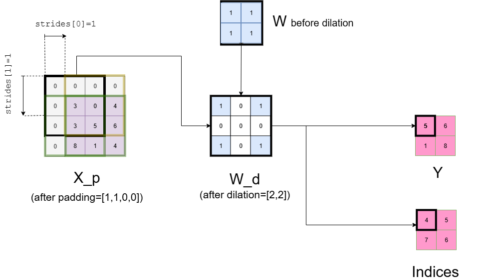
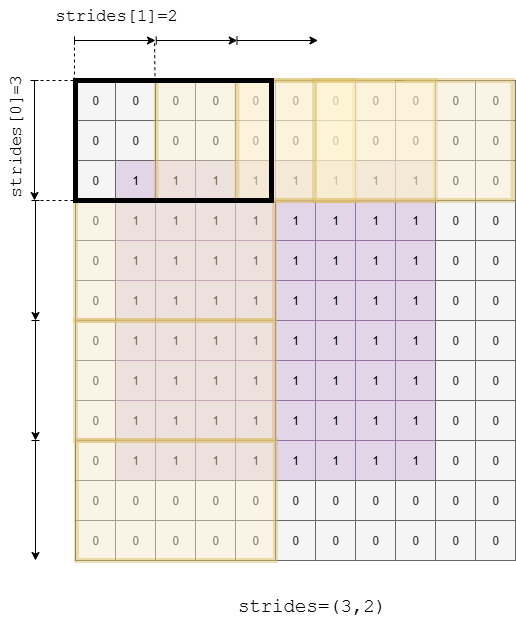

# Contents

- **MaxPool** operator for type [real](#real)
- **MaxPool** operator for types [float16, float, double](#float)
- **MaxPool** operator for types [int8, uint8](#int)

Based on ONNX [MaxPool version 22](https://onnx.ai/onnx/operators/onnx__MaxPool.html).

<a id="real"></a>
# **MaxPool** (real)

## Signature
$\textbf{MaxPool}$ signature:
($Y, \textit{Indices}) = \textbf{MaxPool}(X)$

where:
- $X$: Input tensor
- $Y$: Output tensor containing max value selected from $X$
- $\textit{Indices}$: Output tensor containing the indices in $X$ from where the max values are taken.

<a id="restrictions"></a> 
## Restrictions

[General restrictions](../common/general_restrictions.md) are applicable.

The following specific restrictions apply to the **MaxPool** operator:

| Restriction | Statement                                                   | Origin                                                                                      |
|-------------|-------------------------------------------------------------|---------------------------------------------------------------------------------------------|
| `[R1]` <a id="R1"></a> | Input tensor $X$ has 2 spatial axes | Transient |
| `[R2]` <a id="R2"></a> | All attributes must be explicitly set  | [No default values](../../../../../deliverables/reqs/reqs.md#no_default_value)
| `[R3]` <a id="R3"></a> | Attribute `auto_pad` is restricted to NOTSET  | Transient
| `[R4]` <a id="R4"></a> | Attribute `ceil_mode` is set to zero  | Transient
| `[R5]` <a id="R5"></a> | Attribute `storage_order` is set to zero | Transient

<a id="Informal_spec"></a>
## Informal specification

Operator **MaxPool** consumes an input tensor $X$ and applies max pooling across the tensor according to the kernel shape, strides, dilations and pads. Max pooling consists of computing the max on all values of a subset of the input tensor according to the kernel shape and downsampling the data into the output tensor $Y$.

**MaxPool** is a sliding window operator like **Conv**, for instance. In contrast to **Conv**, the sliding window, called "kernel", or $W$. At a given position, the kernel is only there for indicating the set of elements of $X$ of which the maximum shall be computed. Therefore, only the shape of the kernel matters for **MaxPool**.

Operator **MaxPool** stores in $Indices$ the indices of the input tensor $X$ from which the max values are taken. The index values are those of a flatten 1-D view of $X$.

The mathematical definition of output $Y$ and $Indices$ are given hereafter:

$$\begin{gathered}
    Y[b, c, m, n] = \text{max}_{h=0}^{dW_0-1} \text{max}_{w=0}^{dW_1-1} \\ X_p[b,c,m \cdot \text{strides}[0]+ h \cdot \text{dilations}[0], n \cdot \text{strides}[1]+ w \cdot \text{dilations}[1] ]
\end{gathered}$$

$$\begin{gathered}
   Indices[b, c, m, n] = (h \cdot dX_3 + w) ~~\text{if}~~ Y[b, c, m, n] = X[h,w] 
\end{gathered}$$

(Voir quel est l'index s'il y a "plusieurs max": première valeur trouvée en privilégiant la premère en haut à gauche, à tester.)

Where
- $h \in [0,dX_2-1]$ is the index on the first spatial axis of $X_p$, whose dimension is $dX_2$.
- $w \in [0,dX_3-1]$ is the index on the second spatial axis of $X_p$, whose dimension is $dX_3$.
- $b \in [0,dY_0-1]$ is the batch index. $dY_0$ is the batch size of output $Y$
- $c \in [0,dY_1-1]$ is the data channel. $dY_1$ is the number of data channels of output $Y$
- $m \in [0,dY_2-1]$ is the index along the first spatial axis of output $Y$
- $n \in [0,dY_3-1]$ is the index along the second spatial axis of output $Y$
- $dW_0$ is the dimension of the first spatial axis of the kernel, i.e., the first value of attribute `kernel_shape`
- $dW_1$ is the dimension of the second spatial axis of the kernel, i.e., the second value of attribute `kernel_shape`
- `strides` is an attribute of the operator. It will be described later in this section.
- `dilation` is an attribute of the operator. It will be described later in this section.
- $X_{p} = \text{pad}(X,pads)$ is the padded version of the input tensor $X$. Function $\text{pad}$ applies padding as specified by attribute [pads](#real_pads).

### A graphical view of MaxPool:



### Example

$\text{Y},\text{indices} = \text{MaxPool}(X)$

- Shape of $X$ = [1, 1, 8, 8]
- kernel\_shape = [3,3]
- pads = [0,0,0,0]
- dilation = [1,1]
- strides = [1,1]
- Shape of $Y$ = [1, 1, 6, 6]
- Shape of $\text{indices}$ = [1, 1, 6, 6]


```math
X =
\begin{bmatrix}
  \begin{bmatrix}
    \begin{bmatrix}
        5.67591154 & -0.04859958 & 2.94203104 & 3.70327292 & 2.47014306 & 4.12455586 & 5.81838665 & 1.84118807 \\
        -0.05267874 & 2.75227858 & 2.16608732 & 4.03416243 & 1.28184638 & 4 81748948 & 4.64878412 & 3.31626988 \\
        3.55427648 & 0.39997585 & 4.45761508 & 4.82722666 & 0.18843372 & 0.49564314 & 7.96647029 & 4.82851447 \\
        1.52417623 & 2.28965587 & 0.36251913 & 1.64413983 & 4.67267459 & 3.73167179 & 2.20052118 & 2.06720836 \\
        -1.22446366 & -0.86469519 & 6.01461967 & -1.08813165 & 2.11920055 & 0.78561867 & 0.29834533 & 1.94499626 \\
        1.57776732 & 3.64260188 & 3.47181319 & 4.83723727 & 1.49868674 & 3.27683692 & 2.42625178 & 0.4401565 \\
        6.8972704 & 5.51113868 & 5.99293336 & 4.24088721 & 1.94993561 & -0.04040625 & 3.07940675 & 3.06769141 \\
        3.1299626 & 4.5546675 & 3.5008191 & 2.06181403 & 3.27400104 & 6.70386189 & 0.92777015 & -1.29092574
    \end {bmatrix}
  \end {bmatrix}
\end {bmatrix}
```

```math
Y =
\begin{bmatrix}
  \begin{bmatrix}
    \begin{bmatrix}
        5.67591154 & 4.82722666 & 4.82722666 & 4.82722666 & 7.96647029 & 7.96647029 \\
        4.45761508 & 4.82722666 & 4.82722666 & 4.82722666 & 7.96647029 & 7.96647029 \\
        6.01461967 & 6.01461967 & 6.01461967 & 4.82722666 & 7.96647029 & 7.96647029 \\
        6.01461967 & 6.01461967 & 6.01461967 & 4.83723727 & 4.67267459 & 3.73167179 \\
        6.8972704 & 6.01461967 & 6.01461967 & 4.83723727 & 3.27683692 & 3.27683692 \\
        6.8972704 & 5.99293336 & 5.99293336 & 6.70386189 & 6.70386189 & 6.70386189
    \end {bmatrix}
  \end {bmatrix}
\end {bmatrix}
```

```math
Indices = 
\begin{bmatrix}
  \begin{bmatrix}
    \begin{bmatrix}
        0 & 19 & 19 & 19 & 22 & 22 \\
        18 & 19 & 19 & 19 & 22 & 22 \\
        34 & 34 & 34 & 19 & 22 & 22 \\
        34 & 34 & 34 & 43 & 28 & 29 \\
        48 & 34 & 34 & 43 & 45 & 45 \\
        48 & 50 & 50 & 61 & 61 & 61
    \end {bmatrix}
  \end {bmatrix}
\end {bmatrix}
```


## Error conditions
No error conditions.

<a id="real_attributes"></a>
## Attributes

### `auto_pad`: string

The `auto_pad` attribute determines if and how automatic padding is done for the input tensor X.

#### Constraints
-  `[C1]`: Value domain 
    - Statement: `auto_pad` shall be in set {NOTSET, VALID, SAME_UPPER, SAME_LOWER}. 
    - Rationale: `[R2]`
-  `[C2]`: Explicit padding 
    - Statement: `auto_pad` shall be set to NOTSET. 
    - Rationale: `[R3]`

> (rajouter les liens vers les Rx)

### `ceil_mode`: int

Whether to use floor (0, default) or ceil (1) to compute the output shape. See the description of output $Y$.

#### Constraints
-  `[C1]`: Value domain 
    - Statement: `ceil_mode` shall be in set, i.e., to 0 (zero) or 1.
    - Rationale: `[R2]`
-  `[C2]`: floor mode is selected 
    - Statement: `ceil_mode` shall be set to 0.
    - Rationale: `[R4]`

### `dilations`: list of ints

Dilation value along each spatial axis of filter.

Attribute `dilations` specifies the spacing between the elements of $W$. The ith value in the list gives the dilation factor for spatial axis $i$. If the dilation factor is greater than 1 for axis $i$, then the kernel elements are spaced out by the dilation factor for that axis. 

The effect of the `dilations` attribute for a tensor with two spatial axes is depicted on the following figure.  


In the example above:
- `dilations`=(2,2)
- Before dilation, $W$ contains only 1s. Those 1s are used as selectors of values of $X$.
- After dilation, a '0' means that the value in $X$ is not selected.
- The offset between two '1' in the dilated $W$ along one spacial axis equals the dilation value for that axis, i.e., '2' in the example. Therefore, at a given position of $W$ on $X$, one value of $X$ over two is selected for computing the max along each spatial axis. 
  
#### Constraints
- `[C1]`: Value domain
    - Statement: `dilations` is a list of strictly positive integers
    - Rationale: The dilation is a *factor of expansion* along a certain axis. 
- `[C2]`: Relation between `dilations` and $W$ 
    - Statement: The `dilations` and `kernel_shape` lists have the same length
    - Rationale: Dilation is defined for all spatial axes of $W$.
- `[C3]`: Consistency between the shape of tensors $Y$, $X$ and attributes `kernel_shape`, `pads`, `dilations` and `strides`  
    - Statement: [See constraint (C2) of Y](#shape_consist)


### `kernel_shape`: list of ints

The size of the kernel along each spatial axis.

<a id="real_pads"></a>
### `pads`: list of ints

Attribute `pads` determines the padding at the beginning and end along each spatial axis of the input tensor $X$.

`pads` is a list of the form (x1_begin, x2_begin,..., x1_end, x2_end,...), where xi_begin is the number of elements (possibly zero) added at the beginning of axis $i$ and xi_end is the number of elements added at the end of axis $i$.

The value of the constant to pad depends on the input tensor data type. Therefore:
- see [floating-point value to pad](#pad_const_float_val)
- see [integer values to pad](#pad_const_int_val)

The effect of the `pads` attribute is illustrated on the following figure on integers. In this example,  `pads`=(2,1,2,2) and the padded value is the one for type uint8, i.e., zero.


#### Constraints
- `[C1]`: Consistency between the shape of $X$ and the length of `pads`
    - Statement: The length of the `pads` list is twice the number of spatial axes of $X$
    - Rationale: Padding shall be given for all spatial axes, and a begining value and an end value must be given for each axis.
- `[C2]`: Consistency between the shape of tensors $Y$, $X$ and attributes `kernel_shape`, `pads`, `dilations` and `strides`  
    - Statement: [See constraint (C2) of Y](#shape_consist)

### `storage_order`: int

The storage order of the tensor. 0 is row major, and 1 is column major.

#### Constraints
-  `[C1]`: Explicit storage order
    - Statement: `storage_order` shall be set to zero.
    - Rationale: `[R2]`, `[R5]`

### `strides`: list of ints

Attribute `strides` determines how the kernel is applied on tensor $X$ during the **MaxPool**.

For instance, with $\texttt{stride}[0]=3$ and $\texttt{stride}[1]=2$, the kernel is applied to data 2 units on right in the first spatial axis and to data 3 units down in the second spatial axis at each step of the max pooling.

The effect of the `strides` attribute is illustrated on the following figure. In this example, `strides`=(3,2).



#### Constraints
- `[C1]`: Value domain
    - Statement: `strides` is a list of strictly positive integers.
    - Rationale: Stride values represent the number of applications of the kernel in the two spatial dimensions
- `[C2]`: Consistency between the shape of tensors $Y$, $X$ and  attributes `kernel_shape`, `pads`, `dilations` and `strides`
    - Statement: [See constraint (C2) of Y](#shape_consist)


## Inputs

### $\text{X}$: real

$X$ is the input tensor from which the max values are selected. 


#### Constraints

- `[C1]` <a id="C1ia"></a> First constraint on $X$
    - Statement: The number of spatial axes of tensor $X$ is 2. 
    - Rationale: `R1`.
- `C2`: Consistency between the shape of tensors $Y$, $X$ and  attributes `kernel_shape`, `pads`, `dilations` and `strides`
    - Statement: [See constraint (C2) of Y](#shape_consist)


## Outputs

### $\text{Y}$: real

The shape of the output $Y$ is $(dY_0 , dY_1 , dY_2 , dY_3)$ where
- $dY_0$ is the number of batches
- $dY_1$ is the number of channels
- $dY_2$ and $dY_3$ are the sizes of the output for the two spatial axes

#### Constraints.
- `[C1]`: <a id="shape_consist"></a> Consistency between the shape of tensors $Y$, $X$, and attributes `kernel_shape`, `pads`, `dilations` and `strides`
    - Statement:
        - $dY_2 = \left\lfloor{(dX_2 + pad\_shape[0] - \texttt{dilations}[0] \times (\texttt{kernel\_shape}[0] - 1) - 1) / (strides[0] + 1)}\right\rfloor$
        - $dY_3 = \left\lfloor{(dX_3 + pad\_shape[1] - \texttt{dilations}[1] \times (\texttt{kernel\_shape}[1] - 1) - 1) / (strides[1] + 1)} \right\rfloor$
        - where $pad\_shape[i]$ is the sum of the pads along spatial axis $i$ 
        - In the previous formula, `ceil_mode` is considered set to 0.
  
> Rajouter un renvoi sur le ceil_mode...
> Vérifier la validité du "+1" 

### $\text{Indices}$: int64

$Indices$ contains the indices of the input tensor $X$ from which the max values are taken.

#### Constraints

 - `[C1]` <a id="C1iy"></a> First constraint on $Indices$
   - Statement: $Indices$ and $Y$ shall have the same shape

<a id="float"></a>
# **MaxPool** (float)
where float is in {float16, float, double}
> Reporter les modifications faites sur "real".
## Signature
Definition of operator $\text{MaxPool}$ signature:
($Y, Indices) = \text{MaxPool}(X)$

where:
- $X$: input tensor
- $Y$: output tensor containing max value selected from $X$
- $Indices$: output tensor containing the indices in $X$ from where the max values are taken.
   
## Restrictions

See [Restrictions](#restrictions).


## Informal specification

Operator **MaxPool** consumes an input tensor $X$ and applies max pooling across the tensor according to the kernel shape, strides, dilations and pads. Max pooling consists of computing the max on all values of a subset of the input tensor according to the kernel shape and downsampling the data into the output tensor $Y$.

**MaxPool** is a sliding window operator like **Conv**, for instance. In contrast to **Conv**, the sliding window, called "kernel", or $W$, in this document, has no existence. Indeed, there is no need for kernel values. At a given posittion, the kernel is only there for indicating the set of elements of $X$ of which the maximum shall be computed. Therefore, only the shape of the kernel matters for **MaxPool**.

Operator **MaxPool** stores in $Indices$ the indices of the input tensor $X$ from which the max values are taken. The index values are those of a flatten 1-D view of $X$.

The mathematical definitions of output $Y$ and $Indices$ are given hereafter:

$$\begin{gathered}
    Y[b, c, m, n] = max_{h=0}^{dW_0-1} max_{w=0}^{dW_1-1} \\ X_p[b,c,m \cdot \text{strides}[0]+ h \cdot \text{dilations}[0], n \cdot \text{strides}[1]+ w \cdot \text{dilations}[1] ]
\end{gathered}$$

In the definition of $Y$ above, any NaN value in $X_p$ is considered as -inf.

> Supprimer les `$` autour de inf.

$$\begin{gathered}
    Y[b, c, m, n] = X_{p}[h,w] \implies Indices[b, c, m, n] = (h \cdot dX_3 + w)
\end{gathered}$$

Where
- $h \in [0,dX_2-1]$ is the index on the first spatial axis of $X_p$, whose dimension is $dX_2$.
- $w \in [0,dX_3-1]$ is the index on the second spatial axis of $X_p$, whose dimension is $dX_3$.
- $b \in [0,dY_0-1]$ is the batch index. $dY_0$ is the batch size of output $Y$
- $c \in [0,dY_1-1]$ is the data channel. $dY_1$ is the number of data channels of output $Y$
- $m \in [0,dY_2-1]$ is the index along the first spatial axis of output $Y$
- $n \in [0,dY_3-1]$ is the index along the second spatial axis of output $Y$
- $dW_0$ is the dimension of the first spatial axis of the kernel, i.e., the first value of attribute `kernel_shape`
- $dW_1$ is the dimension of the second spatial axis of the kernel, i.e., the second value of attribute `kernel_shape`
- `strides` is an attribute of the operator. It will be described later in this section.
- `dilation` is an attribute of the operator. It will be described later in this section.
- $X_{p} = \text{pad}(X,pads)$ is the padded version of the input tensor $X$. Function $\text{pad}$ applies padding as specified in section [pads](#pad_const_float_val).


The effect of the operator is illustrated on the following examples.

### Example 1

$S, Ind = \text{MaxPool}(E)$

- Data type: double
- Shape of $E$ = [1, 1, 3, 3]
- kernel_shape = [2,2]
- pads = [0,0,0,0]
- dilation = [1,1]
- strides = [1,1]
- Shape of $Y$ = [1, 1, 2, 2]
- Shape of $Ind$ = [1, 1, 2, 2]


```math
X =
\begin{bmatrix}
  \begin{bmatrix}
    \begin{bmatrix}
        1.70792822 & 1.59383029 & 2.22933891 \\
        1.39774388 & 2.03411151 & 3.15139065 \\
        2.81201102 & 5.85721996 & 3.55039159 \\
    \end {bmatrix}
  \end {bmatrix}
\end {bmatrix}
```

```math
Y =
\begin{bmatrix}
  \begin{bmatrix}
    \begin{bmatrix}
        2.03411151 & 3.15139065 \\
        5.85721996 & 5.85721996 \\
    \end {bmatrix}
  \end {bmatrix}
\end {bmatrix}
```

```math
Indices = 
\begin{bmatrix}
  \begin{bmatrix}
    \begin{bmatrix}
        4 & 5 \\
        7 & 7 \\
    \end {bmatrix}
  \end {bmatrix}
\end {bmatrix}
```

### Example 2

$S, Ind = \text{MaxPool}(E)$

- Data type: double
- Shape of $E$ = [1, 1, 3, 3]
- kernel\_shape = [2,2]
- pads = [1,0,1,0]
- dilation = [1,1]
- strides = [1,1]
- Shape of $Y$ = [1, 1, 4, 2]
- Shape of $Ind$ = [1, 1, 4, 2]


```math
X =
\begin{bmatrix}
  \begin{bmatrix}
    \begin{bmatrix}
        2.41529657 & 0.12586645 & 5.17877496 \\
        5.82770299 & 3.77328965 & 3.51988829 \\
        1.40679595 & 3.95043140 & -1.37421443 \\
    \end {bmatrix}
  \end {bmatrix}
\end {bmatrix}
```

```math
Y =
\begin{bmatrix}
  \begin{bmatrix}
    \begin{bmatrix}
        2.41529657 & 5.17877496 \\
        5.82770299 & 5.17877496 \\
        5.82770299 & 3.95043140 \\
        3.95043140 & 3.95043140 \\
    \end {bmatrix}
  \end {bmatrix}
\end {bmatrix}
```

```math
Indices = 
\begin{bmatrix}
  \begin{bmatrix}
    \begin{bmatrix}
        0 & 2 \\
        3 & 2 \\
        3 & 7 \\
        7 & 7 \\
    \end {bmatrix}
  \end {bmatrix}
\end {bmatrix}
```

### Example 3
> Changer (s, ind)...
 
> Rajouter la contrainte sur la taille du padding (inférieure taille kernel)

$S, Ind = \text{MaxPool}(E)$

- Data type: double
- Shape of $E$ = [1, 1, 3, 3]
- kernel\_shape = [2,2]
- pads = [0,0,0,0]
- dilation = [1,1]
- strides = [1,1]
- Shape of $Y$ = [1, 1, 2, 2]
- Shape of $Ind$ = [1, 1, 2, 2]


```math
X =
\begin{bmatrix}
  \begin{bmatrix}
    \begin{bmatrix}
        -inf & -inf & 4.56432533 \\
        -inf & -inf & 2.55354471 \\
        2.83691720 & 3.46789489 & 5.23979851 \\
    \end {bmatrix}
  \end {bmatrix}
\end {bmatrix}
```

```math
Y =
\begin{bmatrix}
  \begin{bmatrix}
    \begin{bmatrix}
        -inf & 4.56432533e+000 \\
        3.46789489e+000 & 5.23979851e+000 \\
    \end {bmatrix}
  \end {bmatrix}
\end {bmatrix}
```

```math
Indices = 
\begin{bmatrix}
  \begin{bmatrix}
    \begin{bmatrix}
        0 & 2 \\
        7 & 8 \\
    \end {bmatrix}
  \end {bmatrix}
\end {bmatrix}
```

### Example 4

$S, Ind = \text{MaxPool}(E)$

- Data type: double
- Shape of $E$ = [1, 1, 3, 3]
- kernel\_shape = [2,2]
- pads = [1,1,1,1]
- dilation = [1,1]
- strides = [1,1]
- Shape of $Y$ = [1, 1, 4, 4]
- Shape of $Ind$ = [1, 1, 4, 4]


```math
X =
\begin{bmatrix}
  \begin{bmatrix}
    \begin{bmatrix}
        -inf & 9.57875561 & 4.56432533 \\
        2.72844928 & 3.54234851 & 2.55354471 \\
        2.83691720 & 3.46789489 & 5.23979851 \\
    \end {bmatrix}
  \end {bmatrix}
\end {bmatrix}
```

```math
Y =
\begin{bmatrix}
  \begin{bmatrix}
    \begin{bmatrix}
        -inf & 9.57875561e+000 & 9.57875561e+000 & 4.56432533e+000 \\
        2.72844928e+000 & 9.57875561e+000 & 9.57875561e+000 & 4.56432533e+000 \\
        2.83691720e+000 & 3.54234851e+000 & 5.23979851e+000 & 5.23979851e+000 \\
        2.83691720e+000 & 3.46789489e+000 & 5.23979851e+000 & 5.23979851e+000 \\
    \end {bmatrix}
  \end {bmatrix}
\end {bmatrix}
```

```math
Indices = 
\begin{bmatrix}
  \begin{bmatrix}
    \begin{bmatrix}
        0 & 1 & 1 & 2 \\
        3 & 1 & 1 & 2 \\
        6 & 4 & 8 & 8 \\
        6 & 7 & 8 & 8 \\
    \end {bmatrix}
  \end {bmatrix}
\end {bmatrix}
```

### Dicrepancies observed in an existing implementations

**WARNING: Non compliances with the SONNX specification have been observed on the ONNX Runtime implementation (version 1.23.2).**

> S'assurer que les tests suivants ont été exécuté sur la bonne version d'ORT.

Non compliance concern both the max values ($Y$) and the indices ($\text{indices}$). Refer to this [jupyter notebook](../../tests/maxpool/maxpool_divergence.ipynb) for further details on the observed problems.

> Mettre les exemples dans `maxpool_doc.ypnb`.  

For instance, example 3 above executed on ONNX runtime with CPU provider produces the following output tensors:

```math
Y =
\begin{bmatrix}
  \begin{bmatrix}
    \begin{bmatrix}
        -1.79769313e+308 & 4.56432533e+000 \\
        3.46789489e+000 & 5.23979851e+000 \\
    \end {bmatrix}
  \end {bmatrix}
\end {bmatrix}
```

```math
\text{Indices} = 
\begin{bmatrix}
  \begin{bmatrix}
    \begin{bmatrix}
        -4 & 2 \\
        7 & 8 \\
    \end {bmatrix}
  \end {bmatrix}
\end {bmatrix}
```

Two discrepancies appear:
- in $Y$: -1.79769313e+308 instead of $-inf$ as first element.
- in $Indices$: $-4$ instead of $0$ (first element of $X$).

## Error conditions
No error conditions.

## Attributes

For all attributes except `pads`, see section [<b><span style="font-family: 'Courier New', monospace">[MaxPool(real)->Attributes]</span></b>](#real_attributes).

### $pads$: list of ints

For the structural definition of `pads`, see [<b><span style="font-family: 'Courier New', monospace">[MaxPool(real)->Attributes->pads]</span></b>](#real_pads).

<a id="pad_const_float_val"></a>
The constant float value to pad is $-inf$.


## Inputs

### $\text{X}$: floating-point tensor

$X$ is the input tensor from which the max values are selected. 


#### Constraints

See constraint [<b><span style="font-family: 'Courier New', monospace">[C1]</span></b>](#C1ia) on MaxPool(real) Input $X$.
See constraint [<b><span style="font-family: 'Courier New', monospace">[C1]</span></b>](#shape_consist) on MaxPool(real) Output $Y$.


## Outputs

### $\text{Y}$: floating-point tensor

The size of the output $Y$ will be $(dY_0 , dY_1 , dY_2 , dY_3)$ where
- $dY_0$ is the number of batches
- $dY_1$ is the number of channels
- $dY_2$ and $dY_3$ are the sizes of the output for the two spatial axes

#### Constraints.

See constraint [<b><span style="font-family: 'Courier New', monospace">[C1]</span></b>](#shape_consist) on MaxPool(real) Output $Y$.

### $\text{Indices}$: int64
> Appliquer les modification faites pour Real.

$Indices$ contains the indices of the input tensor $X$ from which the max values are taken.

#### Constraints

 - `[C1]` <a id="C1iy"></a> First constraint on $Indices$
   - Statement: $Indices$ and $Y$ shall have the same shape

<a id="int"></a>
# **MaxPool** (int)
where int is in {int8, uint8}.

## Signature
Definition of operator $\text{MaxPool}$ signature:
($Y, Indices) = \text{MaxPool}(X)$

where:
- $X$: input tensor
- $Y$: output tensor containing max value selected from $X$
- $Indices$: output tensor containing the indices in $X$ from where the max values are taken.
   
## Restrictions

See [Restrictions](#restrictions).


## Informal specification

Operator **MaxPool** consumes an input tensor $X$ and applies max pooling across the tensor according to the kernel shape, strides, dilations and pads. Max pooling consists of computing the max on all values of a subset of the input tensor according to the kernel shape and downsampling the data into the output tensor $Y$.

**MaxPool** is a sliding window operator like **Conv**, for instance. In contrast to **Conv**, the sliding window, called "kernel", or $W$, in this document, has no existence. Indeed, there is no need for kernel values. At a given posittion, the kernel is only there for indicating the set of elements of $X$ of which the maximum shall be computed. Therefore, only the shape of the kernel matters for **MaxPool**.

Operator **MaxPool** stores in $Indices$ the indices of the input tensor $X$ from which the max values are taken. The index values are those of a flatten 1-D view of $X$.

The mathematical definitions of output $Y$ and $Indices$ are given hereafter:

$$\begin{gathered}
    Y[b, c, m, n] = max_{h=0}^{dW_0-1} max_{w=0}^{dW_1-1} \\ X_p[b,c,m \cdot \text{strides}[0]+ h \cdot \text{dilations}[0], n \cdot \text{strides}[1]+ w \cdot \text{dilations}[1] ]
\end{gathered}$$

$$\begin{gathered}
    Y[b, c, m, n] = X_{p}[h,w] \implies Indices[b, c, m, n] = (h \cdot dX_3 + w)
\end{gathered}$$

Where
- $h \in [0,dX_2-1]$ is the index on the first spatial axis of $X_p$, whose dimension is $dX_2$.
- $w \in [0,dX_3-1]$ is the index on the second spatial axis of $X_p$, whose dimension is $dX_3$.
- $b \in [0,dY_0-1]$ is the batch index. $dY_0$ is the batch size of output $Y$
- $c \in [0,dY_1-1]$ is the data channel. $dY_1$ is the number of data channels of output $Y$
- $m \in [0,dY_2-1]$ is the index along the first spatial axis of output $Y$
- $n \in [0,dY_3-1]$ is the index along the second spatial axis of output $Y$
- $dW_0$ is the dimension of the first spatial axis of the kernel, i.e., the first value of attribute `kernel_shape`
- $dW_1$ is the dimension of the second spatial axis of the kernel, i.e., the second value of attribute `kernel_shape`
- `strides` is an attribute of the operator. It will be described later in this section.
- `dilation` is an attribute of the operator. It will be described later in this section.
- $X_{p} = \text{pad}(X,pads)$ is the padded version of the input tensor $X$. Function $\text{pad}$ applies padding as specified in section [pads](#pad_const_int_val).


The effect of the operator is illustrated on the following examples.

### Example 1:

$S, Ind = \text{MaxPool}(E)$

- Data type: int8
- Shape of $E$ = [1, 1, 3, 3]
- kernel\_shape = [2,2]
- pads = [0,0,0,0]
- dilation = [1,1]
- strides = [1,1]
- Shape of $Y$ = [1, 1, 2, 2]
- Shape of $Ind$ = [1, 1, 2, 2]


```math
X =
\begin{bmatrix}
  \begin{bmatrix}
    \begin{bmatrix}
        -12 & -13 &  5 \\
        -14 & -15 &  6 \\
        7 &  8 & -1 \\
    \end {bmatrix}
  \end {bmatrix}
\end {bmatrix}
```

```math
Y =
\begin{bmatrix}
  \begin{bmatrix}
    \begin{bmatrix}
        -12 & 6 \\
        8 & 8 \\
    \end {bmatrix}
  \end {bmatrix}
\end {bmatrix}
```

```math
Indices = 
\begin{bmatrix}
  \begin{bmatrix}
    \begin{bmatrix}
        0 & 5 \\
        7 & 7 \\
    \end {bmatrix}
  \end {bmatrix}
\end {bmatrix}
```

### Example 2:

$S, Ind = \text{MaxPool}(E)$

- Data type: int8
- Shape of $E$ = [1, 1, 3, 3]
- kernel\_shape = [2,2]
- pads = [0,0,0,0]
- dilation = [1,1]
- strides = [1,1]
- Shape of $Y$ = [1, 1, 2, 2]
- Shape of $Ind$ = [1, 1, 2, 2]


```math
X =
\begin{bmatrix}
  \begin{bmatrix}
    \begin{bmatrix}
        -128 & -128 & 5 \\
        -128 & -128 & 6 \\
        7 & 8 & -1 \\
    \end {bmatrix}
  \end {bmatrix}
\end {bmatrix}
```

```math
Y =
\begin{bmatrix}
  \begin{bmatrix}
    \begin{bmatrix}
        -128 & 6 \\
        8 & 8 \\
    \end {bmatrix}
  \end {bmatrix}
\end {bmatrix}
```

```math
Indices = 
\begin{bmatrix}
  \begin{bmatrix}
    \begin{bmatrix}
        0 & 5 \\
        7 & 7 \\
    \end {bmatrix}
  \end {bmatrix}
\end {bmatrix}
```

### Example 3

$S, Ind = \text{MaxPool}(E)$

- Data type: int8 
- Shape of $E$ = [1, 1, 3, 3]
- kernel\_shape = [2,2]
- pads = [0,1,1,1]
- dilation = [1,1]
- strides = [1,1]
- Shape of $Y$ = [1, 1, 3, 4]
- Shape of $Ind$ = [1, 1, 3, 4]


```math
X =
\begin{bmatrix}
  \begin{bmatrix}
    \begin{bmatrix}
        1 & 2 & 0 \\
        0 & 3 & 5 \\
        -2 & 5 & 6 \\
    \end {bmatrix}
  \end {bmatrix}
\end {bmatrix}
```

```math
Y =
\begin{bmatrix}
  \begin{bmatrix}
    \begin{bmatrix}
        1 & 3 & 5 & 5 \\
        0 & 5 & 6 & 6 \\
        -2 & 5 & 6 & 6 \\
    \end {bmatrix}
  \end {bmatrix}
\end {bmatrix}
```

```math
Indices = 
\begin{bmatrix}
  \begin{bmatrix}
    \begin{bmatrix}
        0 & 4 & 5 & 5 \\
        3 & 7 & 8 & 8 \\
        6 & 7 & 8 & 8 \\
    \end {bmatrix}
  \end {bmatrix}
\end {bmatrix}
```

### Example 4

$S, Ind = \text{MaxPool}(E)$

- Data type: int8
- Shape of $E$ = [1, 1, 3, 3]
- kernel\_shape = [2,2]
- pads = [1,1,1,1]
- dilation = [1,1]
- strides = [1,1]
- Shape of $Y$ = [1, 1, 4, 4]
- Shape of $Ind$ = [1, 1, 4, 4]


```math
X =
\begin{bmatrix}
  \begin{bmatrix}
    \begin{bmatrix}
        -128 & -127 & 5 \\
        -128 & -127 & 6 \\
        7 & 8 & -128 \\
    \end {bmatrix}
  \end {bmatrix}
\end {bmatrix}
```

```math
Y =
\begin{bmatrix}
  \begin{bmatrix}
    \begin{bmatrix}
        -128 & -127 & 5 & 5 \\
        -128 & -127 & 6 & 6 \\
        7 & 8 & 8 & 6 \\
        7 & 8 & 8 & -128 \\
    \end {bmatrix}
  \end {bmatrix}
\end {bmatrix}
```

```math
Indices = 
\begin{bmatrix}
  \begin{bmatrix}
    \begin{bmatrix}
        0 & 1 & 2 & 2 \\ 
        3 & 1 & 5 & 5 \\
        6 & 7 & 7 & 5 \\
        6 & 7 & 7 & 8 \\
    \end {bmatrix}
  \end {bmatrix}
\end {bmatrix}
```

### Example 5

$S, Ind = \text{MaxPool}(E)$

- Data type: uint8
- Shape of $E$ = [1, 1, 3, 3]
- kernel\_shape = [2,2]
- pads = [1,1,1,1]
- dilation = [1,1]
- strides = [1,1]
- Shape of $Y$ = [1, 1, 4, 4]
- Shape of $Ind$ = [1, 1, 4, 4]


```math
X =
\begin{bmatrix}
  \begin{bmatrix}
    \begin{bmatrix}
        0 & 1 & 5 \\
        1 & 1 & 6 \\
        7 & 8 & 0 \\
    \end {bmatrix}
  \end {bmatrix}
\end {bmatrix}
```

```math
Y =
\begin{bmatrix}
  \begin{bmatrix}
    \begin{bmatrix}
        0 & 1 & 5 & 5 \\
        1 & 1 & 6 & 6 \\
        7 & 8 & 8 & 6 \\
        7 & 8 & 8 & 0 \\
    \end {bmatrix}
  \end {bmatrix}
\end {bmatrix}
```

```math
Indices = 
\begin{bmatrix}
  \begin{bmatrix}
    \begin{bmatrix}
         0 & 1 & 2 & 2 \\
         3 & 1 & 5 & 5 \\
         6 & 7 & 7 & 5 \\
         6 & 7 & 7 & 8 \\
    \end {bmatrix}
  \end {bmatrix}
\end {bmatrix}
```


### Discrepancies observed in an existing implementation

> Reporter les modifs ci-dessus.

Runnning Example 4 above on ONNX runtime with CPU as provider produces the following $Indices$ output tensor:

```math
Indices = 
\begin{bmatrix}
  \begin{bmatrix}
    \begin{bmatrix}
        -4 & 1 & 2 & 2 \\ 
        -4 & 1 & 5 & 5 \\
        6 & 7 & 7 & 5 \\
        6 & 7 & 7 & -4 \\
    \end {bmatrix}
  \end {bmatrix}
\end {bmatrix}
```

The following discreapancies of the same kind appear in it:
- $-4$ instead of $0$ (first element of $X$).
- $-4$ instead of $3$ (fourth element of $X$).
- $-4$ instead of $8$ (ninth element of $X$).


## Error conditions
No error conditions.

## Attributes

For all attributes except `pads`, see section [<b><span style="font-family: 'Courier New', monospace">[MaxPool(real)->Attributes]</span></b>](#real_attributes).

### $pads$: list of ints

For the structural definition of `pads`, see [<b><span style="font-family: 'Courier New', monospace">[MaxPool(real)->Attributes->pads]</span></b>](#real_pads).

<a id="pad_const_int_val"></a>
The integer const value to pad is:
-  $-128$ for int8
-  $0$ for uint8.

## Inputs

### $\text{X}$: floating-point tensor

$X$ is the input tensor from which the max values are selected. 


#### Constraints

See constraint [<b><span style="font-family: 'Courier New', monospace">[C1]</span></b>](#C1ia) on MaxPool(real) Input $X$.
See constraint [<b><span style="font-family: 'Courier New', monospace">[C1]</span></b>](#shape_consist) on MaxPool(real) Output $Y$.


## Outputs

### $\text{Y}$: floating-point tensor

The size of the output $Y$ will be $(dY_0 , dY_1 , dY_2 , dY_3)$ where
- $dY_0$ is the number of batches
- $dY_1$ is the number of channels
- $dY_2$ and $dY_3$ are the sizes of the output for the two spatial axes

#### Constraints.

See constraint [<b><span style="font-family: 'Courier New', monospace">[C1]</span></b>](#shape_consist) on MaxPool(real) Output $Y$.

### $\text{Indices}$: int64

$Indices$ contains the indices of the input tensor $X$ from which the max values are taken.

#### Constraints

 - `[C1]` <a id="C1iy"></a> First constraint on $Indices$
   - Statement: $Indices$ and $Y$ shall have the same shape
