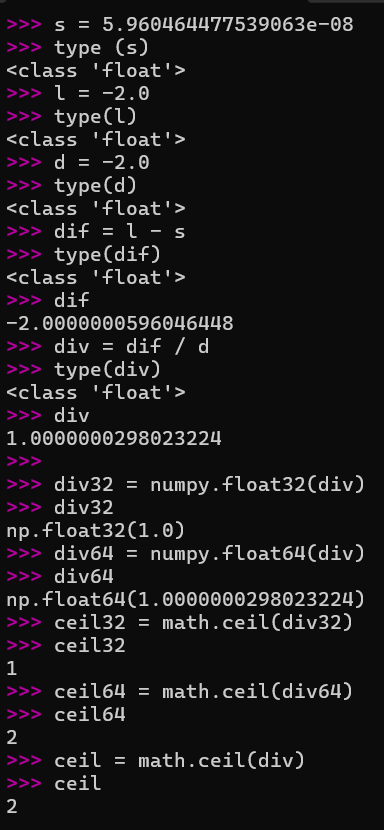

# Doubts and Questions

## Open Questions

### Question 1: [Mismatch between expected shape and ONNX actual output shape]

As addresed in the previous meeting, during our hypothesis testing we were unable to check that the expected shape matched the actual output shape from ONNX Range operator.

The expected shape is calculated according to what is stated by the ONNX reference documentation that can be consulted here (https://onnx.ai/onnx/operators/onnx__Range.html#l-onnx-doc-range).

$$ \text{expShape} = \displaystyle\ \max \left( \displaystyle\ \left\lceil \frac{\text{L} - \text{S}}{\text{D}}\right\rceil ,\ 0 \right) $$

Where:
- $\text{expShape}$ is the **expected** output shape

- $\text{S}$ is the **start** of the range (inclusive)

- $\text{L}$ is the **limit** of the range (exclusive)

- $\text{D}$ is the **delta/step** of the range

**Context:**
Based on the above formula and on the fact that $S$, $L$ and $D$ all have the same datatype, we implemented the following code to calculate the expected shape:

```python
max( math.ceil( (l - s) / d ), 0 )
```

The error mentioned above was only verified while using floating point datatypes (FLOAT32).

**Example 1:** 
```
S: 0.5
S_type: float32
binary of S 00111111000000000000000000000000

L: -8388608.0
L_type: float32
binary of L 11001011000000000000000000000000

D: -1.0
D_type: float32
binary of D 10111111100000000000000000000000

Value of (L - S) / D: 8388608.5
binary of (L - S) / D 01001011000000000000000000000000

Value after Ceil: 8388609
binary after Ceil 01001011000000000000000000000001

Expected y shape: 8388609
Actual y shape (ONNX): (8388608,)

ONNX result: y: [ 5.0000000e-01 -5.0000000e-01 -1.5000000e+00 ... -8.3886045e+06 -8.3886055e+06 -8.3886065e+06] 
```

**Example 2:** 
```
S: 0.5
S_type: float32
binary of S 00111111000000000000000000000000

L: -8388608.0
L_type: float32
binary of L 11001011000000000000000000000000

D: -16.0
D_type: float32
binary of D 11000001100000000000000000000000

Value of (L - S) / D: 524288.03125
binary of (L - S) / D 01001001000000000000000000000000

Value after Ceil: 524289
binary after Ceil 01001001000000000000000000010000

Expected y shape: 524289
Actual y shape (ONNX): (524288,)

ONNX result: y: [ 5.0000000e-01 -1.5500000e+01 -3.1500000e+01 ... -8.3885595e+06 -8.3885755e+06 -8.3885915e+06]
 
```

**Example 3:** 
```
S: 9.999999747378752e-06
S_type: float32
binary of S 00110111001001111100010110101100

L: -256.0
L_type: float32
binary of L 11000011100000000000000000000000

D: -1.0
D_type: float32
binary of D 10111111100000000000000000000000

Value of (L - S) / D: 256.00000999999975
binary of (L - S) / D 01000011100000000000000000000000

Value after Ceil: 257
binary after Ceil 01000011100000001000000000000000

Expected y shape: 257
Actual y shape (ONNX): (256,)

ONNX result: y: [ 9.9999997e-06 -3.1999990e+01 -6.3999992e+01 -9.5999992e+01 -1.2799999e+02 -1.6000000e+02 -1.9200000e+02 -2.2400000e+02]
```

**Example 4:** 
```
S: 5.960464477539063e-08
S_type: float32
binary of S 00110011100000000000000000000000

L: -2.0
L_type: float32
binary of L 11000000000000000000000000000000

D: -2.0
D_type: float32
binary of D 11000000000000000000000000000000

Value of (L - S) / D: 1.0000000298023224
binary of (L - S) / D 00111111100000000000000000000000

Value after Ceil: 2
binary after Ceil 01000000000000000000000000000000

Expected y shape: 2
Actual y shape (ONNX): (1,)

ONNX result: y: [5.9604645e-08]
```

\
These are some of the examples we obtained for which the expected shape does not match the actual output shape from ONNX Range operator.

We haven't yet analysed the root cause of this mismatch, but we suspect it might be related to floating point precision errors. We plan to do **Ceil** operator in the coming days and after that we might be able to investigate this issue further.

One possible cause of this problem might be that the calculation of the expected shape uses higher precision arithmetic than the one used by ONNX Range operator internally, which could lead to small discrepancies in the final result of the division and consequently in the Ceil operation. This is just a hypothesis that we need to investigate further, but once python uses, by default , double precision (float64) this could be the root of the problem. 

Here is a quick analysis of **Example 4** to illustrate our suspicion. Please baer in mind that all genertaed variables ($S$, $L$, $D$) are of type FLOAT32. We know that because we set them explicitly to be generated as FLOAT32 values in Hypothesis.




We did not find a way to identify the exact precision of $\text{dif}$ and $\text{div}$ variables. However it seems possible that they are calculated using higher precision arithmetic (e.g., FLOAT64) which would explain the mismatch in the final result. Please note that our expected shape match indeed the shape proposed with higher precision arithmetic while the ONNX actaul shape matches the one obtained with the converted \{div} to a numpy FLOAT32 value.

### Question 2: [Overflow in the calculation of expected shape]

Moreover, we also found some cases where the calculation of the expected shape overflows while the ONNX Range operator is still able to provide a valid output.

**Example 5:** 
```
S: 0.0
S_type: float64

L: 8.98846567431158e+307
L_type: float64

D: 0.5
D_type: float64 
```

**ONNX Execution**
```
S shape: (), 
X=0.00000000

L shape: (), 
X=8.98846567e+307

D shape: (), 
X=0.50000000

Output shape: (0,),
Result = []
```

At first glance, ONNX seems to produce a strange result. Note that for the range defined, the output tensor shouldn't be empty at all.

We did not find a smart way to deal with this overflow problem yet.

Until now our solution is to limit the range of the input generated values ( $\text{S}, \text{L}, \text{D}$ ) to avoid this overflow situation.