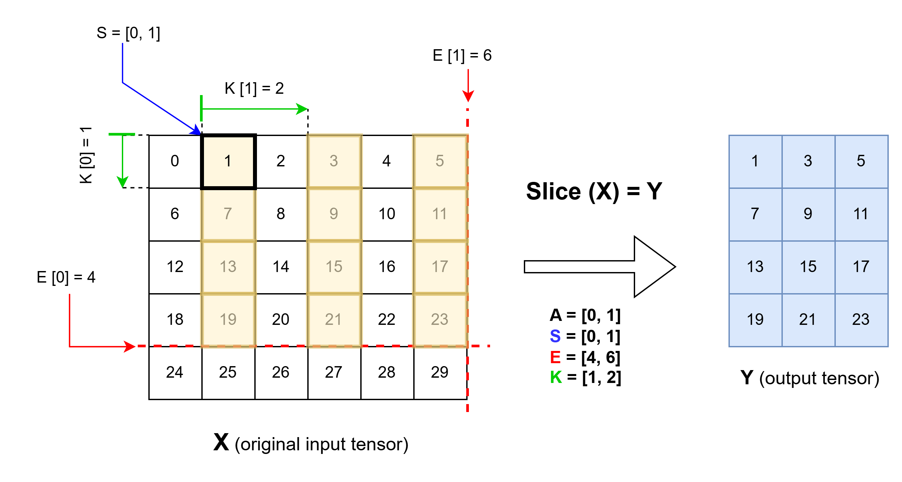
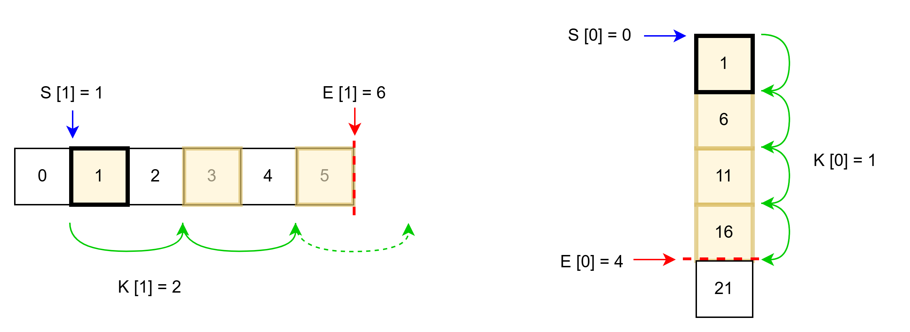

# Contents

- **slice** operator for type [real](#real)
- **slice** operator for types [INT8, INT16, INT32, INT64, UINT8, UINT16, UINT32, UINT64, FP16, FP32, DOUBLE, BFLOAT16, BOOL, STRING](#types)

Based on ONNX documentation version 13.

<a id="real"></a>
# **slice** (real)

## Signature
$Y = \text{slice}(X,S,E,A,K)$

where:
- `X`: input tensor
- `A`: 1-D tensor of axes to slice
- `S`: 1-D tensor with starting indices of corresponding axis in `A`
- `E`: 1-D tensor with ending indices of corresponding axis in `A`
- `K`: 1-D tensor of steps for each axis in `A`
- `Y`: output tensor


## Restrictions
The following restrictions apply to the **slice** operator for the SONNX profile:

| Restriction | Statement                                                   | Origin                                                                                      |
|-------------|-------------------------------------------------------------|---------------------------------------------------------------------------------------------|
| `[R1]`  <a id="R1"></a>   | Input `A` must be set                           | [No default values](../../../deliverables/reqs/reqs.md#no_default_value) |
| `[R2]`  <a id="R2"></a>   | All axes must be specified for input `A`        | [No default values](../../../deliverables/reqs/reqs.md#no_default_value) |
| `[R3]`  <a id="R3"></a>   | Input `K` must be set                           | [No default values](../../../deliverables/reqs/reqs.md#no_default_value) |
| `[R4]`   <a id="R4"></a>  | Sparse tensors are not supported              | General restriction [GR1](../general_restrictions.md#GR1) |
| `[R5]`     <a id="R5"></a>     | Shape of tensors shall be explicit          | General restriction [GR2](../general_restrictions.md#GR2) |
| `[R6]`     <a id="R6"></a>     | Positive steps must have starting positions lower or equal than ending positions | Transient |
| `[R7]`     <a id="R7"></a>     | Negative steps must have starting positions greater or equal than ending positions | Transient |
| `[R8]`     <a id="R8"></a>     | For all axis of the input tensor, the start value, on tensor `S`, that represent that axis must be lower than the axis dimension   | Transient |

## Informal specification


Operator **slice** extracts from `X` a subtensor defined by the axes listed in `A`. 

For each axis, `i` of the input tensor, slicing: 
- starts at $S'[i]$ 
- slides with a step of $K[i]$ 
- stops strictly before $E'[i]$

The result is stored in output tensor `Y`.

<a id="Y"></a>
```math
\begin{align*}
Y[a, b, \ldots, z] = X[&\text{S'}[t_0] + a \cdot \text{K}[t_0], \\
                       &\text{S'}[t_1] + b \cdot \text{K}[t_1], \\
                       &\vdots \\
                       &\text{S'}[t_{r-1}] + z \cdot \text{K}[t_{r-1}]]
\end{align*}
```

Where:
- $r$ is the rank of tensor `X`
- $a \in [0, dY_0-1]$ is the index along the first dimension of output tensor `Y`
- $b \in [0, dY_1-1]$ is the index along the second dimension of output tensor `Y`
- $z \in [0, dY_{r-1}-1]$ is the index along the last dimension of output tensor `Y`
- $i \in \{0, ...\ r-1\}$ is the index of the current axis
- $A'$ is the clamped tensor `A`. For each entry $A[i]$:
  - If $A[i] < 0$, then $A'[i] = A[i] + r$

  - Otherwise, $A'[i] = A[i]$
- $S'$ is the clamped tensor `S`. For each entry $S[i]$:
  - If $S[i] < 0$, then $S'[i] = S[i] + dX_{A'[i]}$

  - Otherwise, $S'[i] = S[i]$
- $E'$ is the clamped tensor `E`. For each entry $E[i]$:
  - If $E[i] < 0$, then $E'[i] = E[i] + dX_{A'[i]}$

  - Otherwise, $E'[i] = E[i]$

- $space_{i} = E'[i] - S'[i]$ is the available space along axis `i` for slicing
```math
<a id="f"></a> f = \begin{cases} 0 & \text{if}\quad (space_{i} \bmod K[i] = 0) \\ 1 & \text{otherwise} \end{cases}
\quad \text{is a flag indicating whether there is a remainder when dividing the available space by the step size along axis i}
```
- $t_z \in [0, r-1]$ is the index in which axis `z` is represented in tensor $A'$
- <a id="dY"></a> $dY_{A'[i]} = \left\lfloor \frac{\text{space}_{i}}{K[i]} \right\rfloor + f$ is the dimension of the output tensor `Y` along axis `i` 

\
\
The effect of the operator is illustrated on the following figure. In this example
- shape of `X` is ($5, 6$)
- shape of `A` is ($2$) with values `[0, 1]`
- shape of `S` is ($2$) with values `[0, 1]`
- shape of `E` is ($2$) with values `[4, 6]`
- shape of `K` is ($2$) with values `[1, 2]`

Once there are no negative values for `S` and `E`, the clamped tensors `S'` and `E'` are equal to `S` and `E`, respectively.


Finally, the following figure illustrates operator Slice applied on input `X` with the above parameters, resulting in output `Y` with shape ($4, 3$).



In order to understand how the shape of output `Y` is computed, the following figure illustrates the slicing process along each axis.

For the horizontal axis and starting from the black square we can do two steps and the third one is incomplete. Once there is an incomplete step we have to add one ( [<b><span style="font-family: 'Courier New', monospace">f</span></b>](#f) - ensuring that the dimension is equal to the total number of steps, completed or not). In this case it is clear that the dimension should be three yet only 2 steps were completed.

For the vertical axes there is no incomplete steps and the dimension is the same as the number of steps completed.


## Error conditions
No error condition

## Inputs

### $X$: `real tensor`
Tensor `X` is the input tensor from which a subtensor will be extracted.

### Constraints

- `[C1]` <a id="C1ra"></a> Dimensional consistency
    - Statement:
        - $rank(X) = d{S_0} = d{E_0} = d{A_0} = d{K_0}$
    - Rationale: This ensures that the slicing parameters are well-defined for each axis of `X`. [<b><span style="font-family: 'Courier New', monospace">[R2]</span></b>](#R2)
-  `[C2]`<a id="C2ra"></a> Rank consistency
   - Statement: The rank of tensor `X` and `Y` must be the same.
   - Rationale: Slicing does not change the rank of the tensor.
- `[C3]`<a id= "C27ra"></a> Minimum rank
    - Statement: The rank of tensor `X` must be at least 1.
    - Rationale: Slicing is not defined for scalars.

### $S$: `integer tensor`
Tensor `S` is a tensor containing the starting indices for each axis specified in `A`.

Tensor `S` must be a 1-D tensor.

### Constraints
- `[C1]` Dimensional consistency
   - Statement: see constraint [<b><span style="font-family: 'Courier New', monospace">[C1]</span></b>](#C1ra) on tensor `X`.

- `[C2]` <a id="C3ra"></a> Value Domain
    - Statement: The adjusted starting indices must be clamped to valid ranges.
```math
\forall i \in [0, r-1], \quad S[i] \in [-d{X_{A'_{[i]}}}, d{X_{A'_{[i]}}}-1]
```

Where:
- $r$ is the rank of tensor `X`.
- $i$ is the axis index.
- $A'$ is the clamped tensor `A`. For each entry $A[i]$:
    - If $A[i] < 0$, then $A'[i] = A[i] + r$
    - Otherwise, $A'[i] = A[i]$
- Rationale: Starting indices must be within the valid range of indices for tensor `X`, adjusted for negative indexing. Accouting for start inclusivity the maximum valid index is $dX_i - 1$. [<b><span style="font-family: 'Courier New', monospace">[R8]</span></b>](#R8)

- `[C3]`<a id="C8ra"></a> Steps and starting/ending indices consistency
   - Statement: Ensuring that output dimensions are positive and follow this [<b><span style="font-family: 'Courier New', monospace">formula</span></b>](#dY). [<b><span style="font-family: 'Courier New', monospace">[R6]</span></b>](#R6) [<b><span style="font-family: 'Courier New', monospace">[R7]</span></b>](#R7)


         
### $E$: `integer tensor`
Tensor `E` is a tensor containing the ending indices (exclusive) for each axis specified in `A`.

Tensor `E` must be a 1-D tensor.

### Constraints
- `[C1]` Dimensional consistency
   - Statement: see constraint [<b><span style="font-family: 'Courier New', monospace">[C1]</span></b>](#C1ra) on tensor `X`.

- `[C2]` <a id="C4ra"></a> Value Domain
    - Statement: The adjusted ending indices must be clamped to valid ranges based on the stepping direction.
```math
\forall i \in [0, r-1], \quad
E[i] \in 
\begin{cases} 
[-d{X_{A'_{[i]}}}, d{X_{A'_{[i]}}}] & \text{if } K[i] > 0 \\
[-d{X_{A'_{[i]}}}-1, d{X_{A'_{[i]}}} -1] & \text{if } K[i] < 0 
\end{cases}
```
Where
- $r$ is the rank of tensor `X`.
- $i$ is the axis index.
- $A'$ is the clamped tensor `A`. For each entry $A[i]$:
  - If $A[i] < 0$, then $A'[i] = A[i] + r$

  - Otherwise, $A'[i] = A[i]$

- `[C3]` Steps and starting/ending indices consistency
   - Statement: see constraint [<b><span style="font-family: 'Courier New', monospace">[C3]</span></b>](#C8ra) on tensor `S`. [<b><span style="font-family: 'Courier New', monospace">[R6]</span></b>](#R6) [<b><span style="font-family: 'Courier New', monospace">[R7]</span></b>](#R7)


### $A$: `integer tensor`
Tensor `A` is a tensor containing the axes along which to slice.

Tensor `A` must be a 1-D tensor.
### Constraints
 - `[C1]` Dimensional consistency
   - Statement: see constraint [<b><span style="font-family: 'Courier New', monospace">[C1]</span></b>](#C1ra) on tensor `X`.   

 - `[C2]` <a id="C5ra"></a> Value Domain
   - Statement: Each axis specified in `A` must be a valid axis index for tensor `X`.
```math
   \forall i \in [0, r-1], \quad
   A[i] \in [-r, r-1]
```
Where
- $r$ is the rank of tensor `X`.
- $i$ is the axis index.
- Rationale: This ensures that the slicing axes are valid for the input tensor.
 - `[C3]` <a id="C6ra"></a> Uniqueness
   - Statement: After normalizing negative indices, all axes in `A` must be unique: 
     $$\forall i, j \in [0, r-1], \; (A[i] + r) \bmod r = ((A[j] + r) \bmod r)\implies (i = j)$$
   - Rationale: Prevents ambiguity when the same axis is specified multiple times using different representations (negative and positive).

### $K$: `integer tensor`
Tensor `K` is a tensor containing the steps for each axis specified in `A`.

Tensor `K` must be a 1-D tensor.

### Constraints
 - `[C1]` Dimensional consistency
   - Statement: see constraint [<b><span style="font-family: 'Courier New', monospace">[C1]</span></b>](#C1ra) on tensor `X`.

 - `[C2]` <a id="C7ra"></a> Value Domain
   - Statement: Each step in `K` must be a valid step size for the corresponding axis in `A`.
```math
 \forall i \in [0, r-1], \quad
 K[i] \in \mathbb{Z} \setminus \{0\}
 ```
Where
  - $r$ is the rank of tensor `X`.
  - $i$ is the axis index.
- Rationale: This ensures that the steps are well-defined for each axis of `X`.
  
 - `[C3]` Steps and starting/ending indices consistency
   - Statement: see constraint [<b><span style="font-family: 'Courier New', monospace">[C3]</span></b>](#C8ra) on tensor `S`. [<b><span style="font-family: 'Courier New', monospace">[R6]</span></b>](#R6) [<b><span style="font-family: 'Courier New', monospace">[R7]</span></b>](#R7)


## Outputs

### $Y$: `real tensor`
Tensor `Y` is the output tensor containing the sliced subtensor from `X`.
### Constraints
 - `[C1]` Rank consistency
   - Statement: see constraint [<b><span style="font-family: 'Courier New', monospace">[C2]</span></b>](#C2ra) on tensor `X`.

 - `[C2]` Consistency between the shape of tensors `S`, `E`, `A`, `K`, and `Y`  
   - Statement: 
        - $\forall i \in [0, r-1], \quad  dY_{A'[i]} = \left\lfloor \frac{\text{space}_{i}}{K[i]} \right\rfloor + f \gt 0$

   - Rationale: The size of the output tensor `Y` is determined by the slicing parameters applied to tensor `X`.

   Where
    - $A'$ is the clamped tensor `A`. For each entry A[i]:
        - If $A[i] < 0$, then $A'[i] = A[i] + r$

        - Otherwise, $A'[i] = A[i]$
    - $S'$ is the clamped tensor `S`. For each entry S[i]:
         - If $S[i] < 0$, then $S'[i] = S[i] + dX_{A'[i]}$

         - Otherwise, $S'[i] = S[i]$
    - $E'$ is the clamped tensor `E`. For each entry E[i]:
         - If $E[i] < 0$, then $E'[i] = E[i] + dX_{A'[i]}$

         - Otherwise, $E'[i] = E[i]$

    - $space_{i} = E'[i] - S'[i]$ is the available space along axis `i` for slicing
```math
<a id="f"></a> f = \begin{cases} 0 & \text{if}\quad (space_{i} \bmod K[i] = 0) \\ 1 & \text{otherwise} \end{cases}
\quad \text{is a flag indicating whether there is a remainder when dividing the available space by the step size along axis i}
```
 - `[C3]` Value Consistency
   - Statement: Each element in tensor `Y` must correspond to the appropriate sliced element from tensor `X` based on the slicing parameters. [<b><span style="font-family: 'Courier New', monospace">Y</span></b>](#Y)

   - Rationale: Ensures that the output tensor `Y` accurately reflects the slicing operation performed on tensor `X`.


## Attributes

Operator **slice** has no attribute.

## Formal specification
 
See the Why3 specification.

## Numerical Accuracy

Operator **slice** does not introduce any numerical error. Hence, for all valid indices the output values are exactly equal to the corresponding input values.
<a id="types"></a>
# **slice** (type, itype, itype, itype, itype)

Where type is in {INT8, INT16, INT32, INT64, UINT8, UINT16, UINT32, UINT64, FP16, FP32, DOUBLE, BFLOAT16, BOOL, STRING}

Where itype is in {INT32, INT64}

## Signature
$Y = \text{slice}(X,S,E,A,K)$

where:
- `X`: input tensor
- `A`: 1-D tensor of axes to slice
- `S`: 1-D tensor with starting indices of corresponding axis in `A`
- `E`: 1-D tensor with ending indices of corresponding axis in `A`
- `K`: 1-D tensor of steps for each axis in `A`
- `Y`: output tensor


## Restrictions
The following restrictions apply to the **slice** operator for the SONNX profile:

| Restriction | Statement                                                   | Origin                                                                                      |
|-------------|-------------------------------------------------------------|---------------------------------------------------------------------------------------------|
| `[R1]`  <a id="tR1"></a>   | Input `A` must be set                           | [No default values](../../../deliverables/reqs/reqs.md#no_default_value) |
| `[R2]`  <a id="tR2"></a>   | All axes must be specified for input `A`        | [No default values](../../../deliverables/reqs/reqs.md#no_default_value) |
| `[R3]`  <a id="tR3"></a>   | Input `K` must be set                           | [No default values](../../../deliverables/reqs/reqs.md#no_default_value) |
| `[R4]`   <a id="tR4"></a>  | Sparse tensors are not supported              | General restriction [GR1](../general_restrictions.md#GR1) |
| `[R5]`     <a id="tR5"></a>     | Shape of tensors shall be explicit          | General restriction [GR2](../general_restrictions.md#GR2) |
| `[R6]`     <a id="tR6"></a>     | Positive steps must have starting positions lower or equal than ending positions | Transient |
| `[R7]`     <a id="tR7"></a>     | Negative steps must have starting positions greater or equal than ending positions | Transient |
| `[R8]`     <a id="R8"></a>     | For all axis of the input tensor, the start value, on tensor `S`, that represent that axis must be lower than the axis dimension   | Transient |
| `[R9]`     <a id="tR9"></a>     | `X` and `Y` tensor must have the same type   |  General restriction [GR3](../general_restrictions.md#GR3) |
| `[R10]`     <a id="tR10"></a>     | `A`, `S`, `E` and `K` must have the same type |  General restriction [GR3](../general_restrictions.md#GR3) |

## Informal specification


Operator **slice** extracts from `X` a subtensor defined by the axes listed in `A`. 

For each axis, `i` of the input tensor, slicing: 
- starts at $S'[i]$ 
- slides with a step of $K[i]$ 
- stops strictly before $E'[i]$

The result is stored in output tensor `Y`.

<a id="tY"></a>
```math
  \begin{align*}
Y[a, b, \ldots, z] = X[&\text{S'}[t_0] + a \cdot \text{K}[t_0], \\
                       &\text{S'}[t_1] + b \cdot \text{K}[t_1], \\
                       &\vdots \\
                       &\text{S'}[t_{r-1}] + z \cdot \text{K}[t_{r-1}]]
\end{align*}
```

Where:
- $r$ is the rank of tensor `X`
- $a \in [0, dY_0-1]$ is the index along the first dimension of output tensor `Y`
- $b \in [0, dY_1-1]$ is the index along the second dimension of output tensor `Y`
- $z \in [0, dY_{r-1}-1]$ is the index along the last dimension of output tensor `Y`
- $i \in \{0, ...\ r-1\}$ is the index of the current axis~
- $A'$ is the clamped tensor `A`. For each entry $A[i]$:
  - If $A[i] < 0$, then $A'[i] = A[i] + r$

  - Otherwise, $A'[i] = A[i]$
- $S'$ is the clamped tensor `S`. For each entry $S[i]$:
  - If $S[i] < 0$, then $S'[i] = S[i] + dX_{A'[i]}$

  - Otherwise, $S'[i] = S[i]$
- $E'$ is the clamped tensor `E`. For each entry $E[i]$:
  - If $E[i] < 0$, then $E'[i] = E[i] + dX_{A'[i]}$

  - Otherwise, $E'[i] = E[i]$

- $space_{i} = E'[i] - S'[i]$ is the available space along axis `i` for slicing
```math
<a id="tf"></a> f = \begin{cases} 0 & \text{if}\quad (space_{i} \bmod K[i] = 0) \\ 1 & \text{otherwise} \end{cases}
\quad \text{is a flag indicating whether there is a remainder when dividing the available space by the step size along axis i}
```
- $t_z \in [0, r-1]$ is the index in which axis `z` is represented in tensor $A'$
- <a id="tdY"></a> $dY_{A'[i]} = \left\lfloor \frac{\text{space}_{i}}{K[i]} \right\rfloor + f$ is the dimension of the output tensor `Y` along axis `i` 

\
\
The effect of the operator is illustrated on the following figure. In this example
- shape of `X` is ($5, 6$)
- shape of `A` is ($2$) with values `[0, 1]`
- shape of `S` is ($2$) with values `[0, 1]`
- shape of `E` is ($2$) with values `[4, 6]`
- shape of `K` is ($2$) with values `[1, 2]`

Once there are no negative values for `S` and `E`, the clamped tensors `S'` and `E'` are equal to `S` and `E`, respectively.


Finally, the following figure illustrates operator Slice applied on input `X` with the above parameters, resulting in output `Y` with shape ($4, 3$).


In order to understand how the shape of output `Y` is computed, the following figure illustrates the slicing process along each axis.

For the horizontal axis and starting from the black square we can do two steps and the third one is incomplete. Once there is an incomplete step we have to add one ( [<b><span style="font-family: 'Courier New', monospace">f</span></b>](#f) - ensuring that the dimension is equal to the total number of steps, completed or not). In this case it is clear that the dimension should be three yet only 2 steps were completed.

For the vertical axes there is no incomplete steps and the dimension is the same as the number of steps completed.


## Error conditions
No error condition

## Inputs

### $X$: INT8, INT16, INT32, INT64, UINT8, UINT16, UINT32, UINT64, FP16, FP32, DOUBLE, BFLOAT16, BOOL, STRING
Tensor `X` is the input tensor from which a subtensor will be extracted.

### Constraints

- `[C1]` <a id="C1ta"></a> Dimensional consistency
    - Statement:
        - $rank(X) = d{S_0} = d{E_0} = d{A_0} = d{K_0}$
    - Rationale: This ensures that the slicing parameters are well-defined for each axis of `X`. [<b><span style="font-family: 'Courier New', monospace">[R2]</span></b>](#tR2)
-  `[C2]`<a id="C2ta"></a> Rank consistency
   - Statement: The rank of tensor `X` and `Y` must be the same.
   - Rationale: Slicing does not change the rank of the tensor.
- `[C3]`<a id= "C27ta"></a> Minimum rank
    - Statement: The rank of tensor `X` must be at least 1.
    - Rationale: Slicing is not defined for scalars.
- `[C4]` <a id="C20ta"></a> Type consistency
   - Statement: Tensors `X` and `Y` must have the same type. [<b><span style="font-family: 'Courier New', monospace">[R9]</span></b>](#tR9)

### $S$: INT32, INT64
Tensor `S` is a tensor containing the starting indices for each axis specified in `A`.

Tensor `S` must be a 1-D tensor.

### Constraints
- `[C1]` Dimensional consistency
   - Statement: see constraint [<b><span style="font-family: 'Courier New', monospace">[C1]</span></b>](#C1ta) on tensor `X`.

- `[C2]` <a id="C3ta"></a> Value Domain
    - Statement: The adjusted starting indices must be clamped to valid ranges.
```math
\forall i \in [0, r-1], \quad S[i] \in [-d{X_{A'_{[i]}}}, d{X_{A'_{[i]}}}-1]
```
Where
- $r$ is the rank of tensor `X`.
- $i$ is the axis index.
- $A'$ is the clamped tensor `A`. For each entry $A[i]$:
  - If $A[i] < 0$, then $A'[i] = A[i] + r$

  - Otherwise, $A'[i] = A[i]$
- Rationale: Starting indices must be within the valid range of indices for tensor `X`, adjusted for negative indexing. Accouting for start inclusivity the maximum valid index is $dX_i - 1$. [<b><span style="font-family: 'Courier New', monospace">[R8]</span></b>](#tR8)

- `[C3]`<a id="C8ta"></a> Steps and starting/ending indices consistency
   - Statement: Ensuring that output dimensions are non negative and follow this [<b><span style="font-family: 'Courier New', monospace">formula</span></b>](#tdY). [<b><span style="font-family: 'Courier New', monospace">[R6]</span></b>](#tR6) [<b><span style="font-family: 'Courier New', monospace">[R7]</span></b>](#tR7)
- `[C4]`<a id="C21ta"></a> Type consistency
   - Statement: Tensors `A`, `S`, `E`, and `K` must have the same type. [<b><span style="font-family: 'Courier New', monospace">[R10]</span></b>](#tR10)


         
### $E$: INT32, INT64
Tensor `E` is a tensor containing the ending indices (exclusive) for each axis specified in `A`.

Tensor `E` must be a 1-D tensor.

### Constraints
- `[C1]` Dimensional consistency
   - Statement: see constraint [<b><span style="font-family: 'Courier New', monospace">[C1]</span></b>](#C1ta) on tensor `X`.

- `[C2]` <a id="C4ta"></a> Value Domain
    - Statement: The adjusted ending indices must be clamped to valid ranges based on the stepping direction.
 ```math
 \forall i \in [0, r-1], \quad
 E[i] \in 
 \begin{cases} 
 [-d{X_{A'_{[i]}}}, d{X_{A'_{[i]}}}] & \text{if } K[i] > 0 \\
 [-d{X_{A'_{[i]}}}-1, d{X_{A'_{[i]}}} -1] & \text{if } K[i] < 0 
 \end{cases}
 ```
Where
- $r$ is the rank of tensor `X`.
- $i$ is the axis index.
- $A'$ is the clamped tensor `A`. For each entry $A[i]$:
  - If $A[i] < 0$, then $A'[i] = A[i] + r$

  - Otherwise, $A'[i] = A[i]$

- `[C3]` Steps and starting/ending indices consistency
   - Statement: see constraint [<b><span style="font-family: 'Courier New', monospace">[C3]</span></b>](#C8ta) on tensor `S`. [<b><span style="font-family: 'Courier New', monospace">[R6]</span></b>](#tR6) [<b><span style="font-family: 'Courier New', monospace">[R7]</span></b>](#tR7)
- `[C4]` Type consistency
   - Statement: see constraint [<b><span style="font-family: 'Courier New', monospace">[C4]</span></b>](#C21ta) on tensor `S`.


### $A$: INT32, INT64
Tensor `A` is a tensor containing the axes along which to slice.

Tensor `A` must be a 1-D tensor.
### Constraints
 - `[C1]` Dimensional consistency
   - Statement: see constraint [<b><span style="font-family: 'Courier New', monospace">[C1]</span></b>](#C1ta) on tensor `X`.   

 - `[C2]` <a id="C5ta"></a> Value Domain
   - Statement: Each axis specified in `A` must be a valid axis index for tensor `X`.
```math
\forall i \in [0, r-1], \quad
A[i] \in [-r, r-1]
```
Where
- $r$ is the rank of tensor `X`.
- $i$ is the axis index.
- Rationale: This ensures that the slicing axes are valid for the input tensor.
 - `[C3]` <a id="C6ta"></a> Uniqueness
   - Statement: After normalizing negative indices, all axes in `A` must be unique: 
     $$\forall i, j \in [0, r-1], \; (A[i] + r) \bmod r = ((A[j] + r) \bmod r)\implies (i = j)$$
   - Rationale: Prevents ambiguity when the same axis is specified multiple times using different representations (negative and positive).
 - `[C4]` Type consistency
   - Statement: see constraint [<b><span style="font-family: 'Courier New', monospace">[C4]</span></b>](#C21ta) on tensor `S`.

### $K$: INT32, INT64
Tensor `K` is a tensor containing the steps for each axis specified in `A`.

Tensor `K` must be a 1-D tensor.

### Constraints
 - `[C1]` Dimensional consistency
   - Statement: see constraint [<b><span style="font-family: 'Courier New', monospace">[C1]</span></b>](#C1ta) on tensor `X`.

 - `[C2]` <a id="C7ta"></a> Value Domain
   - Statement: Each step in `K` must be a valid step size for the corresponding axis in `A`.
```math
 \forall i \in [0, r-1], \quad
 K[i] \in \mathbb{Z} \setminus \{0\}
 ```
 Where
 - $r$ is the rank of tensor `X`.
 - $i$ is the axis index.
- Rationale: This ensures that the steps are well-defined for each axis of `X`.
  
 - `[C3]` Steps and starting/ending indices consistency
   - Statement: see constraint [<b><span style="font-family: 'Courier New', monospace">[C3]</span></b>](#C8ta) on tensor `S`. [<b><span style="font-family: 'Courier New', monospace">[R6]</span></b>](#tR6) [<b><span style="font-family: 'Courier New', monospace">[R7]</span></b>](#tR7)
 - `[C4]` Type consistency
   - Statement: see constraint [<b><span style="font-family: 'Courier New', monospace">[C4]</span></b>](#C21ta) on tensor `S`.


## Outputs

### $Y$: INT8, INT16, INT32, INT64, UINT8, UINT16, UINT32, UINT64, FP16, FP32, DOUBLE, BFLOAT16, BOOL, STRING
Tensor `Y` is the output tensor containing the sliced subtensor from `X`.
### Constraints
 - `[C1]` Rank consistency
   - Statement: see constraint [<b><span style="font-family: 'Courier New', monospace">[C2]</span></b>](#C2ta) on tensor `X`.

 - `[C2]` Consistency between the shape of tensors `S`, `E`, `A`, `K`, and `Y`  
   - Statement: 
        - $\forall i \in [0, r-1], \quad  dY_{A'[i]} = \left\lfloor \frac{\text{space}_{i}}{K[i]} \right\rfloor + f \gt 0$

   - Rationale: The size of the output tensor `Y` is determined by the slicing parameters applied to tensor `X`.

   Where
      - $A'$ is the clamped tensor `A`. For each entry $A[i]$:
        - If $A[i] < 0$, then $A'[i] = A[i] + r$

        - Otherwise, $A'[i] = A[i]$
      - $S'$ is the clamped tensor `S`. For each entry S[i]:
         - If $S[i] < 0$, then $S'[i] = S[i] + dX_{A'[i]}$

         - Otherwise, $S'[i] = S[i]$
      - $E'$ is the clamped tensor `E`. For each entry E[i]:
         - If $E[i] < 0$, then $E'[i] = E[i] + dX_{A'[i]}$

         - Otherwise, $E'[i] = E[i]$

      - $space_{i} = E'[i] - S'[i]$ is the available space along axis `i` for slicing
```math
<a id="tf"></a> f = \begin{cases} 0 & \text{if}\quad (space_{i} \bmod K[i] = 0) \\ 1 & \text{otherwise} \end{cases}
\quad \text{is a flag indicating whether there is a remainder when dividing the available space by the step size along axis i}
```
 - `[C3]` Value Consistency
   - Statement: Each element in tensor `Y` must correspond to the appropriate sliced element from tensor `X` based on the slicing parameters. [<b><span style="font-family: 'Courier New', monospace">Y</span></b>](#tY)

   - Rationale: Ensures that the output tensor `Y` accurately reflects the slicing operation performed on tensor `X`.
 - `[C4]` Type consistency
   - Statement: see constraint [<b><span style="font-family: 'Courier New', monospace">[C4]</span></b>](#C20ta) on tensor `X`.


## Attributes

Operator **slice** has no attribute.

## Formal specification
 
See the Why3 specification.

## Numerical Accuracy

Operator **slice** does not introduce any numerical error. Hence, for all valid indices the output values are exactly equal to the corresponding input values.
