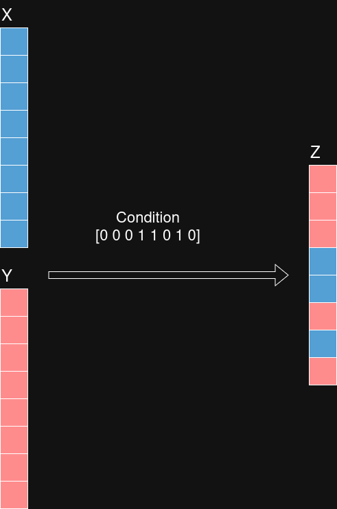

# Contents

- **Where** operator for type [real](#real)
- **Where** operator for types [float16, float, double](#float)
- **Where** operator for types [int8, int16, int32, int64, uint8, uint16, uint32, uint64](#int)

Based on ONNX documentation [Where version 16](https://onnx.ai/onnx/operators/onnx__Where.html).

<a id="real"></a>

# **Where** (bool, real, real)

## Signature

$Z = \textbf{Where}(condition, X, Y)$

where:

* $condition$: boolean input tensor used to select values between $X$ and $Y$
* $X$: first input tensor
* $Y$: second input tensor
* $Z$: output tensor formed by element-wise selection between $X$ and $Y$

## Restrictions

[General restrictions](./../common/general_restrictions.md) are applicable.

No specific restrictions apply to the **Where** operator.

## Informal specification

Operator **Where** selects elements from tensors $X$ and $Y$ element-wise according to the boolean tensor $condition$.

For any [tensor index](./../common/definitions.md#tensor_index) $i$:

> Image en fond blanc.

$$
Z[i] =
\begin{cases}
X[i] & \text{if } condition[i] = \text{True} \\
Y[i] & \text{otherwise}
\end{cases}
$$

The effect of the operator is illustrated on the following examples.
The following figure illustrates operator **Where** applied on inputs $X$,$Y$ with condition $condition$ :



### Example 1

```math
condition = \begin{bmatrix} \text{True} & \text{False} & \text{True} \end{bmatrix}
```

```math
X = \begin{bmatrix} 9.0 & 8.0 & 7.1 \end{bmatrix}
```

```math
Y = \begin{bmatrix} 6.0 & 5.0 & 4.0 \end{bmatrix}
```

Result $Z$ is:

```math
Z = \begin{bmatrix} 9.0 & 5.0 & 7.1 \end{bmatrix}
```

### Example 2

```math
condition =
\begin{bmatrix}
\text{True} & \text{True} \\
\text{True} & \text{False} \\
\text{False} & \text{True}
\end{bmatrix}
```

```math
X =
\begin{bmatrix}
1 & 2 \\
3 & 4 \\
5 & 6
\end{bmatrix}
```

```math
Y =
\begin{bmatrix}
12 & 11 \\
10 & 9 \\
8 & 7
\end{bmatrix}
```

Result $Z$ is:

```math
Z =
\begin{bmatrix}
1 & 2 \\
3 & 9 \\
8 & 6
\end{bmatrix}
```

## Error conditions

No error condition.

## Attributes

Operator **Where** has no attribute.

## Inputs

### $\text{condition}$: bool tensor

Boolean tensor used to select values from $X$ and $Y$.

#### Constraints

- `[C1]` <a id="C1ra"></a> Shape consistency

  - Statement: Tensors $condition$, $X$, $Y$, and $Z$ shall have the same shape.

### $\text{X}$: real tensor

First input tensor.

#### Constraints

- `[C1]` Shape consistency

  - Statement: see constraint [`[C1]`](#C1ra) on tensor $condition$.


### $\text{Y}$: real tensor

Second input tensor.

#### Constraints

- `[C1]` Shape consistency

  - Statement: see constraint [`[C1]`](#C1ra) on tensor $condition$.

## Outputs

### $\text{Z}$: real tensor

Output tensor formed by selecting values from $X$ and $Y$.

#### Constraints

- `[C1]` <a id="C1rc"></a> Shape consistency

  - Statement: See constraint [`[C1]`](#C1ra) on tensor $condition$.

## Formal specification

See the Why3 specification.


<a id="float"></a>

# **Where** (bool, float, float)

where float is in {float16, float, double}

## Signature

Definition of operator $\text{Where}$ signature:
$Z = \textbf{Where}(condition, X, Y)$

where:

- $condition$: boolean input tensor
- $X$: first floating-point input tensor
- $Y$: second floating-point input tensor
- $Z$: output tensor formed by element-wise selection

## Restrictions

[General restrictions](./../common/general_restrictions.md) are applicable.

No specific restrictions apply to the **Where** operator.

## Informal specification

Operator **Where** selects elements from tensors $X$ and $Y$ element-wise according to the boolean tensor $condition$.

For any [tensor index](./../common/definitions.md#tensor_index) $i$:

$$
Z[i] =
\begin{cases}
X[i] & \text{if } condition[i] = \text{True} \\
Y[i] & \text{otherwise}
\end{cases}
$$

Selection follows standard IEEE 754 semantics for floating-point values.
In particular, NaN and infinite values are propagated according to the selected branch.


### Example 1

```math
condition = \begin{bmatrix} \text{True} & \text{False} & \text{True} \end{bmatrix}
```

```math
X = \begin{bmatrix} 19.0 & 28.0 & 37.1 \end{bmatrix}
```

```math
Y = \begin{bmatrix} 16.0 & 25.0 & 34.0 \end{bmatrix}
```

Result $Z$ is:

```math
Z = \begin{bmatrix} 19.0 & 25.0 & 37.1 \end{bmatrix}
```


### Example 2

```math
condition =
\begin{bmatrix}
\text{True} & \text{False} & \text{True} & \text{False} & \text{True}
\end{bmatrix}
```

```math
X =
\begin{bmatrix}
\text{+0.0} & \text{+0.0} & \text{+inf} & \text{+inf} & \text{NaN}
\end{bmatrix}
```

```math
Y =
\begin{bmatrix}
\text{+0.0} & \text{-0.0} & \text{-inf} & \text{-inf} & 1.0
\end{bmatrix}
```

Result $Z$ is:

```math
Z =
\begin{bmatrix}
\text{+0.0} & \text{-0.0} & \text{+inf} & \text{-inf} & \text{NaN}
\end{bmatrix}
```


## Error conditions

No error condition.

## Attributes

Operator **Where** has no attribute.

## Inputs

### $\text{condition}$: bool tensor

Boolean tensor used for selection.

#### Constraints

- `[C1]` <a id="C1fa"></a> Shape consistency

  - Statement: Tensors $condition$, $X$, $Y$, and $Z$ shall have the same shape.
- `[C2]` <a id="C2fa"></a> Type consistency

  - Statement: Tensors $X$, $Y$, and $Z$ shall have the same floating-point type.


### $\text{X}$: floating-point tensor

First input tensor.

#### Constraints

- `[C1]` Shape consistency

  * Statement: see constraint [`[C1]`](#C1fa) on tensor $condition$.
- `[C2]` Type consistency

  - Statement: see constraint [`[C2]`](#C2fa) on tensor $condition$.


### $\text{Y}$: floating-point tensor

Second input tensor.

#### Constraints

- `[C1]` Shape consistency

  - Statement: see constraint [`[C1]`](#C1fa) on tensor $condition$.
- `[C2]` Type consistency

  - Statement: see constraint [`[C2]`](#C2fa) on tensor $condition$.

## Outputs

### $\text{Z}$: floating-point tensor

Output tensor formed by selection between $X$ and $Y$.

#### Constraints

- `[C1]` <a id="C1fc"></a> Shape consistency

  - Statement: See constraint [`[C1]`](#C1fa) on tensor $condition$.
- `[C2]` Type consistency

  - Statement: See constraint [`[C2]`](#C2fa) on tensor $condition$.

## Formal specification

See Why3 specification.

## Numeric accuracy

[See the numeric accuracy note](./where_acc.md).


<a id="int"></a>

# **Where** (bool, int, int)

where int is in {int8, int16, int32, int64, uint8, uint16, uint32, uint64}

## Signature

Definition of operator $\text{Where}$ signature:
$Z = \textbf{Where}(condition, X, Y)$

where:

- $condition$: boolean input tensor
- $X$: first integer input tensor
- $Y$: second integer input tensor
- $Z$: output tensor formed by element-wise selection

## Restrictions

[General restrictions](./../common/general_restrictions.md) are applicable.

No specific restrictions apply to the **Where** operator.

## Informal specification

Operator **Where** selects elements from integer tensors $X$ and $Y$ element-wise according to the boolean tensor $condition$.

For any [tensor index](./../common/definitions.md#tensor_index) $i$:

$$
Z[i] =
\begin{cases}
X[i] & \text{if } condition[i] = \text{True} \\
Y[i] & \text{otherwise}
\end{cases}
$$

The examples given in the real section apply directly when restricted to integer values.
### Example 1

```math
X =
\begin{bmatrix}
1 & 20 \\
3 & 40 \\
5 & 60
\end{bmatrix}
```

```math
Y =
\begin{bmatrix}
12 & 110 \\
10 & 90 \\
8 & 70
\end{bmatrix}
```

Result $Z$ is:

```math
Z =
\begin{bmatrix}
1 & 20 \\
3 & 90 \\
8 & 60
\end{bmatrix}
```
## Error conditions

No error condition.

## Attributes

Operator **Where** has no attribute.

## Inputs

### $\text{condition}$: bool tensor

Boolean tensor used for selection.

#### Constraints

- `[C1]` <a id="C1ia"></a> Shape consistency

  - Statement: Tensors $condition$, $X$, $Y$, and $Z$ shall have the same shape.
- `[C2]` <a id="C2ia"></a> Type consistency

  - Statement: Tensors $X$, $Y$, and $Z$ shall have the same integer type.


### $\text{X}$: integer tensor

First input tensor.

#### Constraints

- `[C1]` Shape consistency

  - Statement: see constraint [`[C1]`](#C1ia) on tensor $condition$.
- `[C2]` Type consistency

  - Statement: see constraint [`[C2]`](#C2ia) on tensor $condition$.


### $\text{Y}$: integer tensor

Second input tensor.

#### Constraints

- `[C1]` Shape consistency

  - Statement: see constraint [`[C1]`](#C1ia) on tensor $condition$.
- `[C2]` Type consistency

  - Statement: see constraint [`[C2]`](#C2ia) on tensor $condition$.

## Outputs

### $\text{Z}$: integer tensor

Output tensor formed by selection between $X$ and $Y$.

#### Constraints

- `[C1]` <a id="C1ic"></a> Shape consistency

  - Statement: See constraint [`[C1]`](#C1ia) on tensor $condition$.
- `[C2]` Type consistency

  - Statement: See constraint [`[C2]`](#C2ia) on tensor $condition$.


